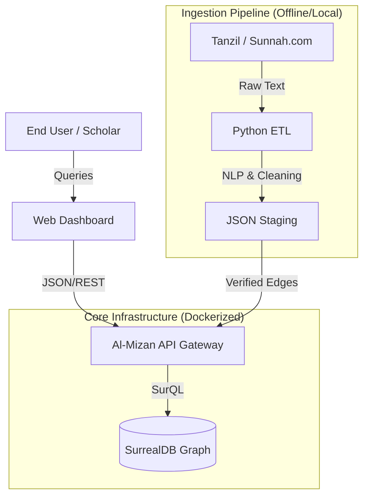

# Al-Mizan System Architecture

## 1. Architectural Overview

* **Pattern**: Service-Oriented Architecture (SOA) with a unified Graph Persistency Layer.
* **Philosophy**: "Immutable Core, Mutable Periphery."
* **Primary Constraint**: The system is designed for **Read-Heavy workloads** (99% Reads, 1% Writes) to serve as a high-performance Reference API.

### 1.1 High-Level Context (C4 Level 1)

The system functions as a "Semantic Middleware" between Raw Islamic Text Sources and End-User Applications (EdTech, Researchers).



## 2. Tech Stack & Components (C4 Level 2)

### 2.1 Backend Core (`almizan-core`)

* **Language**: Rust (2021 Edition).
* **Framework**: Axum (Tokio-based).
* **Responsibility**:
  * Exposing OpenAPI 3.0 REST endpoints.
  * Handling Graph Traversal Logic ($O(1)$ adjacency lookups).
  * Enforcing Epistemological Constraints (e.g., preventing a Zanni node from overwriting a Thabit node).
* **Key Modules**:
  * `crate::routes`: Endpoint definitions.
  * `crate::models`: Strong-typed Structs for Verse, Hadith, Ruling.
  * `crate::graph`: The traversal engine logic.

### 2.2 Database Layer (`almizan-db`)

* **Engine**: SurrealDB (v2.x).
* **Mode**: Single-Node (Development) / Distributed (Production).
* **Schema Logic**:
  * **Nodes (Vertices)**: `verse`, `hadith`, `scholar`, `book`, `topic`.
  * **Edges (Relations)**: `explains`, `narrates`, `derived_from`, `abrogates`, `condition_for`.
* **Security**:
  * `DEFINE SCOPE public_read`: Allows anonymous read-only access.
  * `DEFINE SCOPE admin_write`: Restricted to internal API calls only.

### 2.3 Data Pipeline (`almizan-etl`)

* **Language**: Python 3.11+.
* **Libraries**: `pandas` (Dataframe manipulation), `langchain` (NLP Drafting), `beautifulsoup4` (Scraping).
* **Workflow**:
  * **Extract**: Pull raw text from tanzil.net XML files.
  * **Transform**:
    * Normalize Arabic text (remove/standardize diacritics for search).
    * **NLP Draft**: Use LLM (e.g., Llama-3-8b via local Ollama) to suggest relations (e.g., "Extract all narrators from this Hadith text").
  * **Load**: Generate `.surql` scripts for bulk ingestion into SurrealDB.

### 2.4 Frontend (`almizan-web`)

* **Tech**: HTML5, CSS3, JavaScript (ES6+).
* **Visualization**: D3.js (Force Directed Graph).
* **Features**:
  * **RTL Support**: Natively handles Arabic text direction.
  * **Interactive Explorer**: Click-to-expand node navigation.

## 3. Data Model (Ontology)

### 3.1 Node Types (Entities)

| Node Type | Description | Epistemological Tier |
| :--- | :--- | :--- |
| `quran_verse` | A single Ayah (e.g., 2:255). | **Tier 1 (Thabit)** |
| `hadith` | A narration text (Matn + Sanad). | **Tier 1 (Thabit)** |
| `fiqh_ruling` | A legal derivation (e.g., "Wudu is Fard"). | **Tier 2 (Zanni)** |
| `scholar` | A person (Narrator or Jurist). | **Tier 3 (Context)** |

### 3.2 Edge Types (Relationships)

| Edge Type | Direction | Description |
| :--- | :--- | :--- |
| `EXPLAINS` | `hadith` -> `verse` | A Hadith provides Tafsir for a Verse. |
| `NARRATED_BY` | `hadith` -> `scholar` | Connects a text to its transmitter. |
| `DERIVED_FROM` | `fiqh_ruling` -> `[verse/hadith]` | The "Dalil" (Evidence) link. |
| `PREREQUISITE_FOR` | `concept` -> `concept` | Logic flow (e.g., Wudu -> Salah). |

## 4. Operational Security (OpSec)

### 4.1 "The Sandbox Protocol"

To prevent "Data Poisoning" (injection of false hadith):

1. **No Public Write Access**: The API exposes ZERO POST/PUT endpoints to the public internet.
2. **Air-Gapped Ingestion**: Database writes happen only via the `almizan-etl` pipeline running on the local intranet/researcher machine.

### 4.2 Docker Composition

The entire system is reproducible via `docker-compose.yml`:

```yaml
version: '3.8'
services:
  surrealdb:
    image: surrealdb/surrealdb:latest
    ports:
      - "8000:8000"
    volumes:
      - ./data:/my-database
  
  api:
    build: ./backend
    ports:
      - "3000:3000"
    depends_on:
      - surrealdb
```

## 5. Deployment Strategy (FYP Phase)

* **Environment**: Localhost (University Lab / Laptop).
* **Data Volume**:
  * **Tier 1 (Text)**: ~6,236 Verses + ~2,000 Hadith (Full Text).
  * **Tier 2 (Graph)**: ~500 Verified Edges (Juz Amma Focus).
