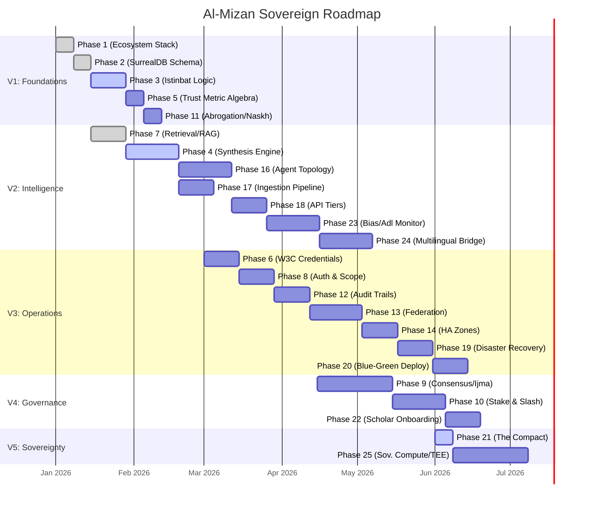

# Al-Mizan: Project Roadmap & Schedule

This document visualizes the execution timeline of the 25-Phase Master Plan using a Mermaid Gantt Chart.

## Global Execution Roadmap (2026)

## Status Legend
| Color | Meaning |
| :--- | :--- |
| **Grey (Done)** | Completed & Validated (e.g., Phase 1, 2, 7). |
| **Blue (Active)** | Currently under active development (e.g., Phase 4, 21). |
| **Pink (Future)** | Planned for future sprints. |
