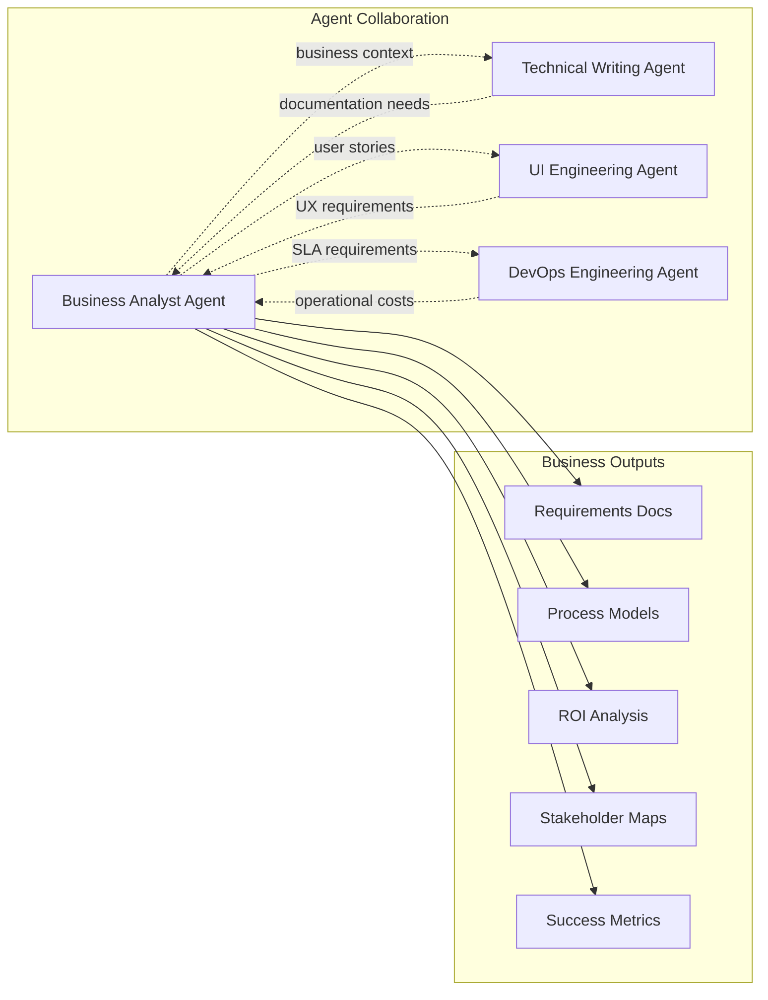
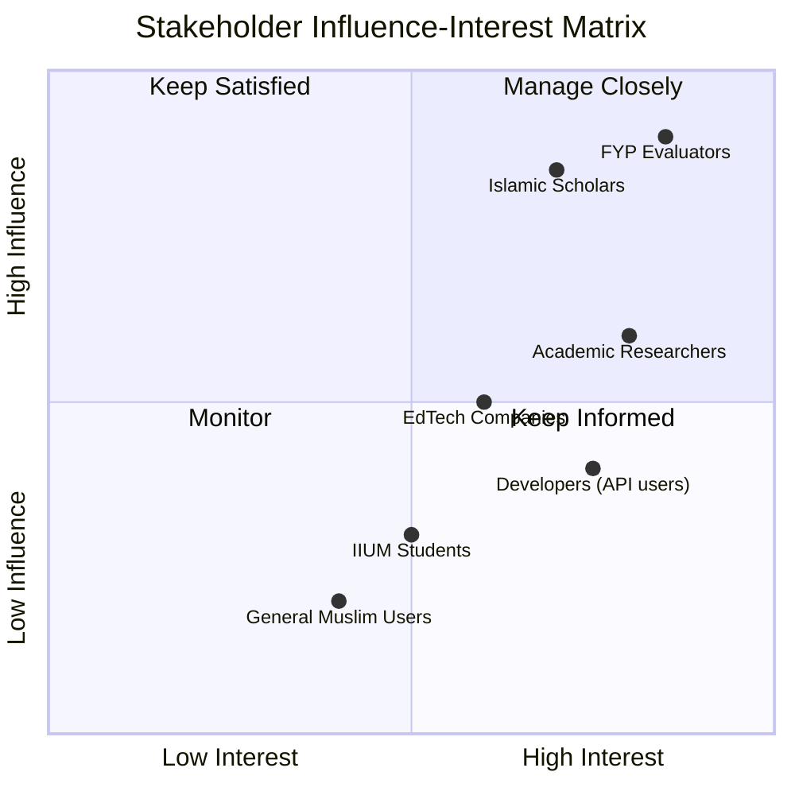
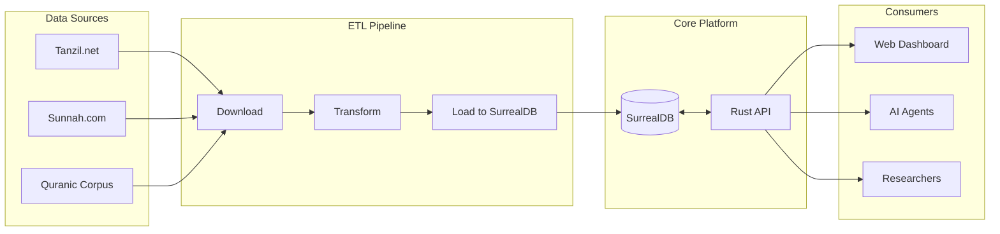
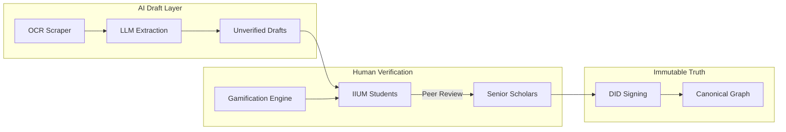

# Business Analysis & Strategic Assessment

> **Author**: Business Analyst Agent  
> **Date**: 2026-01-04  
> **Status**: Initial Assessment

---

## Executive Summary

This document provides a comprehensive business analysis of the **Al-Mizan Project** — a Tawhidic Knowledge Graph Framework addressing epistemological fragmentation in Islamic digital resources. The project is positioned at the intersection of **Islamic Knowledge Preservation**, **Graph Database Technology**, and **AI Readiness**, with significant potential for academic, research, and commercial applications.

---

## 1. My Role in This Project

### Primary Responsibilities

| Area | Scope | Status |
|------|-------|--------|
| **Requirements Analysis** | Stakeholder needs, functional specs | 🟡 Starting |
| **Business Process Modeling** | Value streams, workflow optimization | 🟡 Starting |
| **ROI & Feasibility Studies** | Cost-benefit, resource planning | 🔴 Not Started |
| **Stakeholder Management** | Engagement, communication plans | 🟡 Starting |
| **Success Metrics** | KPI definition, measurement frameworks | 🔴 Not Started |
| **Market Analysis** | Competitive landscape, positioning | 🔴 Not Started |

### Relationship with Other Agents



### Future Collaboration with Project Manager

Once the Project Manager agent joins the team, I will:
- Provide requirements documentation for sprint planning
- Support resource allocation decisions with data-driven analysis
- Deliver stakeholder communication materials
- Supply risk assessments and mitigation strategies
- Feed success metrics into project tracking systems

---

## 2. Project Business Context

### 2.1 Problem Statement

The Islamic digital ecosystem suffers from **"Epistemological Incongruence"**:

| Problem | Impact | Severity |
|---------|--------|----------|
| **Text Fragmentation** | Knowledge stored as isolated strings without relational context | 🔴 Critical |
| **Lost Isnad (Chain of Transmission)** | Digital quotes circulate without verifiable attribution | 🔴 Critical |
| **AI Hallucination Risk** | LLMs generate plausible but unverified theological rulings | 🔴 Critical |
| **Semantic Gap** | Keyword search fails to bridge conceptual relationships | 🟠 High |

### 2.2 Value Proposition

Al-Mizan transforms Islamic knowledge management from:

```
FROM: "Bag of Words" Retrieval Systems
  └── Text-based search
  └── No relational context
  └── No verification layer

TO: "Semantic Knowledge Graph" Framework
  └── Graph-based traversal
  └── Full relationship preservation
  └── Cryptographic verification ("Fitna Defense Protocol")
```

### 2.3 Strategic Alignment

| Business Objective | Technical Implementation | Alignment |
|-------------------|-------------------------|-----------|
| **Epistemological Certainty** | Rust backend (type safety) | ✅ Strong |
| **Tawhidic Knowledge Graph** | SurrealDB (multi-model graph) | ✅ Strong |
| **Scalable Architecture** | Clean Architecture + Docker | ✅ Strong |
| **Scholarly Governance** | Majlis al-Ulama integration | ✅ Strong |
| **Multi-Sided Platform** | B2B API + B2C Frontend | ⚠️ In Progress |

---

## 3. Stakeholder Analysis

### 3.1 Stakeholder Map



### 3.2 Stakeholder Profiles

| Stakeholder | Needs | Current Support | Priority |
|-------------|-------|-----------------|----------|
| **FYP Evaluators** | Demo, technical depth, documentation | 🟢 Good | P0 |
| **Academic Researchers** | Query API, data export, ontology reference | 🟡 Partial | P0 |
| **Islamic Scholars** | Verification interface, Isnad validation | 🔴 Missing | P1 |
| **Developers** | REST API, SDK, integration guides | 🟡 Partial | P1 |
| **EdTech B2B** | Licensing, SLA, support contracts | 🔴 Missing | P2 |

### 3.3 Engagement Strategy

| Phase | Focus | Activities |
|-------|-------|------------|
| **FYP 1** | Evaluators & Supervisors | Demo preparation, documentation polish |
| **FYP 2** | Researchers & Scholars | Beta testing, feedback loops |
| **Post-FYP** | B2B & General Users | API monetization, community building |

---

## 4. Requirements Inventory

### 4.1 Functional Requirements (Current State)

| ID | Requirement | Source | Status |
|----|-------------|--------|--------|
| FR-001 | Ingest Quranic morphology data | FYP Scope | ✅ Complete |
| FR-002 | Store Hadith with Isnad relationships | FYP Scope | ✅ Complete |
| FR-003 | REST API for graph traversal | FYP Scope | ✅ Complete |
| FR-004 | Sub-50ms query latency | Non-Functional | ✅ Verified |
| FR-005 | Interactive graph visualization | FYP Scope | ✅ Complete |
| FR-006 | Scholar verification interface | Phase 2 Roadmap | 🔴 Not Started |
| FR-007 | Gamified verification (Micro-Waqf) | Phase 2 Roadmap | 🔴 Not Started |
| FR-008 | Cryptographic node signing (DID) | Phase 2 Roadmap | 🔴 Not Started |

### 4.2 Gap Analysis

| Category | Documented | Implemented | Gap |
|----------|------------|-------------|-----|
| **API Endpoints** | 20+ | 20+ | ✅ None |
| **Data Model** | Schema defined | Schema deployed | ✅ None |
| **User Flows** | Partial | Prototype | 🟠 UX refinement needed |
| **Business Rules** | Implicit in code | **Documented (v1)** | ✅ Extracted from code |
| **Scholar Verification** | Roadmap only | None | 🔴 Phase 2 priority |

---

## 5. Business Rules Inventory

### 5.1 Epistemological Integrity (The "Fitna Defense")

| Rule ID | Name | Logic / Constraint | Enforcement |
|---------|------|--------------------|-------------|
| **BR-001** | **Immutability of Revelation** | `verse` and `hadith` nodes are `CONSTANT`. Cannot be modified after ingestion. | DB Schema (`ASSERT $value = 'CONSTANT'`) |
| **BR-002** | **Fabrication Guard** | Rulings cannot be derived from `Mawdu` (fabricated) Hadith. | DB Event (`prevent_mawdu_derivation`) |
| **BR-003** | **Source Dependency** | A source text (`verse`/`hadith`) cannot be deleted if a ruling depends on it. | DB Event (`prevent_source_deletion`) |
| **BR-004** | **Chronological Abrogation** | Abrogating verse (*Nasikh*) must be chronologically after abrogated (*Mansukh*). Cycles are forbidden. | DB Event & Rust Logic (`ChronologicalValidation`) |

### 5.2 Scholar Governance (The "Algorithmic Shura")

| Rule ID | Name | Logic / Constraint | Enforcement |
|---------|------|--------------------|-------------|
| **BR-010** | **Scholar Reputation** | Reputation is a bounded float `0.0` to `10.0`. | DB Schema |
| **BR-011** | **Three Strikes Law** | If `slashing_count >= 3`, scholar is permanently banned (`slashed`) and reputation reset to `0.0`. | DB Event (`auto_ban_byzantine_scholars`) |
| **BR-012** | **Ghost Scholar Defense** | Rulings from `Slashed` or `Suspended` scholars are automatically rejected/hidden. | Rust Middleware (`validate_scholar_integrity`) |
| **BR-013** | **Consensus Threshold** | A Global Ruling moves from `Pending` to `Probationary` when total signer reputation ≥ 20.0. | Rust Logic (`GlobalRuling::check_status`) |

### 5.3 Financial Compliance (Al-Mizan Standard)

| Rule ID | Name | Logic / Constraint | Enforcement |
|---------|------|--------------------|-------------|
| **BR-020** | **Prohibition of Riba** | Contracts with "compounding" late fees are flagged `HARAM`. | Rust Logic (`analyze_contract`) |
| **BR-021** | **Prohibition of Gharar** | `Murabaha` contracts with "variable" rates are flagged `WARNING`. | Rust Logic (`analyze_contract`) |
| **BR-022** | **Certification Tiers** | - **Gold**: Fixed-rate Murabaha<br>- **Silver**: General Compliance<br>- **Non-Standard**: Tawarruq (Discouraged) | Rust Logic (`check_standard`) |

### 5.4 Audit & Compliance

| Rule ID | Name | Logic / Constraint | Enforcement |
|---------|------|--------------------|-------------|
| **BR-030** | **Ruling Audit Trail** | Every create, update, or delete of a `fiqh_ruling` must be logged to `ruling_history`. | DB Event (`track_ruling_changes`) |
| **BR-031** | **Attribution** | Anonymous rulings are forbidden. Every ruling must link to a `scholar` record. | DB Schema (`ASSERT $value != NONE`) |

---

## 6. Business Process Models

### 6.1 Current Value Stream (Phase 1)



### 6.2 Future Value Stream (Phase 2+)



---

## 7. Risk Assessment

### 7.1 Strategic Risks

| Risk | Probability | Impact | Mitigation |
|------|-------------|--------|------------|
| **Scholar adoption resistance** | Medium | High | Early engagement, Sharia Board |
| **Data quality disputes** | Medium | High | Governance model, audit trails |
| **AI misuse of API** | Low | Critical | Rate limiting, usage monitoring |
| **Funding gap post-FYP** | High | Medium | Grant applications, B2B revenue |
| **Key person dependency** | Medium | High | Documentation, knowledge transfer |

### 7.2 Operational Risks

| Risk | Probability | Impact | Mitigation |
|------|-------------|--------|------------|
| **SurrealDB stability** | Low | High | Version pinning, backup strategy |
| **Performance degradation at scale** | Medium | Medium | Load testing, horizontal scaling |
| **Security breach** | Low | Critical | Air-gapped ingestion, no public writes |

---

## 8. Success Metrics Framework

### 8.1 FYP Phase KPIs

| Metric | Target | Current | Status |
|--------|--------|---------|--------|
| **API Endpoints Documented** | 100% | 100% | ✅ Met |
| **Graph Query Latency** | <50ms p99 | <10ms | ✅ Exceeded |
| **Data Coverage (Quran)** | 6,236 verses | 6,236 | ✅ Met |
| **Documentation Completeness** | 80% | ~60% | 🟠 In Progress |
| **Demo Readiness** | Polished | Functional | 🟠 Needs polish |

### 8.2 Post-FYP KPIs (Proposed)

| Metric | Target | Measurement Method |
|--------|--------|-------------------|
| **Verified Edges** | 5,000+ | Graph analytics |
| **Scholar Verifiers** | 40+ | User registry |
| **API Consumers** | 10+ integrations | API key issuance |
| **Query Volume** | 100K/month | Telemetry |
| **Accuracy Rate** | 99.9% | Audit sampling |

---

## 9. Recommendations

### 9.1 Immediate Priorities (This Week)

1. **Document Business Rules** — Extract implicit rules from Rust code into explicit specifications
2. **Create Stakeholder Communication Plan** — Prepare FYP evaluator briefing materials
3. **Define MVP Scope for Phase 2** — Prioritize Cyborg Isnad features

### 9.2 Short-Term (Next 2 Weeks)

1. **ROI Model** — Build financial projections for B2B API monetization
2. **User Story Backlog** — Convert requirements into actionable user stories
3. **Risk Register** — Formalize risk tracking with owners and deadlines

### 9.3 Long-Term (Post-FYP)

1. **Go-to-Market Strategy** — Define positioning for EdTech and Islamic Finance sectors
2. **Partnership Development** — Identify potential collaborators (universities, Islamic banks)
3. **Sustainability Model** — Explore grant funding, SaaS subscriptions, licensing

---

## 10. Integration Points

### With Technical Writing Agent

- Receive documentation requests for business-facing materials
- Provide business context for user guides
- Coordinate on glossary consistency

### With UI Agent

- Supply user personas for UX design
- Define user flow requirements
- Review UI against business objectives

### With DevOps Agent

- Communicate SLA requirements
- Request cost analysis for infrastructure decisions
- Define monitoring metrics aligned with business KPIs

### With Future Project Manager

- Deliver requirements artifacts for sprint planning
- Provide risk assessments for prioritization
- Support resource allocation with data

---

## 11. Summary

The Al-Mizan Project demonstrates strong technical foundations with clear strategic alignment. As the Business Analyst Agent, I will focus on:

1. **Bridging business vision and technical execution**
2. **Formalizing stakeholder engagement**
3. **Building measurement frameworks for success**
4. **Preparing for post-FYP commercialization**

My immediate focus will be supporting FYP deliverables while laying groundwork for Phase 2 business planning.

---

*This document is maintained by the Business Analyst Agent. Last updated: 2026-01-04T21:11:00+08:00*
