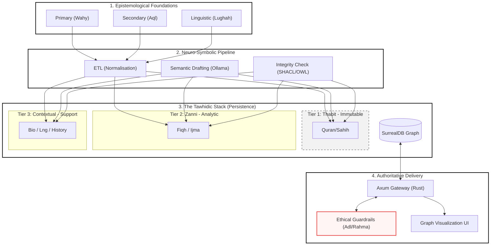
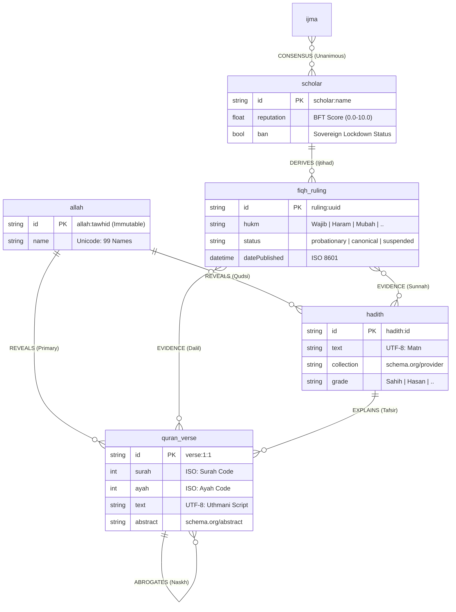
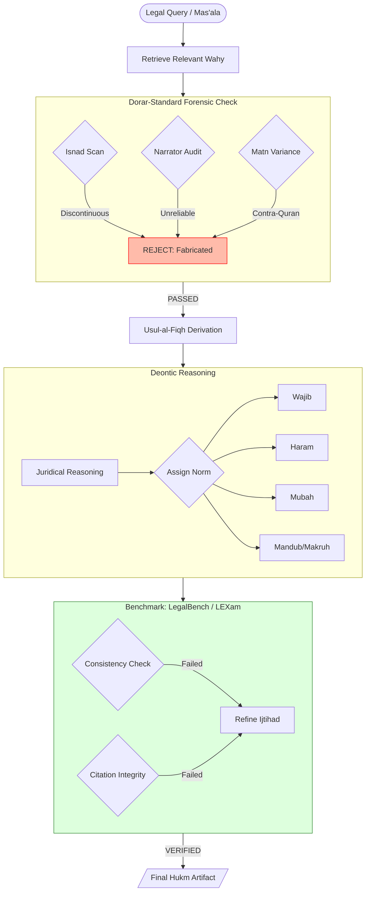
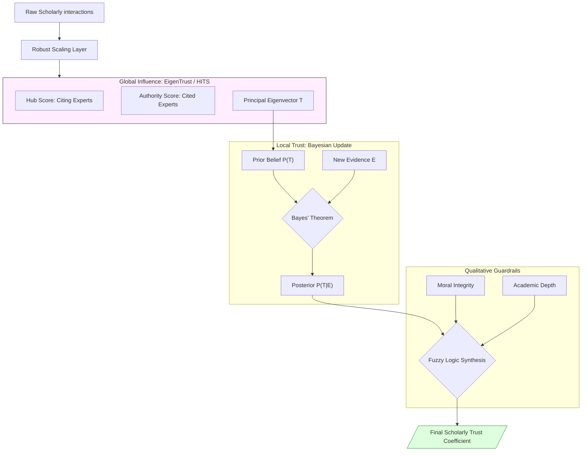
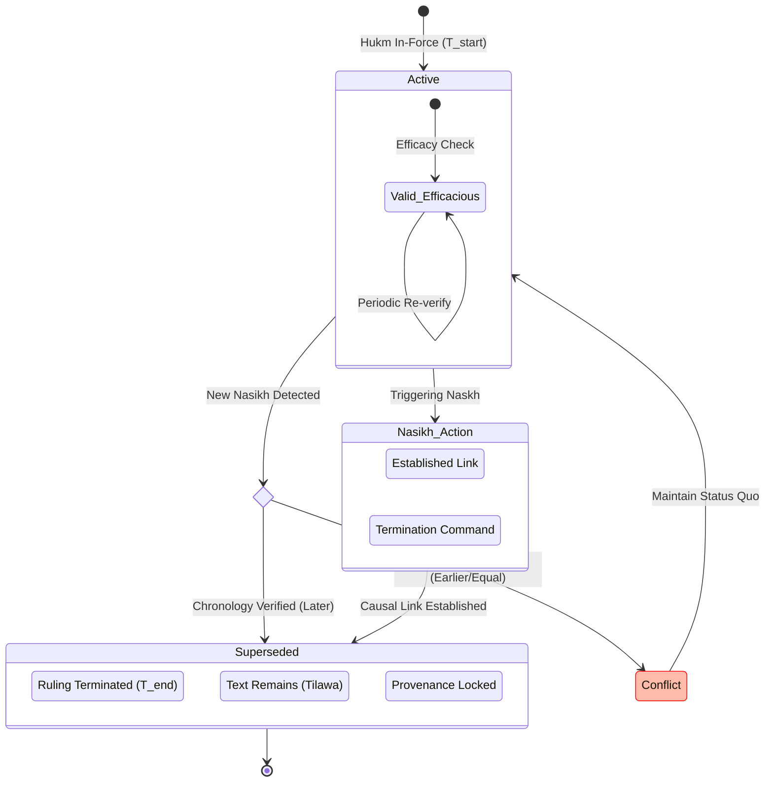

# Al-Mizan Charter: V1 - Foundations (The Epistemological Engine)

This volume specifies the core epistemological layers, data structures, and foundational logic that ensure the integrity of the Al-Mizan system.

---

## Phase 1: High-Level Ecosystem (The Tawhidic Stack)

> **Status:** 🟡 `DEV` | **Implemented in:** [`almizan-core`](file:///home/a/code/al-mizan-project/almizan-core)

A non-negotiable zero-trust architecture optimized for epistemological integrity.

---

## Phase 2: Physical SurrealDB Schema (Definitive ERD)

> **Status:** 🟢 `PROD` | **Implemented in:** [`database/schema`](file:///home/a/code/al-mizan-project/database/schema)

Strict `SCHEMAFULL` enforcement of nodes and relations with specific theological primitives.

---

## Phase 3: Istinbat (Legal Derivation) & Mawdu Defense

> **Status:** 🟡 `DEV` | **Implemented in:** [`domain/validation.rs`](file:///home/a/code/al-mizan-project/almizan-core/src/domain/validation.rs)

The strict logical flow for deriving rulings, including automated evidence validation.

---

## Phase 5: Trust Metric Algebra (Scoring Math)

> **Status:** 🟡 `DEV` | **Implemented in:** [`domain/opinion.rs`](file:///home/a/code/al-mizan-project/almizan-core/src/domain/opinion.rs)

How the system calculates the "Certainty Score" for scholarly evidence.

---

## Phase 11: Abrogation (Naskh) Logic State Machine

> **Status:** 🟡 `DEV` | **Implemented in:** [`domain/verse.rs`](file:///home/a/code/al-mizan-project/almizan-core/src/domain/verse.rs)

Ensuring theological consistency across revelation periods.

