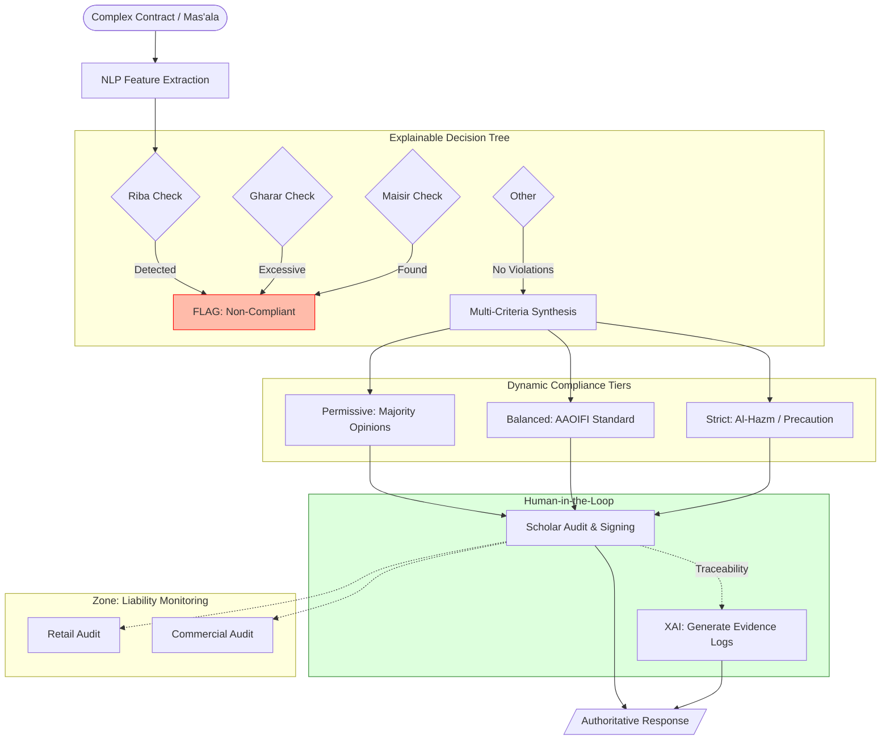
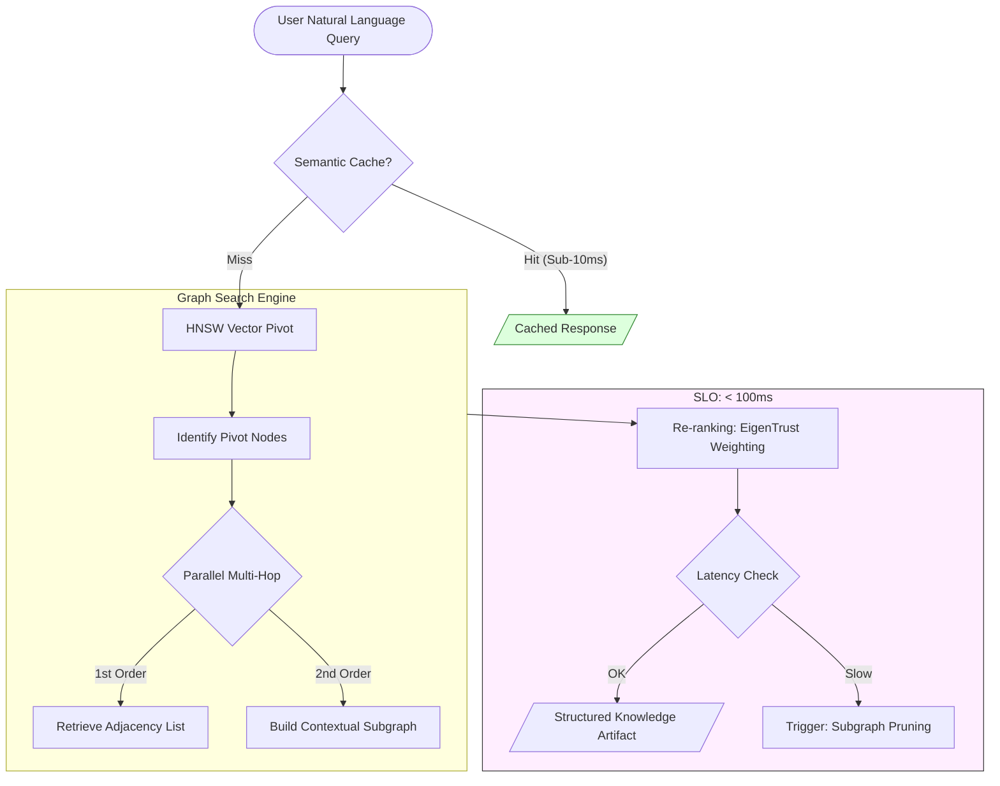
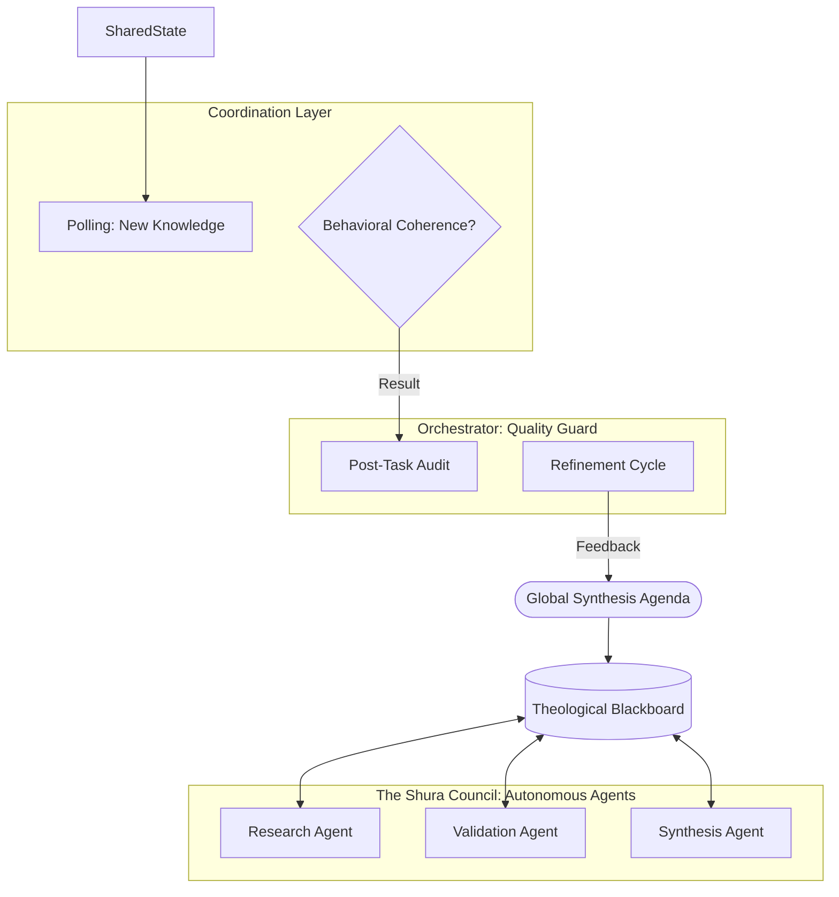
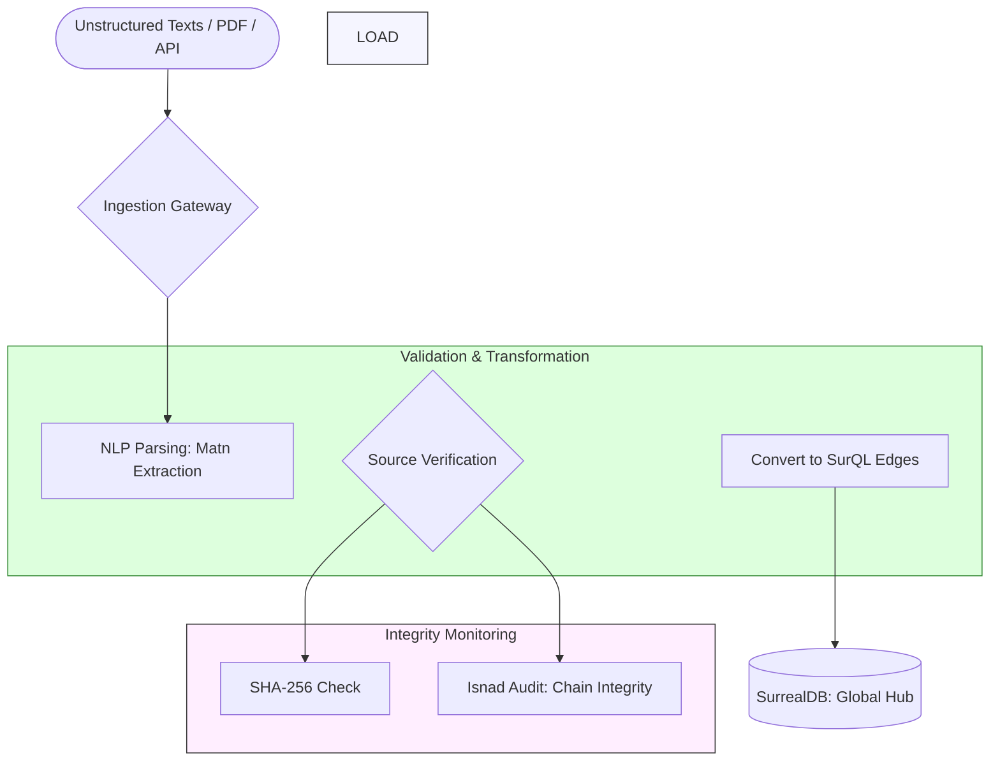
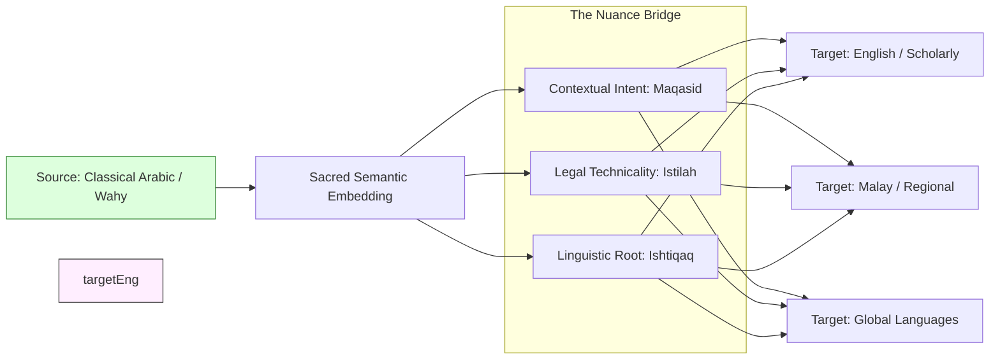

# Al-Mizan Charter: V2 - Intelligence (The Truth Factory)

This volume specifies the AI synthesis engines, knowledge retrieval lifecycles, and autonomous agent topologies that drive the system's analytical capabilities.

---

## Phase 4: Synthesis Engine: Score & Strategy

> **Status:** 🟡 `DEV` | **Implemented in:** [`api/v1/synthesis.rs`](file:///home/a/code/al-mizan-project/almizan-core/src/api/v1/synthesis.rs)

Advisory logic mapping strictness and seniority levels to final responses.



---

## Phase 7: Knowledge Retrieval Lifecycle (UI to DB)

> **Status:** 🟢 `PROD` | **Implemented in:** [`api/v1/graph.rs`](file:///home/a/code/al-mizan-project/almizan-core/src/api/v1/graph.rs)

The definitive journey of a query through the zero-trust gateway.



---

## Phase 16: Agent Collaboration Topology

> **Status:** 🟡 `DEV` | **Implemented in:** [`api/v1/agents.rs`](file:///home/a/code/al-mizan-project/almizan-core/src/api/v1/agents.rs)

The "Blackboard" architecture for multi-agent theological synthesis.



---

## Phase 17: Ingestion Pipeline (The Truth Factory)

> **Status:** 🟡 `DEV` | **Implemented in:** [`ingestion/`](file:///home/a/code/al-mizan-project/almizan-core/src/ingestion)

High-throughput processing of scholarly texts and revelation data.

### Data Lineage: The Lifecycle of a Verse
Tracing the path from Raw Text to Retrieval-Ready Vector.

```mermaid
flowchart LR
    Scan[Crawler: Scan PDFs] --> OCR[OCR: Extract Text]
    OCR --> Clean[Normalizer: Remove Diacritics]
    Clean --> Meta[Enrichment: Add Metadata (Surah/Ayah)]
    Meta --> Chunk[Chunking: Semantic Split]
    Chunk --> Embed[Embedding: Vectorize (OpenAI/Cohere)]
    Embed --> Upsert[SurrealDB: Upsert Vector Node]
    Upsert --> Index[HNSW Index: Ready for Search]
```



---

## Phase 18: API Topology: Endpoint Tiers

> **Status:** 🟡 `DEV` | **Implemented in:** [`api/`](file:///home/a/code/al-mizan-project/almizan-core/src/api)

Definitive distribution tiers for public and private access.

```mermaid
flowchart TD
    %% GLOBAL STANDARD: Kong/Envoy Gateway (50k+ RPS)
    %% MODEL: gRPC Internal Mesh + GraphQL Public Tier

    Entry --> Auth
    
    subgraph SECURITY_OWASP [Edge Hardening]
        direction TB
        Auth[mTLS / JWT Auth]
        Headers[Security Headers: HSTS/CSP]
        WAF[Web Application Firewall]
    end
    
    Auth & Headers & WAF --> Tier1 & Tier2 & Tier3
    
    subgraph THROTTLING [Distribution Tiers: Token Bucket]
        direction LR
        Tier1[Scholar: Unlimited Burst]
        Tier2[Public: 100 req/min]
        Tier3[Corporate: High-Volume SLA]
    end
    
    Tier1 & Tier2 & Tier3 --> gRPC & GQL & REST
    
    subgraph PROTOCOLS [Omni-Protocol Access]
        direction TB
        gRPC[Internal: gRPC / Protobuf - 25ms]
        GQL[Public: GraphQL / JSON - 180ms]
        REST[Legacy: REST / JSON - 250ms]
    end
    
    subgraph BACKEND [The Al-Mizan Core]
        gRPC --> Mesh[Service Mesh: Istio/Linkerd]
        GQL & REST --> App[Backend Engine]
    end

---

## Phase 23: Bias Monitoring & "Adl" (Justice) Guardrails

> **Status:** ⚪ `CONC` | **Implemented in:** [`domain/validation.rs`](file:///home/a/code/al-mizan-project/almizan-core/src/domain/validation.rs) (Bias Hooks)

Continuous monitoring for AI "Fitna" (hallucinations) and theological bias.

```mermaid
flowchart TB
    %% GLOBAL STANDARD: NIST AI 600-1 (Generative AI Governance)
    %% MODEL: Adversarial Red-Teaming + Theological Validation

    Output[/Candidate LLM Response/] --> Monitor{Adl Guardrail Engine}
    
    subgraph BIAS_DETECTION [Theological Red-Teaming]
        direction TB
        Hallucination[Hallucination Check: Wahy Alignment]
        Bias[Bias Check: Sectarian / Extreme Skew]
        Safety[Safety Check: Ethical Boundaries]
    end
    
    Monitor --> Hallucination & Bias & Safety
    
    Hallucination & Bias & Safety -- Threshold Met --> Approve[Final Authoritative Hukm]
    Hallucination & Bias & Safety -- Violation --> Quarantine[Isolate Response & Flag for Review]
    
    Quarantine --> Scholar[Human Scholar Audit]
    Scholar -- Corrected --> Approve
```

---

## Phase 24: Multilingual Semantics Bridge

> **Status:** ⚪ `CONC` | **Implemented in:** [`ingestion/semantics.rs`](file:///home/a/code/al-mizan-project/almizan-core/src/ingestion/semantics.rs)

Preserving sacred nuances across linguistic transitions (Arabic to Global Languages).


```
