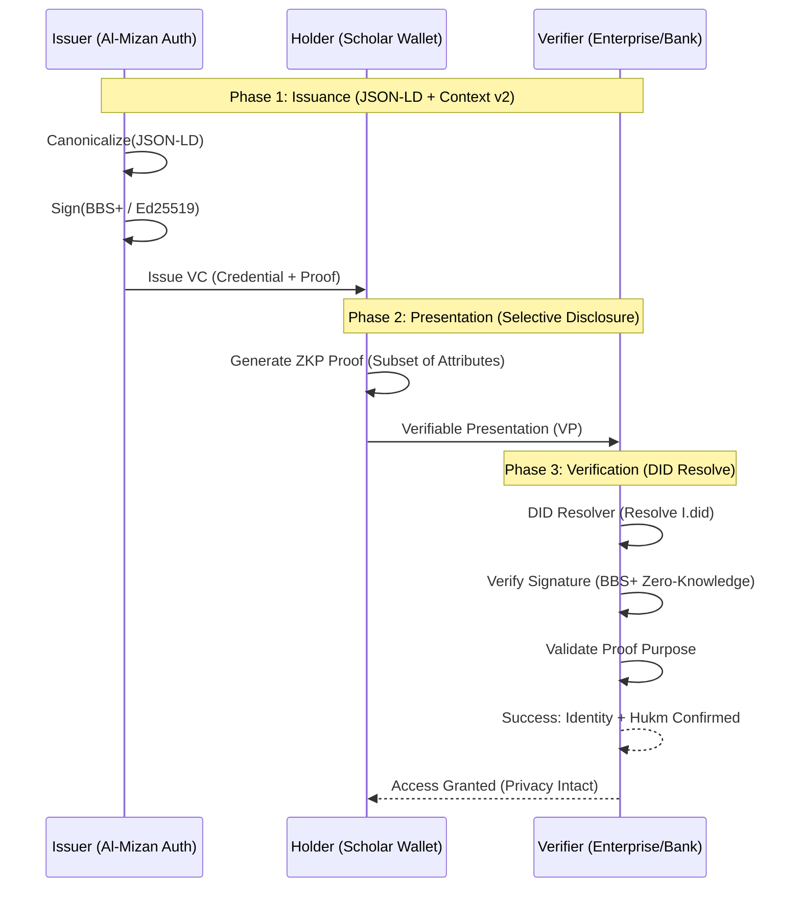
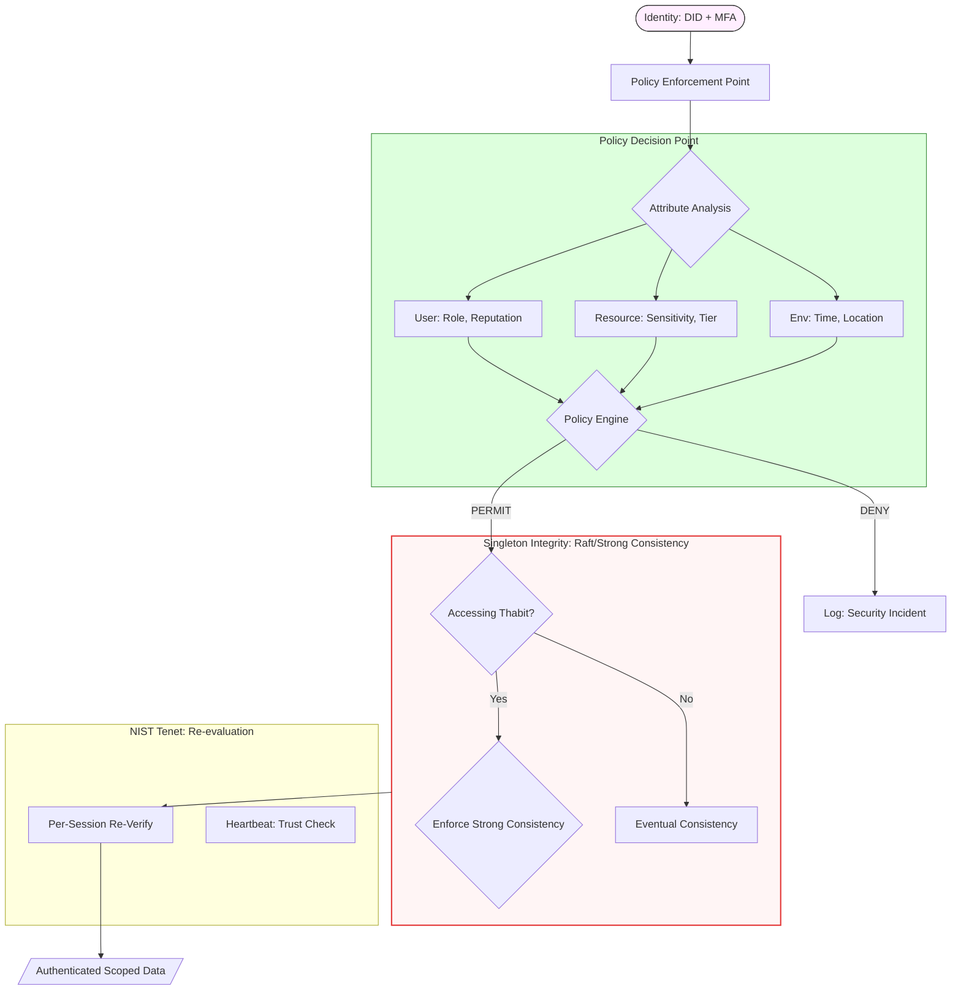
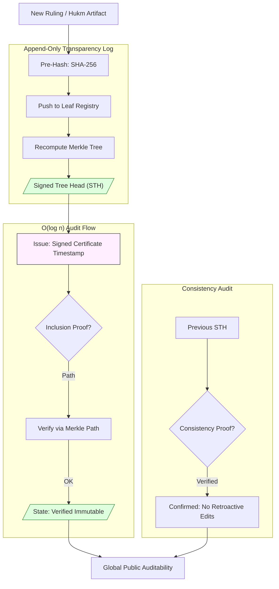
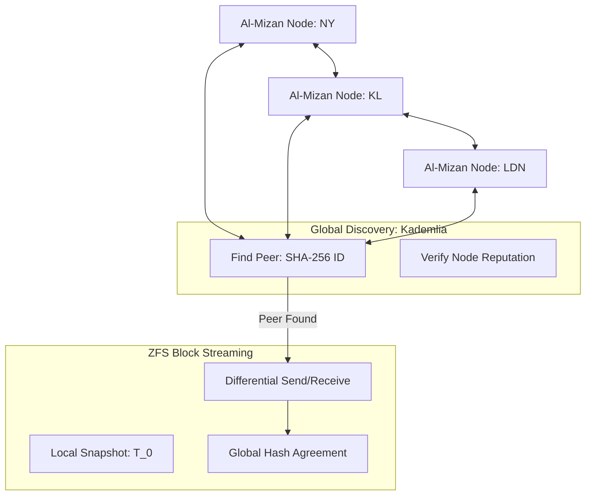
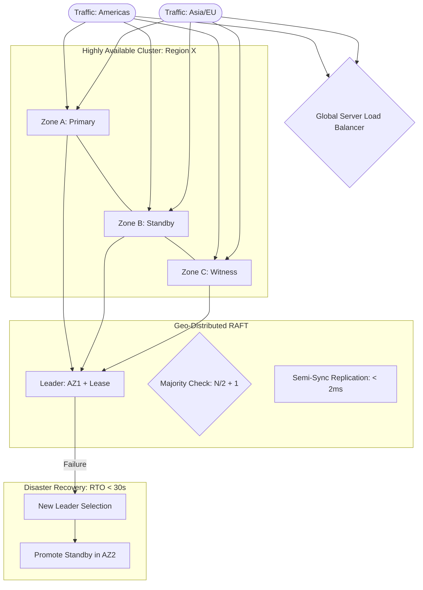
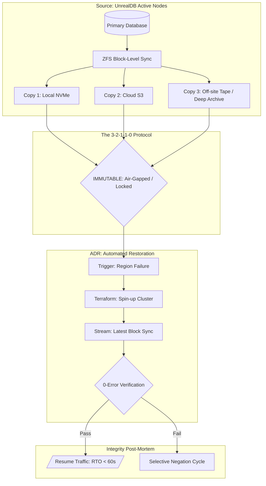

# Al-Mizan Charter: V3 - Operations (Infrastructure & Defense)

This volume specifies the security protocols, infrastructure high-availability, audit trails, and disaster recovery state machines that ensure the system's operational sovereignty.

---

## Phase 6: Enterprise Certification & VC Flow (W3C)

> **Status:** 🟡 `DEV` | **Implemented in:** [`enterprise/`](file:///home/a/code/al-mizan-project/almizan-core/src/enterprise)

The process of issuing Verifiable Credentials for Shariah-compliant contracts.



---

## Phase 8: Security & Scope Authentication

> **Status:** 🟢 `PROD` | **Implemented in:** [`api/auth.rs`](file:///home/a/code/al-mizan-project/almizan-core/src/api/auth.rs)

Definitive Role-Based Access Control (RBAC) mapping.



---

## Phase 12: Audit & Liability Trail (ruling_history)

> **Status:** 🟡 `DEV` | **Implemented in:** [`domain/event.rs`](file:///home/a/code/al-mizan-project/almizan-core/src/domain/event.rs)

A complete, granular history of all interpretive data changes.



---

## Phase 13: Network Federation & Snapshots

> **Status:** ⚪ `CONC` | **Implemented in:** [Federation Strategy]

Global synchronization for decentralized Al-Mizan nodes.



---

## Phase 14: High-Availability Zone Map

> **Status:** 🟡 `DEV` | **Implemented in:** [Infrastructure Config]

Definitive zero-downtime architecture for mission-critical regions.



---

## Phase 19: Backup & Disaster Recovery Logic

> **Status:** 🟢 `PROD` | **Implemented in:** [Ops/Provisioning]

The 3-2-1-1-0 backup rule for theological data protection.



---

## Phase 20: Blue-Green Switch State Machine

> **Status:** 🟡 `DEV` | **Implemented in:** [Infrastructure/Deployment]

Zero-downtime deployment for the Al-Mizan Core.

```mermaid
stateDiagram-v2
    %% GLOBAL STANDARD: Envoy/HAProxy Weight Shifting
    %% MODEL: Shadow Mirroring + Active Draining

    [*] --> Idle: Version Blue (Production)
    
    state STAGING_GREEN {
        direction TB
        Provision: Terraform Cluster
        Deploy: almizan-core v_next
        Validation: Health Checks + AI Audit
    }
    
    Idle --> STAGING_GREEN: Prepare Release
    
    state SWITCH_LOGIC {
        direction LR
        Mirror: Parallel Traffic (Shadow)
        Envoy: Shift Traffic Weight (0% -> 100%)
        Drain: Kill Blue Connections
    }
    
    STAGING_GREEN --> Mirror: Validation Passed
    Mirror --> Compare: Shadow Traffic Match
    Compare --> Envoy: Promote Green
    
    subgraph MONITORING [Post-Switch: DORA Guard]
        direction TB
        Error{CFR > 5%?}
        Latency{p99 > 200ms?}
        Rollback[State: Auto-Rollback to Blue]
        
        Error & Latency -- YES --> Rollback
    end
    
    Drain --> Error & Latency
    
    subgraph STATE_LIVE [State: Live Stability]
        Stable[/"Production: Version Green"/]
    end
    
    Error & Latency -- Clean --> Stable
    
    style STAGING_GREEN fill:#eef,stroke:#333
    style SWITCH_LOGIC fill:#dfd,stroke:#383
    style STATE_LIVE fill:#dfd,stroke:#383
```
