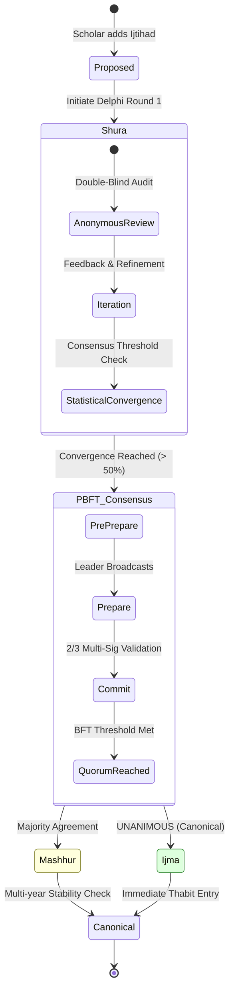

# Al-Mizan Charter: V4 - Governance (Scholarly Integrity)

This volume specifies the mechanisms for scholarly consensus, reputation management, and the decentralized governance of the Al-Mizan project.

---

## Phase 9: Scholarly Consensus (Ijma) Lifecycle

> **Status:** 🟡 `DEV` | **Implemented in:** [`domain/authority.rs`](file:///home/a/code/al-mizan-project/almizan-core/src/domain/authority.rs)

How legal opinions progress toward canonical consensus.



---

## Phase 10: Stake & Slash Governance (BFT)

> **Status:** 🟡 `DEV` | **Implemented in:** [`domain/scholar.rs`](file:///home/a/code/al-mizan-project/almizan-core/src/domain/scholar.rs)

Byzantine Fault Tolerance for the scholarly community.

```mermaid
flowchart TD
    %% GLOBAL STANDARD: Casper FFG & Tendermint Slashing
    %% PENALTY: Correlation Scaling & Tombstoning

    Trigger[Audit Event: Malicious Act] --> Detect{Infraction Type?}
    
    subgraph CRITICAL_PENALTY [Equivocation / Fabrication]
        direction TB
        DoubleSign[Double-Signing / Conflict]
        Mawdu[Mawdu Fabrication]
        Tombstone[/TOMBSTONED: Permanent Ban/]
    end
    
    subgraph LIVENESS_PENALTY [Negligence / Downtime]
        direction TB
        MissedReview[Missed Peer Audit]
        SlowResp[High Latency Response]
        Jail[/JAILED: Temporary Suspension/]
    end
    
    Detect -- Severe --> DoubleSign & Mawdu
    Detect -- Minor --> MissedReview & SlowResp
    
    subgraph SCALE_LOGIC [Correlation Scaling]
        CheckCollusion{Coordinated Attack?}
        CheckCollusion -- Yes --> Heavy[Slash: 50% Rep + Stake]
        CheckCollusion -- No --> Light[Slash: 5% Rep + Stake]
    end
    
    Tombstone & Jail --> SCALE_LOGIC
    
    subgraph RECOVERY [Slashing Recovery]
        Jail --> Appeal[Appeal Process]
        Appeal -- Approved --> Unjail[Status: Active]
    end
    
    SCALE_LOGIC --> Apply[/Apply Reputation Burn/]
    
    style Tombstone fill:#fba,stroke:#f00
    style Jail fill:#ffd,stroke:#883
    style Apply fill:#dfd,stroke:#383

---

## Phase 22: Scholarly Onboarding & Identity Lifecycle

> **Status:** ⚪ `CONC` | **Implemented in:** [`domain/scholar.rs`](file:///home/a/code/al-mizan-project/almizan-core/src/domain/scholar.rs) (Identity Models)

The ritual and technical process for a human Scholar to become an authoritative Signing Node.

```mermaid
sequenceDiagram
    %% GLOBAL STANDARD: KYC/KYB for Religious Institutions
    %% MODEL: Peer-Verification + Reputation Staking

    participant S as Candidate Scholar
    participant V as Verification Council (Existing Shura)
    participant B as BFT Ledger (Identity Registry)

    S->>V: Submit Credentials (Ijazah / Bi-lingual Identity)
    V->>V: Background Audit (Scientific & Moral Integrity)
    
    alt Verification Passed
        V->>S: Issue Cryptographic Keypair (Ed25519)
        S->>B: Register Public Key + Stake (Reputation Bond)
        B->>B: Activate Node Status: PROBATIONARY
        Note over S,B: Multi-month Peer Observation Period
        B->>B: State Transition: ACTIVE_VOTING_NODE
    else Verification Failed
        V->>S: Denial: Deficiency in Isnad/Adl
    end
```
```
