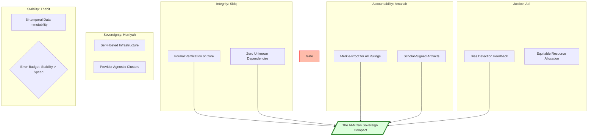

# Al-Mizan Charter: V5 - Sovereignty (The Compact)

This volume specifies the final operational commitments, sacred compacts, and hardware-level security measures that guarantee the project's independence and sovereignty.

---

## Phase 21: Operational Commitments (The Compact)

> **Status:** 🟡 `DEV` | **Implemented in:** [`docs/COMPACT.md`](file:///home/a/code/al-mizan-project/docs/COMPACT.md)

The definitive SLA and ethical binding for all sovereign Al-Mizan nodes.

