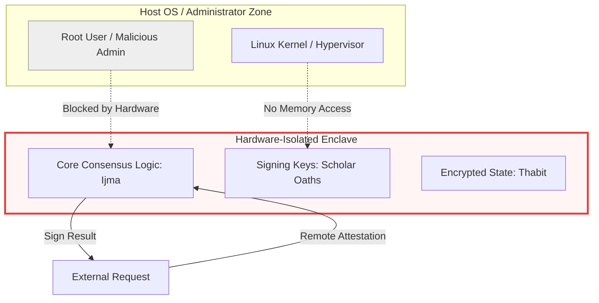

# Al-Mizan Charter: V5 - Sovereignty (The Compact)

This volume specifies the final operational commitments, sacred compacts, and hardware-level security measures that guarantee the project's independence and sovereignty.

---

## Phase 21: Operational Commitments (The Compact)

> **Status:** 🟡 `DEV` | **Implemented in:** [`docs/COMPACT.md`](file:///home/a/code/al-mizan-project/docs/COMPACT.md)

The definitive SLA and ethical binding for all sovereign Al-Mizan nodes.

```mermaid
flowchart TD
    %% GLOBAL STANDARD: Rome Call for AI Ethics & IEEE 7000
    %% MODEL: 99.99% Availability + 100% Traceability

    subgraph PILLAR_1 [Integrity: Sidq]
        C1[Formal Verification of Core]
        C2[Zero Unknown Dependencies]
    end
    
    subgraph PILLAR_2 [Accountability: Amanah]
        C3[Merkle-Proof for All Rulings]
        C4[Scholar-Signed Artifacts]
    end
    
    subgraph PILLAR_3 [Justice: Adl]
        C5[Bias Detection Feedback]
        C6[Equitable Resource Allocation]
    end
    
    subgraph PILLAR_4 [Sovereignty: Hurriyah]
        C7[Self-Hosted Infrastructure]
        C8[Provider Agnostic Clusters]
    end
    
    subgraph PILLAR_5 [Stability: Thabit]
        C9[Bi-temporal Data Immutability]
        ErrorBudget{Error Budget: Stability > Speed}
    end
    
    C1 & C2 & C3 & C4 & C5 --> COMPACT[/"The Al-Mizan Sovereign Compact"/]
    
    style COMPACT fill:#dfd,stroke:#383,stroke-width:4px
    style Gate fill:#fba,stroke:#f00


### Strategic Technology Radar (Sovereignty Edition)
Mapping dependencies by their alignment with "Hurriyah" (Independence).

```mermaid
quadrantChart
    title Sovereignty Radar
    x-axis Commodity --> Sovereign
    y-axis Low Maturity --> High Maturity
    quadrant-1 Core (Adopt)
    quadrant-2 Risk (Assess)
    quadrant-3 Fringe (Hold)
    quadrant-4 Utility (Trial)
    
    "Rust (Core Logic)": [0.9, 0.9]
    "SurrealDB (Knowledge)": [0.8, 0.6]
    "Hyperledger Indy (DID)": [0.7, 0.8]
    "Askama (UI)": [0.9, 0.7]
    
    "OpenAI (Vectors)": [0.1, 0.9]
    "AWS/Azure": [0.05, 0.9]
    "Cloudflare": [0.2, 0.8]
    
    "Intel SGX": [0.7, 0.5]
    "Local LLMs (Llama)": [0.8, 0.4]
```

---


## Phase 25: Sovereign Compute (Trusted Execution Environments)

> **Status:** ⚪ `CONC` | **Implemented in:** [`infra/tee/`](file:///home/a/code/al-mizan-project/infra/tee) (Secure Enclaves)

Hardware-level isolation (Intel SGX / AMD SEV) to protect core consensus logic from administrative overreach.


```
