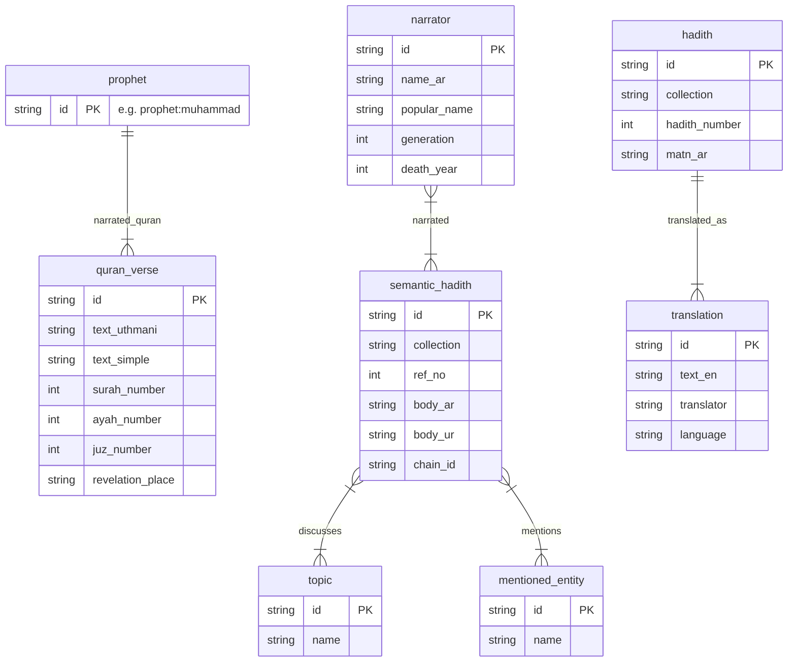
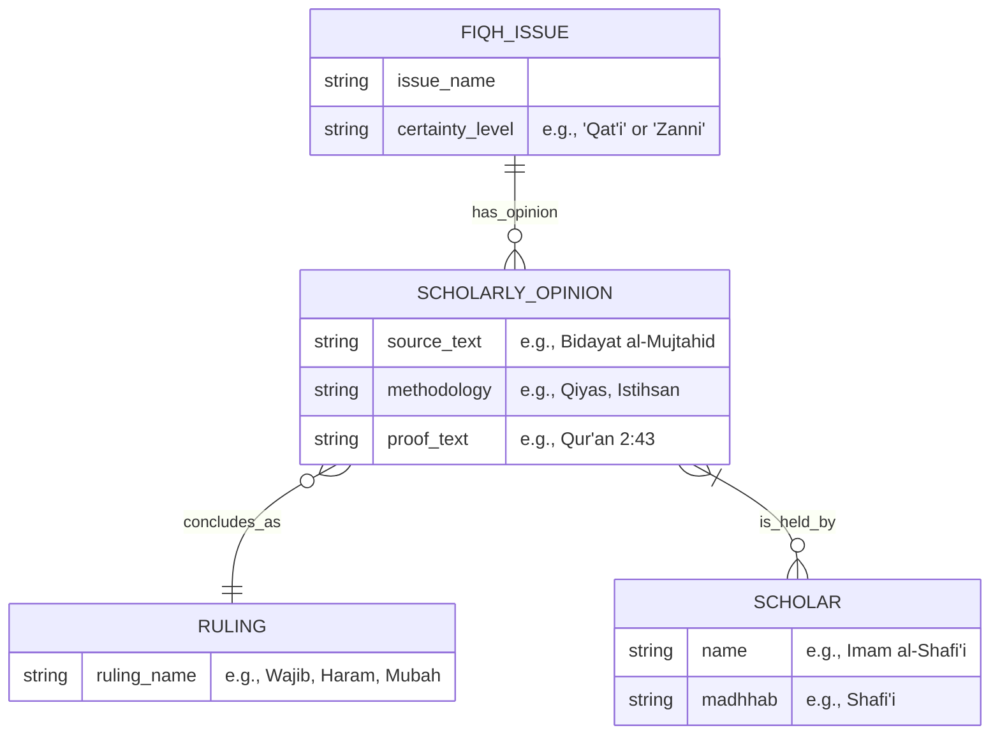

# Database Schema Documentation

## Executive Summary
The Al-Mizan database is implemented in **SurrealDB**, utilizing a graph-relational model. The schema is loosely defined ("schema-on-write") but follows a consistent structure enforced by the ETL pipeline. The core of the dataset connects Islamic texts (Quran and Hadith) to their metadata (Narrators, Topics, Mentioned Entities) via graph edges.

## Entity-Relationship Diagram (ERD)

## Advanced Modeling: Ikhtilaf (Scholarly Disagreement)

This section details the target schema design for checking scholarly disagreements, distinguishing between *Qat'i* (Definitive) and *Zanni* (Speculative) issues.

### Design Notes
*   **Edge as Entity**: `SCHOLARLY_OPINION` essentially acts as a hyper-edge or intermediate node that connects an issue, a ruling, and a scholar, carrying rich metadata (methodology, evidence).
*   **Query Pattern**:
    *   **Qat'i Issue**: Single opinion traversal.
    *   **Zanni Issue**: Multiple opinion traversals, allowing for a graph of diverging views.

## Table Definitions

### Core Texts

#### `quran_verse`
Represents a single verse (Ayah) of the Quran.
- **Primary Key**: `quran_verse:<surah_id>_<ayah_id>` (e.g., `quran_verse:1_1`)
- **Fields**:
    - `text_uthmani`: The Arabic text in Uthmani script.
    - `text_simple`: Simplified Arabic text for search.
    - `surah_number`, `ayah_number`, `juz_number`: Location coordinates.
    - `revelation_place`: 'Makkah' or 'Madinah'.

#### `semantic_hadith`
Represents a Hadith from the semantic corpus (e.g., Ibn Majah).
- **Primary Key**: `semantic_hadith:<ref_id>` (e.g., `semantic_hadith:IM_HD0001`)
- **Fields**:
    - `collection`: Name of the collection (e.g., "ibn_majah").
    - `body_ar`: Arabic text of the Hadith body.
    - `chain_id`: Reference identifier for the narrator chain (Isnad).

#### `hadith`
Represents a Hadith from specific collections like 40 Nawawi.
- **Primary Key**: `hadith:<slug>` (e.g., `hadith:nawawi_1`)
- **Fields**:
    - `matn_ar`: The text of the Hadith.
    - `collection`: Collection name.

### Metadata & Graph Nodes

#### `narrator`
Represents a narrator in a Hadith chain of transmission (Isnad).
- **Primary Key**: `narrator:<narrator_id>` (e.g., `narrator:HN00004`)
- **Fields**:
    - `name_ar`: Full Arabic name.
    - `popular_name`: Commonly known name.
    - `generation`: Generational tier (Tabaqat).

#### `topic`
Thematic tags applied to Hadiths.
- **Primary Key**: `topic:<Name>`
- **Fields**: `name`.

#### `mentioned_entity`
People, places, or concepts explicitly mentioned within the text.
- **Primary Key**: `mentioned_entity:<Name>`
- **Fields**: `name`.

## Relationships (Edges)

- **`narrated_quran`**: Links `prophet:muhammad` to `quran_verse`.
- **`narrated`**: Links `narrator` nodes to `semantic_hadith` nodes, representing the chain of transmission.
- **`discusses`**: Links `semantic_hadith` to `topic`, indicating the subject matter.
- **`mentions`**: Links `semantic_hadith` to `mentioned_entity`, indicating named entity recognition results.
- **`translated_as`**: Links `hadith` to `translation`.
