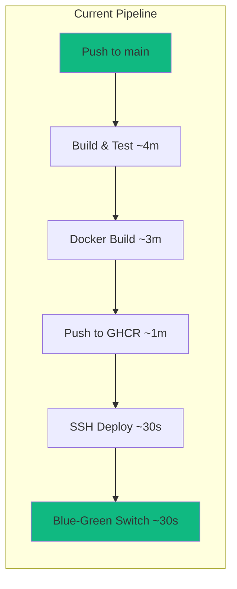
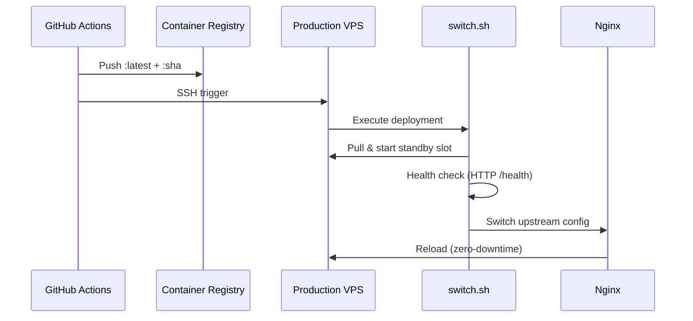
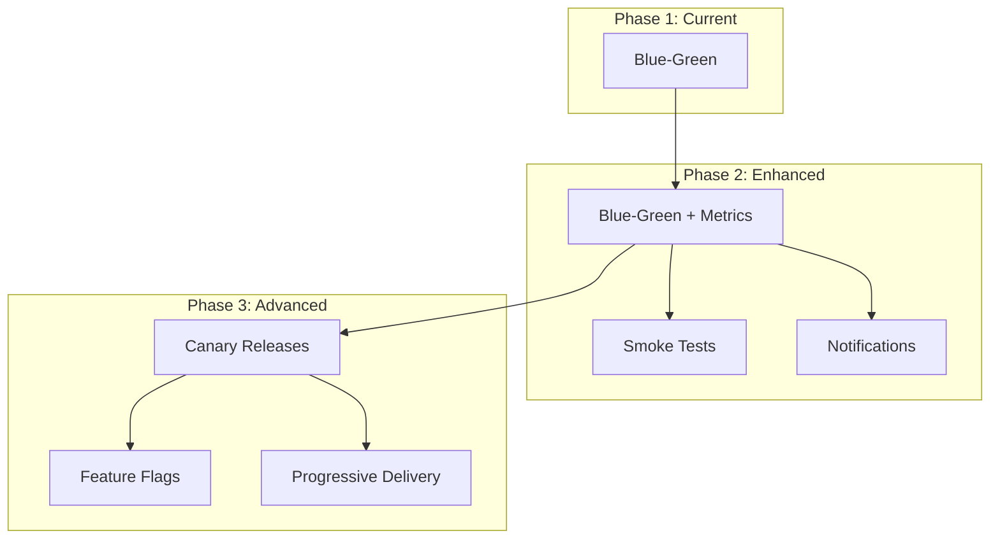

# Deployment Engineering Analysis

> **Author**: Deployment Engineering Agent  
> **Date**: 2026-01-05  
> **Status**: Initial Assessment

---

## Executive Summary

This document provides a specialized deployment engineering analysis of the Al-Mizan project, focusing on CI/CD pipeline optimization, release automation, and deployment strategy excellence. The project has **solid foundational infrastructure** established by the DevOps team, with opportunities for advanced optimization.

---

## 1. My Role in This Project

### Primary Focus Areas

| Area | Scope | Current State |
|------|-------|---------------|
| **CI/CD Pipeline Optimization** | Build speed, caching, parallelization | 🟢 Good |
| **Release Automation** | Tagging, changelog, semantic versioning | 🟡 Partial |
| **Deployment Strategies** | Blue-green, canary, feature flags | 🟢 Good (Blue-Green) |
| **Artifact Management** | Container registry, versioning | 🟢 Good |
| **Pipeline Security** | SAST, dependency scanning | 🟢 Good |
| **Deployment Metrics** | DORA metrics, lead time | 🔴 Not tracked |

### Relationship with DevOps Agent

The DevOps Engineer has established:
- ✅ Infrastructure foundation (Docker, Nginx, SurrealDB)
- ✅ Blue-green deployment (`switch.sh`)
- ✅ Backup/restore procedures
- ✅ Basic CI/CD pipelines

I will focus on:
- 🎯 Pipeline performance optimization
- 🎯 Advanced deployment patterns (canary, progressive)
- 🎯 Deployment velocity metrics
- 🎯 Release orchestration automation

---

## 2. Current CI/CD Pipeline Assessment

### 2.1 GitHub Actions Workflows

| Workflow | Purpose | Grade | Notes |
|----------|---------|-------|-------|
| `backend.yml` | Build, test, lint, audit | **A** | Well-structured, cached |
| `deploy.yml` | Build image, push to GHCR, deploy | **B** | Missing deployment metrics |
| `pages.yml` | Docs deployment | **A** | Simple and effective |

### 2.2 Pipeline Metrics (Current Baseline)



| Metric | Current | Target |
|--------|---------|--------|
| **Lead Time** (commit → prod) | ~9 minutes | <5 minutes |
| **Deployment Frequency** | Manual/Push | >10/day capability |
| **Change Failure Rate** | Unknown | <5% |
| **MTTR** | Unknown | <30 minutes |

### 2.3 Pipeline Strengths

1. **Cargo Caching** - Uses `actions/cache@v4` for Cargo registry
2. **Multi-stage Docker** - `cargo-chef` for optimal layer caching
3. **Security Scanning** - `cargo audit` in CI
4. **Quality Gates** - clippy, rustfmt, tests run on every PR
5. **Blue-Green Deploy** - Zero-downtime switching

### 2.4 Pipeline Gaps

| Gap | Impact | Priority |
|-----|--------|----------|
| **No deployment metrics** | Can't measure DORA metrics | P1 |
| **No GitHub Environments** | No deployment protection rules | P1 |
| **No release tags** | Manual version tracking | P2 |
| **No canary capability** | All-or-nothing deployments | P2 |
| **ETL not in CI** | Data pipeline changes untested | P2 |
| **No integration tests** | API changes may break prod | P2 |

---

## 3. Deployment Strategy Assessment

### 3.1 Current Blue-Green Implementation



**Strengths:**
- ✅ Health checks before traffic switch
- ✅ Automatic rollback on health failure
- ✅ Hot standby for instant rollback
- ✅ Dynamic Nginx container discovery

**Gaps:**
- ❌ No pre-deployment smoke tests
- ❌ No post-deployment validation
- ❌ No deployment notifications (Slack/Discord)
- ❌ No gradual traffic shifting

### 3.2 Recommended Deployment Evolution



---

## 4. Artifact Management Assessment

### 4.1 Container Registry (GHCR)

| Aspect | Status | Notes |
|--------|--------|-------|
| Registry | GHCR | ✅ Integrated with GitHub |
| Image Tags | `latest` + `sha-xxxxx` | ✅ Good |
| Retention | Default | ⚠️ May need cleanup policy |
| Scanning | None | ❌ Missing vulnerability scan |

### 4.2 Versioning Strategy

**Current:** No semantic versioning
**Recommended:** Automated release tagging

```yaml
# Proposed release-please integration
- uses: google-github-actions/release-please-action@v4
  with:
    release-type: rust
    package-name: almizan-core
```

---

## 5. Immediate Action Items

### Phase 1: Metrics & Visibility (This Sprint)

- [ ] Add deployment timestamps to logs
- [ ] Create deployment tracking mechanism
- [ ] Add GitHub Deployment Environments
- [ ] Configure deployment status badges

### Phase 2: Enhanced Automation (Next Sprint)

- [ ] Implement automated release tagging
- [ ] Add slack/discord deployment notifications
- [ ] Create rollback trigger automation
- [ ] Add post-deployment health verification

### Phase 3: Advanced Strategies (Future)

- [ ] Design canary release architecture
- [ ] Evaluate feature flag solutions
- [ ] Implement progressive delivery
- [ ] Add chaos engineering tests

---

## 6. Pipeline Optimization Opportunities

### Build Time Reduction

| Optimization | Potential Savings | Effort |
|-------------|-------------------|--------|
| Docker BuildKit cache | 30-40% | Low |
| Parallel job execution | 20-30% | Low |
| Selective builds (path filter refined) | Variable | Low |
| Pre-built base images | 10-20% | Medium |

### Recommended Pipeline Architecture

```yaml
# Proposed optimized workflow structure
jobs:
  # Fast feedback loop
  lint:          # <30s - fails fast
  test:          # ~2m - unit tests only
  
  # Quality gates (parallel)
  security:      # cargo audit
  clippy:        # lint checks
  
  # Build & Deploy
  build:         # docker build with BuildKit
    needs: [lint, test]
  deploy:        # blue-green switch
    needs: [build]
    environment: production
```

---

## 7. Integration with Team

### Collaboration Points

| Agent | Integration |
|-------|-------------|
| **DevOps Engineer** | Infrastructure coordination |
| **Backend Developer** | Build config, test setup |
| **QA Expert** | Test automation in pipelines |
| **Database Admin** | Migration deployment |
| **SRE Engineer** | Monitoring integration |

---

## 8. Success Metrics

| Metric | Current | 30-Day Target | 90-Day Target |
|--------|---------|---------------|---------------|
| Lead Time | ~9 min | <5 min | <3 min |
| Deploy Frequency | Ad-hoc | On-demand | 10+/day |
| Change Failure Rate | Unknown | <10% | <5% |
| MTTR | Unknown | <30 min | <15 min |
| Rollback Time | ~1 min | <30s | <15s |

---

*This document is maintained by the Deployment Engineering Agent. Last updated: 2026-01-05T00:07:21+08:00*
