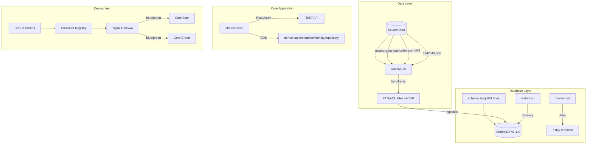
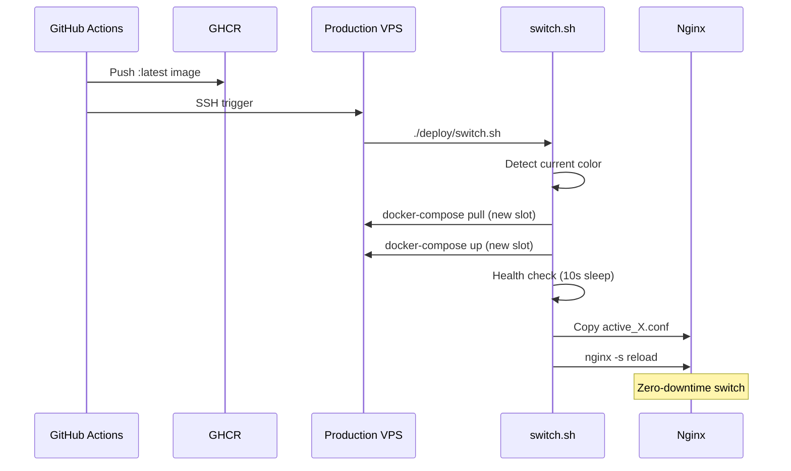

# DevOps Analysis & Operations Documentation

> **Author**: DevOps Engineering Agent  
> **Date**: 2026-01-04  
> **Status**: Comprehensive Assessment (Updated with full visibility)

---

## Executive Summary

This document provides an in-depth DevOps analysis of the Al-Mizan Semantic Knowledge Graph Framework. After thorough examination including gitignored directories, the project demonstrates **surprisingly mature infrastructure** with proper backup scripts, comprehensive schema design, and solid deployment automation. Key gaps remain in observability and production hardening.

---

## 1. My Role in This Project

### Primary Responsibilities

| Area | Scope | Status |
|------|-------|--------|
| **CI/CD Pipeline** | Build, test, deploy automation | 🟢 Good |
| **Container Orchestration** | Docker Compose, image optimization | 🟢 Good |
| **Infrastructure as Code** | Deployment scripts, configs | 🟢 Good |
| **Database Operations** | Backups, restore, schema management | 🟢 Good |
| **Monitoring & Observability** | Metrics, logging, alerting | 🔴 Missing |
| **Security Automation** | Scanning, secrets, hardening | 🟡 Partial |
| **Documentation** | Runbooks, procedures | 🟡 Partial |

### Relationship with Other Components



---

## 2. Complete Infrastructure Assessment

### 2.1 Project Structure (Full Visibility)

```
al-mizan-project/
├── .env                    # Runtime config (153 bytes) ⚠️ 
├── .env.example            # Template
├── .venv/                  # Python 3 virtualenv (pip)
├── .vscode/                # Live Server on 5501
├── .github/workflows/      # 3 CI/CD pipelines
│
├── almizan-core/           # Rust backend
│   ├── Dockerfile          # Multi-stage (cargo-chef)
│   ├── .dockerignore       # ✅ Exists
│   ├── nohup.out           # Dev logs (port conflicts visible)
│   ├── src/
│   │   ├── api/            # 16 modules
│   │   ├── domain/         # 13 modules
│   │   ├── enterprise/     # 4 modules
│   │   ├── identity/       # 3 modules
│   │   └── repository/     # 2 modules
│   └── target/             # Rust build artifacts
│
├── almizan-etl/            # Python ETL
│   ├── requirements.txt    # pandas, bs4, tqdm (pinned)
│   ├── data/
│   │   ├── hadith-api/     # bukhari.json (5.2MB), muslim.json (4.3MB)
│   │   ├── hadith-json.zip # 33MB archive
│   │   ├── semantichadith/ # SemanticHadith-V2 corpus
│   │   └── quran-*.xml     # Tanzil corpus
│   └── output/             # 24 generated SurQL files (~90MB total)
│       ├── ingest.surql            (3.7MB)
│       ├── hadith_collections.surql (8.9MB)
│       ├── semantic_hadith_full.surql (25.9MB) ⭐
│       ├── chain_edges.surql       (10.3MB)
│       └── ...
│
├── database/
│   ├── backups/            # ✅ Automated backups exist!
│   │   ├── backup_20260104_170248.surql (empty?)
│   │   └── backup_20260104_170918.surql (60.4MB) ✅
│   ├── config/
│   │   └── capabilities.json        # Security hardening
│   ├── schema/
│   │   └── schema.surql            # 861 lines, v1.1 ⭐
│   ├── scripts/
│   │   ├── backup.sh               # 7-day retention ✅
│   │   └── restore.sh              # Interactive restore ✅
│   └── seeds/
│       └── tawhidic_foundation.surql
│
└── deploy/
    ├── docker-compose.prod.yml     # Blue/Green + Watchtower
    ├── simulate_prod.sh            # Local prod testing
    ├── switch.sh                   # Deployment orchestrator
    └── nginx/
        ├── nginx.conf              # Dynamic upstream
        ├── active_blue.conf        # Blue slot config
        ├── active_green.conf       # Green slot config
        └── active_upstream.conf    # Current active
```

### 2.2 Database Operations Assessment

**SurrealDB Configuration**:

| Setting | Value | Status |
|---------|-------|--------|
| Version | `v2.1.4` | ✅ Pinned |
| Storage | `file:///mydata/surreal.db` | ✅ Persistent |
| Namespace | `idc` | ✅ Consistent |
| Database | `main` | ✅ Consistent |
| Healthcheck | `isready` endpoint | ✅ Built-in |

**Security Config** (`capabilities.json`):
```json
{
  "allow_scripting": false,      // ✅ Disabled
  "allow_guests": false,         // ✅ Disabled
  "denied_experimental": ["*"],  // ✅ Conservative
  "denied_networks": ["*"]       // ✅ No outbound
}
```

**Backup System** (`database/scripts/backup.sh`):
- ✅ Sources `.env` for credentials
- ✅ Uses Docker Compose exec
- ✅ 7-day rolling retention (`tail -n +8 | xargs -r rm`)
- ✅ Timestamped filenames
- ⚠️ No offsite backup (S3/B2)
- ⚠️ No scheduled cron job

**Schema Maturity** (`schema.surql`):
- 861 lines, well-documented
- Tawhidic Foundation ontology (Allah → Divine Names → Prophets)
- 10 core tables with proper indexes
- 12+ relationship types (typed RELATION tables)
- Event triggers for governance:
  - `prevent_mawdu_derivation` - Blocks fabricated hadith
  - `cascade_scholar_delete` - Soft deletes rulings
  - `track_ruling_changes` - Audit trail
  - `validate_abrogation` - Cycle detection
  - `auto_ban_byzantine_scholars` - 3-strike rule
- Performance indexes for N+1 query optimization

### 2.3 ETL Pipeline Assessment

**Source Data** (`almizan-etl/data/`):

| File | Size | Source |
|------|------|--------|
| `bukhari.json` | 5.2 MB | Hadith API |
| `muslim.json` | 4.3 MB | Hadith API |
| `hadith-json.zip` | 33 MB | Archive |
| `hadith40.json` | 75 KB | Nawawi 40 |
| `quran-uthmani.xml` | 1.3 MB | Tanzil |
| `SemanticHadith-V2/` | - | Semantic corpus |

**Generated Output** (`almizan-etl/output/`):

| File | Size | Purpose |
|------|------|---------|
| `semantic_hadith_full.surql` | 25.9 MB | Full hadith corpus |
| `chain_edges.surql` | 10.3 MB | Isnad chains |
| `hadith_collections.surql` | 8.9 MB | Collection metadata |
| `quran_full.surql` | 3.7 MB | All verses |
| `ingest.surql` | 3.7 MB | Core ingestion |
| `morphology.surql` | 2.8 MB | Root word mappings |
| `hadith_chapters.surql` | 2.2 MB | Chapter structure |
| `narrators.surql` | 1.4 MB | Narrator details |
| ... | ... | 24 files total |

**ETL Issues**:
- ❌ No CI/CD integration
- ❌ No data validation tests
- ❌ No incremental updates
- ✅ Dependencies pinned (`pandas==2.1.4`)

### 2.4 Container Architecture

**Dockerfile Analysis**:

| Aspect | Implementation | Grade |
|--------|---------------|-------|
| Multi-stage build | `chef → planner → builder → runtime` | A |
| Dependency caching | `cargo-chef` | A |
| Non-root user | `appuser:appuser` | A |
| Health checks | `/health` endpoint | B |
| Base image | `debian:trixie-slim` (unstable) | C |
| `.dockerignore` | ✅ Exists in almizan-core | A |

**Critical Issue**: Healthcheck uses `curl` but `curl` is not installed:
```dockerfile
HEALTHCHECK --interval=30s --timeout=3s \
    CMD curl -f http://localhost:3000/health || exit 1
```

### 2.5 CI/CD Pipeline

**GitHub Actions Workflows**:

| Workflow | Triggers | Features | Grade |
|----------|----------|----------|-------|
| `backend.yml` | Push/PR (almizan-core/**) | Build, test, clippy, fmt, audit | A |
| `deploy.yml` | Push (almizan-core/**, deploy/**) | GHCR push, SSH deploy, blue-green | B |
| `pages.yml` | Push (docs/**) | GitHub Pages deploy | A |

**Pipeline Gaps**:
- ❌ No ETL validation workflow
- ❌ No integration tests with SurrealDB
- ❌ No schema migration verification
- ⚠️ SSH deployment exposes VPS

### 2.6 Deployment Strategy

**Blue-Green Implementation**:



**Issues**:
1. Health check too primitive (just `docker ps`)
2. Hardcoded container name `deploy-nginx-1`
3. No HTTP health verification
4. No automatic rollback

### 2.7 Application Logs Analysis

**From `nohup.out`**:

```
✅ Success patterns:
- "Connected to SurrealDB successfully"
- "listening on 0.0.0.0:3000"
- "GRAPH DEBUG: Verses: 50, Roots: 96"

⚠️ Warning patterns:
- "Address already in use" (port conflicts)
- COMMERCIAL AUDIT logs visible

🔍 Commercial Audit Trail:
- "Topic 'bitcoin' accessed with level 'Standard'"
- "Topic 'riba' accessed with level 'Standard'"
- "Topic 'gold' accessed with level 'Standard'"
```

---

## 3. Updated Problem Assessment

### 🔴 P0 - Critical

| Problem | Impact | Status | Remediation |
|---------|--------|--------|-------------|
| **No monitoring/observability** | Blind to prod issues | 🔴 Missing | Prometheus + Grafana |
| **No log aggregation** | Cannot debug prod | 🔴 Missing | Loki or ELK |
| **No alerting** | User-discovered issues | 🔴 Missing | Alertmanager/PagerDuty |
| **Healthcheck missing curl** | Container health fails | 🔴 Bug | Install curl in Dockerfile |

### 🟠 P1 - High

| Problem | Impact | Status | Remediation |
|---------|--------|--------|-------------|
| **No offsite backups** | DR single point of failure | 🟡 Partial | S3/B2 sync |
| **No scheduled backups** | Manual process | 🟡 Partial | Cron job |
| **Secrets in .env** | Security risk | 🟡 Risk | SOPS or Vault |
| **No rollback automation** | Prolonged outages | 🟡 Partial | switch.sh --rollback |
| **Port conflicts in dev** | DX friction | 🟡 Bug | Process management |

### 🟢 P2 - Low (Previously Higher)

| Problem | Original Assessment | Actual Status |
|---------|---------------------|---------------|
| **No database backups** | P1 Critical | ✅ Scripts exist, working |
| **No .dockerignore** | P3 | ✅ Exists in almizan-core |
| **Weak DB credentials** | P1 | ✅ .env.example + config exists |
| **ETL not tested** | P2 | 🟡 Manual but functional |

---

## 4. What's Actually Working Well

### ✅ Strong Points

1. **Database Maturity**
   - 861-line schema with proper ontological design
   - Event triggers for governance (anti-fabrication, audit trail)
   - Cascade delete with soft-delete support
   - Security capabilities.json hardening

2. **Backup System**
   - Working backup.sh with 7-day retention
   - Interactive restore.sh with confirmation
   - Uses Docker Compose exec properly

3. **Deployment Automation**
   - Blue-green with Nginx variable routing
   - Watchtower for container updates
   - GitHub Actions with proper caching

4. **Code Architecture**
   - Clean DDD structure (api/domain/enterprise/identity/repository)
   - cargo-chef for optimal build caching
   - Security audit in CI (`cargo audit`)

5. **ETL Pipeline**
   - 24 generated SurQL files (~90MB)
   - Multiple source integrations
   - Pinned dependencies

---

## 5. Immediate Action Items

### Phase 1: Critical Fixes (This Week)

- [ ] **Fix Dockerfile healthcheck**
  ```dockerfile
  RUN apt-get update && apt-get install -y curl && rm -rf /var/lib/apt/lists/*
  ```

- [ ] **Schedule automated backups**
  ```bash
  # Add to crontab on VPS
  0 2 * * * /opt/al-mizan-project/database/scripts/backup.sh
  ```

- [ ] **Add backup verification**
  ```bash
  # Verify backup is not empty
  if [ ! -s "$FILENAME" ]; then
      echo "Backup is empty!" && exit 1
  fi
  ```

### Phase 2: Observability (Next 2 Weeks)

- [ ] Add Prometheus metrics endpoint to Rust app
- [ ] Deploy Loki + Promtail for log aggregation
- [ ] Create Grafana dashboards
- [ ] Configure alerting rules

### Phase 3: Resilience (Next Month)

- [ ] Add `--rollback` flag to switch.sh
- [ ] HTTP health check instead of process check
- [ ] Offsite backup to S3/B2
- [ ] ETL validation in CI

---

## 6. Runbook Templates

### Daily Backup Verification

```bash
# Check latest backup exists and has content
ls -lah /opt/al-mizan-project/database/backups/ | head -5

# Verify file is not empty
LATEST=$(ls -t /opt/al-mizan-project/database/backups/*.surql | head -1)
if [ -s "$LATEST" ]; then
    echo "✅ Latest backup OK: $LATEST ($(du -h "$LATEST" | cut -f1))"
else
    echo "❌ Backup empty or missing!"
fi
```

### Emergency Restore

```bash
cd /opt/al-mizan-project

# 1. Stop application
docker-compose -f deploy/docker-compose.prod.yml stop almizan-core-blue almizan-core-green

# 2. List available backups
ls -lah database/backups/

# 3. Restore (interactive)
./database/scripts/restore.sh database/backups/backup_YYYYMMDD_HHMMSS.surql

# 4. Restart
docker-compose -f deploy/docker-compose.prod.yml up -d
```

### Deployment Rollback

```bash
cd /opt/al-mizan-project/deploy

# Determine current color
if cmp -s nginx/active_upstream.conf nginx/active_blue.conf; then
    echo "Currently on BLUE, rolling back to GREEN"
    cp nginx/active_green.conf nginx/active_upstream.conf
else
    echo "Currently on GREEN, rolling back to BLUE"
    cp nginx/active_blue.conf nginx/active_upstream.conf
fi

# Reload nginx
docker exec deploy-nginx-1 nginx -s reload
echo "✅ Rolled back"
```

---

## 7. Metrics & SLOs

### Current Baselines (from nohup.out)

| Metric | Observed Value |
|--------|----------------|
| DB Connection Time | ~50ms |
| Graph Query Debug | "Vertices: 50, Roots: 96, Edges: 119" |
| Build Time (dev) | ~4-7s incremental |

### Proposed SLOs

| Service | SLI | Target SLO |
|---------|-----|------------|
| API Availability | % successful responses | 99.9% |
| API Latency | p95 response time | < 200ms |
| Backup Success | Daily backup completion | 100% |
| MTTR | Mean time to recovery | < 30 min |
| Deployment Frequency | Deploys per week | > 3 |

---

## 8. Summary

This project is **more mature than initially assessed**. The existence of backup scripts, a comprehensive 861-line schema with governance triggers, and working blue-green deployment indicates solid foundational work. 

**Priority Focus**:
1. 🔴 **Observability** - Add monitoring/logging (main gap)
2. 🟠 **Automate backups** - Schedule existing scripts
3. 🟠 **Fix Dockerfile** - Install curl for healthcheck
4. 🟢 **ETL in CI** - Validate data pipeline

---

*This document is maintained by the DevOps Engineering Agent. Last updated: 2026-01-04T20:02:48+08:00*
