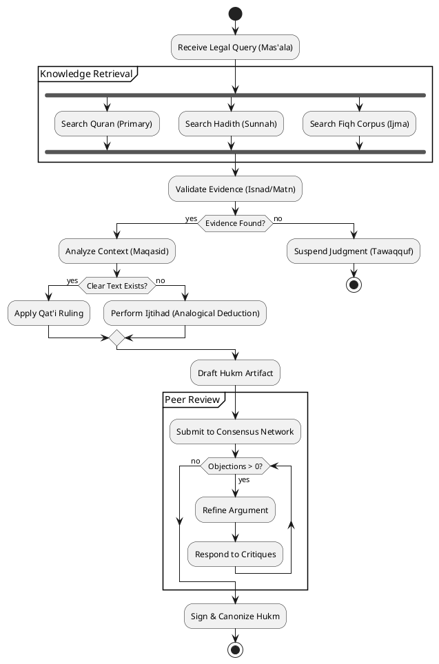

# Al-Mizan: Formal Activity Workflow

This document formally models the "Istinbat" (Legal Derivation) process using a strict UML Activity Diagram.

---

## 1. Activity Diagram: The Istinbat Process

Models the control flow, decision points, and parallel activities involved in deriving a ruling.

