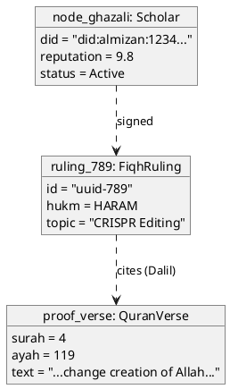
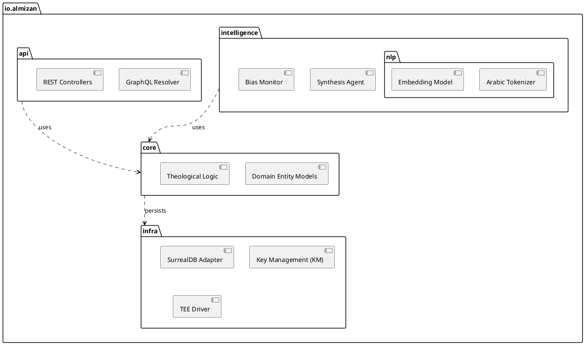
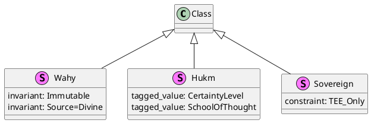
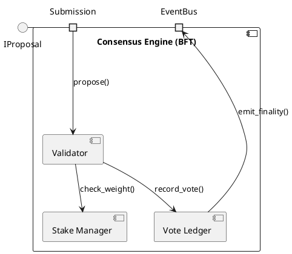

# Al-Mizan: Formal Advanced Structures

This document contains the advanced structural UML diagrams required for a complete academic model: Object, Package, Profile, and Composite Structure diagrams.

---

## 1. Object Diagram (Instance Snapshot)

Models a specific runtime scenario: "Imam Ghazali Node" validating a "Bioethics Ruling" at `t=now`.

---

## 2. Package Diagram (Namespace Hierarchy)

Formalizes the logical organization of the codebase and domain boundaries.

---

## 3. Profile Diagram (Stereotypes)

Defines the Domain-Specific Language (DSL) extensions to UML for Islamic Finance.

---

## 4. Composite Structure Diagram (Internal Parts)

Models the internal structure of the `ConsensusEngine` component, showing ports and connectors.

