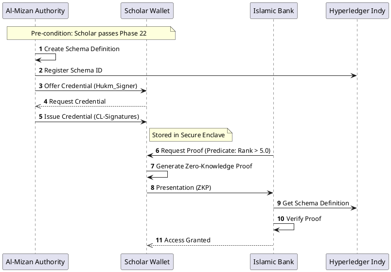
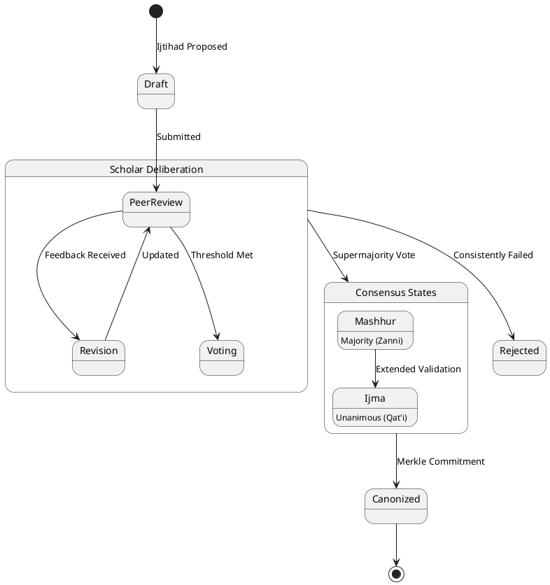
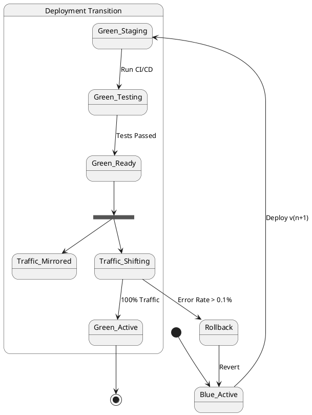

# Al-Mizan: Formal Behavioral Models

This document aggregates the strict temporal and state-based logic of the system, adhering to UML 2.5 Sequence and State Machine standards.

---

## 1. Sequence Diagrams (Interactions)

### 1.1 Verifiable Credential Issuance (Phase 6 Formalized)

---

## 2. State Machine Diagrams (Lifecycle)

### 2.1 Consensus Lifecycle (Phase 9 Formalized)

### 2.2 Blue-Green Deployment State (Phase 20 Formalized)

