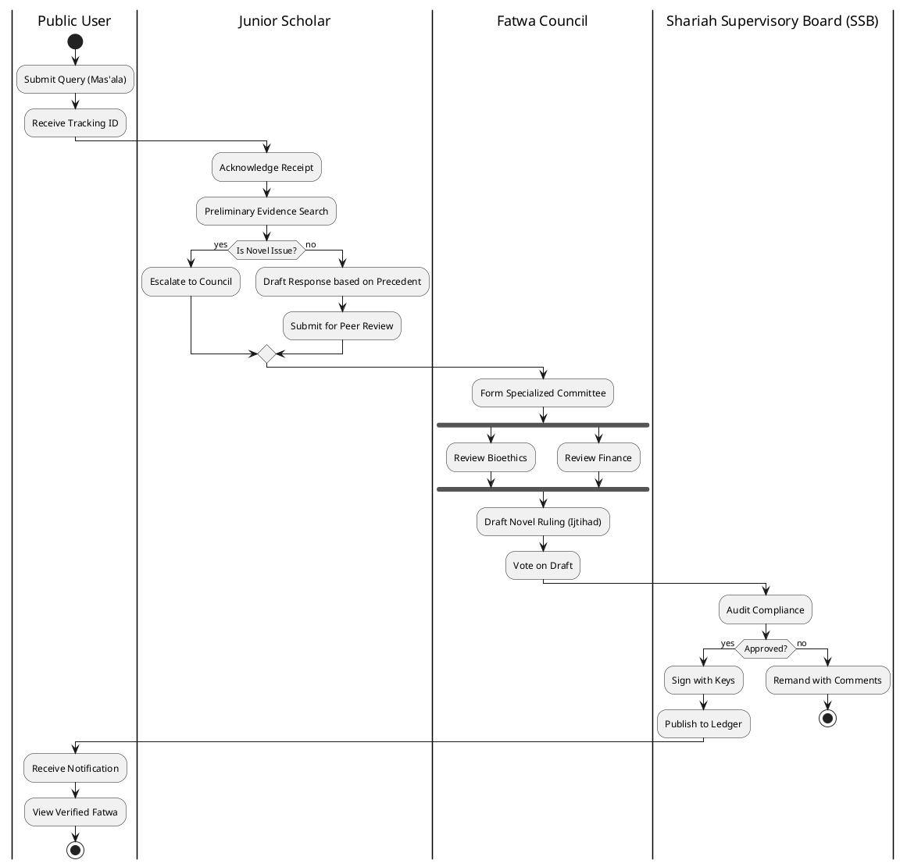

# Al-Mizan: Formal BPMN Process (Regulatory Workflow)

This document formally models the "Regulatory Fatwa Issuance" process using BPMN 2.0 semantics (approximated in PlantUML Activity Beta). It focuses on swimlanes and role-based handoffs.

---

## 1. Fatwa Issuance Workflow (BPMN)

**Scope**: Cross-functional process from public query to official Shariah Board ruling.

