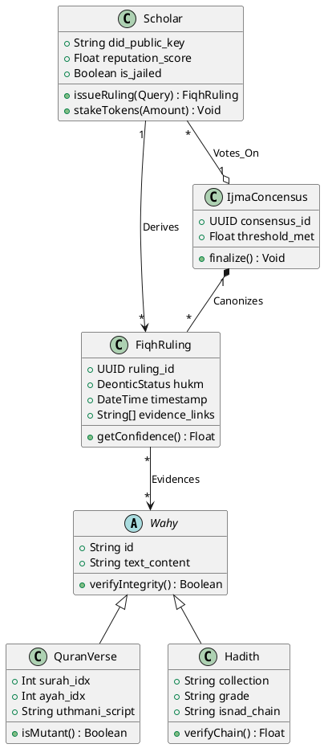

# Al-Mizan: Formal Class Structure

This document transforms the operational Entity-Relationship Diagram (ERD) into a strict UML Class Diagram for academic modeling.

---

## 1. Domain Entities (Static Structure)

The system is composed of five primary immutable classes representing the theological primitives.

---

## 2. Object Constraints (OCL)

Formal constraints affecting the classes above:

*   **Scholar Integrity**: `context Scholar inv: self.reputation_score >= 5.0 implies self.issueRuling()`
*   **Abrogation Logic**: `context QuranVerse inv: self.isAbrogated implies self.efficacy == false`
*   **Consensus Validity**: `context IjmaConcensus inv: self.votes->size() > TotalScholars * 0.66`
