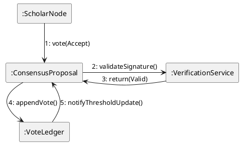

# Al-Mizan: Formal Communication Links

This document formally models the object relationships and message passing during the Consensus Voting process using a strict UML Communication Diagram.

---

## 1. Communication Diagram: Consensus Voting

Focuses on the structural relationships between objects involved in the voting mechanism.

