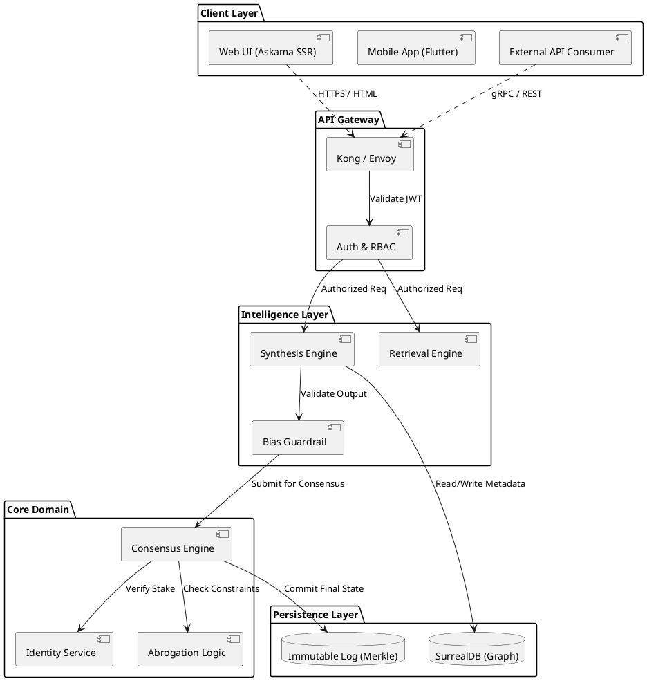

# Al-Mizan: Formal Component Architecture

This document formalizes the high-level ecosystem (Phase 1) and API topology (Phase 18) into a strict UML Component Diagram.

---

## 1. Component Diagram (Level 2 Abstraction)

---

## 2. Interface Definitions

*   **`ISynthesis`**: `generateFatwa(query: String): Artifact`
*   **`IConsensus`**: `proposeBlock(transactions: List<T>): Bool`
*   **`IAudit`**: `verifyMerkleProof(hash: SHA256): Path`
