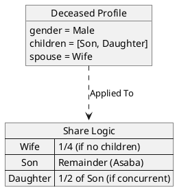

# Al-Mizan: Formal Decision Logic (DMN)

This document formalizes the strict Shariah computational rules using **Decision Model and Notation (DMN)** semantics. It focuses on deterministic logic tables for financial and inheritance calculations.

---

## 1. Zakat Liability Decision Service

**Scope**: Determining if a user is liable for Zakat based on asset thresholds (Nisab) and holding period (Hawl).

*Note: Rendered as a truth table using PlantUML Salt, representing a DMN Decision Table.*

---

## 2. Inheritance (Fara'id) Calculation

**Scope**: Logic for distributing shares to primary heirs (Ashab al-Furud).

