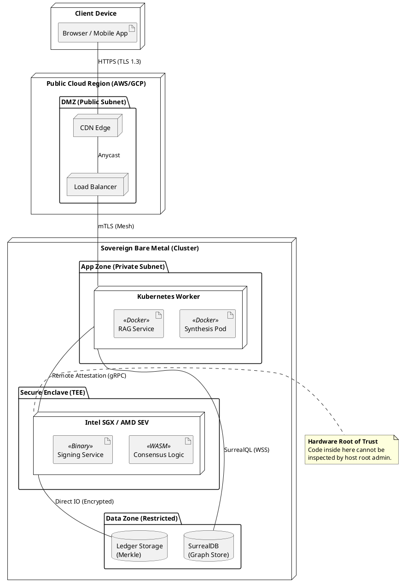

# Al-Mizan: Formal Deployment Topology

This document strictly models the physical deployment nodes, execution environments, and network boundaries using UML Deployment Diagram syntax.

---

## 1. Physical Topology Diagram

---

## 2. Deployment Specifications

### 2.1 Artifact Manifest
| Artifact | Type | Host Node | Security Level |
| :--- | :--- | :--- | :--- |
| **Synthesis Pod** | Docker Image | K8s Worker | `Confidential` |
| **Consensus Logic** | WASM Module | TEE (SGX) | `Strictly Sovereign` |
| **Signing Service** | Binary | TEE (SGX) | `Strictly Sovereign` |
| **Graph Store** | Database File | Data Zone | `Encrypted-at-Rest` |

### 2.2 Network Constraints (OCL)
*   `context Connection inv: self.protocol = 'HTTP' implies self.encryption = 'TLS 1.3'`
*   `context Node inv: self.zone = 'Secure Enclave' implies self.accessControl = 'Remote Attestation'`
