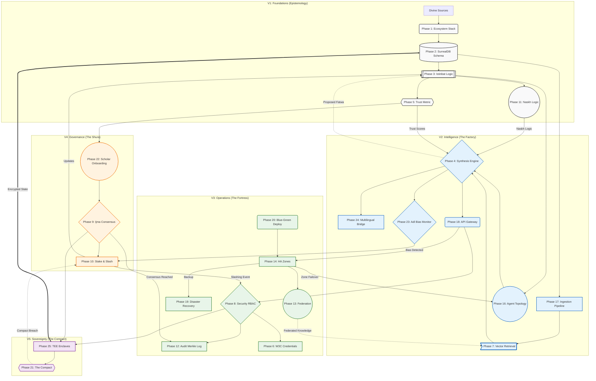

# Al-Mizan: The Grand Unified Model (The Omni-Graph)

This diagram represents the **complete architectural teleology** of the Al-Mizan project, connecting all 25 Phases into a single unified system view.

---

## The Omni-Graph

---

## Legend

| Zone | Focus | Key Tech |
| :--- | :--- | :--- |
| **V1: Foundations** | Epistemology | Wahy, Ontologies, SurrealDB |
| **V2: Intelligence** | Logic & AI | RAG, Agents, Vector Search |
| **V3: Operations** | Resilience | Geo-HA, DR, Merkle Logs |
| **V4: Governance** | Human Consensus | BFT, Staking, DID |
| **V5: Sovereignty** | Hardware Trust | SGX Enclaves, Legal Compacts |
