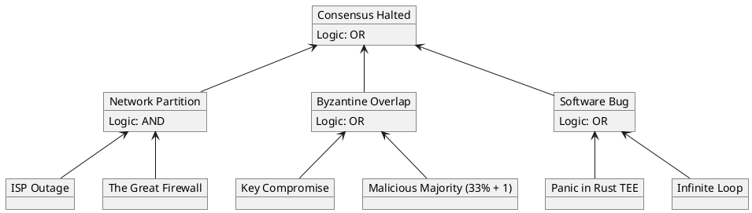

# Al-Mizan: Reliability & Safety Analysis (FTA)

This document formally models system failure modes using **Fault Tree Analysis (FTA)**. It identifies the root causes that could lead to a top-level critical failure, ensuring safety-critical design.

---

## 1. Consensus Liveness Failure (Fault Tree)

**Top Event**: The BFT Consensus Network halts (Safety Violation or Liveness Failure).

**Risk Mitigation Strategy**:
1.  **Network Partition**: Multi-cloud sovereign hosting (Phase 21).
2.  **Byzantine Overlap**: Hardware Enclaves (SGX) + Threshold Signatures (Phase 25).
3.  **Software Bug**: Formal Verification + Rust Memory Safety (Phase 3).
