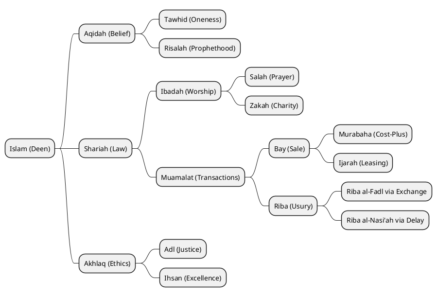

# Al-Mizan: Formal Requirements Traceability (SysML)

This document formally connects theological mandates (Wahy) to technical implementations using SysML Requirement Diagrams and Mind Map Taxonomies.

---

## 1. Compliance Traceability Matrix (SysML)

**Scope**: Linking Divine Law (Quran/Sunnah) to System Components.

```plantuml
@startuml
hide circle
hide empty members

class "Quran 2:275 (Prohibition of Riba)" as Req1 <<Requirement>> {
    ID: REQ-QURAN-275
    Text: Allah has permitted trade and forbidden usury.
    Type: Theological Mandate
}

class "Hadith: Gold for Gold" as Req2 <<Requirement>> {
    ID: REQ-HADITH-GOLD
    Text: Like for like, hand to hand.
    Type: Sunnah Constraint
}

package "Core Components" {
    component "InterestValidator.rs" as Val
    component "ExchangeEngine.rs" as Swap
}

Val .up.|> Req1 : <<satisfies>>
Swap .up.|> Req2 : <<satisfies>>
@enduml
```

---

## 2. Fiqh Ontology Taxonomy (Mind Map)

**Scope**: Hierarchical view of the Islamic Jurisprudence concepts used in the Knowledge Graph.


