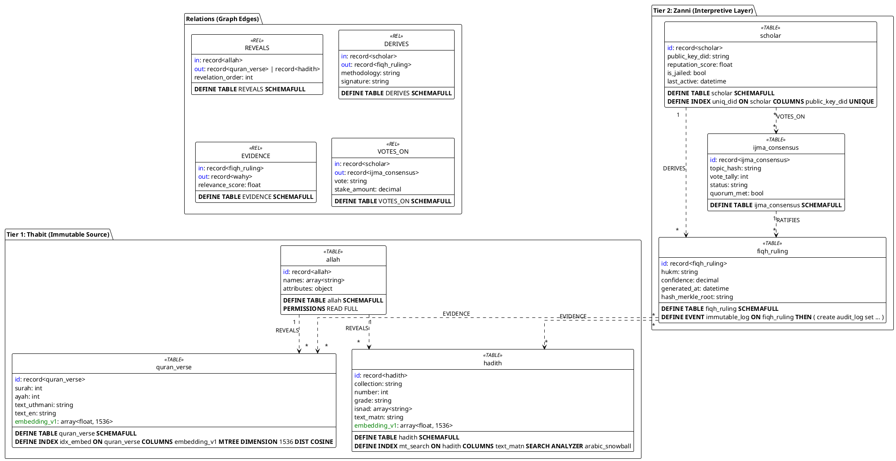

# Al-Mizan: SurrealDB Physical Schema Model

This document specifies the **physical byte-level schema** of the Al-Mizan vector database. It uses strict **SurrealQL** typing conventions (`record<T>`, `array<float>`, `geometry`) to ensure implementation fidelity.

---

## 1. The Physical Graph (SurrealQL)

**Top Event**: The strict `SCHEMAFULL` definition of the Knowledge Graph.



## 2. SurrealQL Implementation Specifics

### 2.1 Vector Indexing (M-Tree)
The `quran_verse` and `hadith` tables utilize strict **M-Tree** indexing for semantic search.

```sql
-- STRICT TYPING
DEFINE INDEX idx_embed ON quran_verse 
  COLUMNS embedding_v1 
  MTREE DIMENSION 1536 
  DIST COSINE;
```

### 2.2 Graph Enforcement
Graph integrity is enforced at the database layer using `TYPE record`.

```sql
-- EDGE CONSTRAINT
DEFINE FIELD in ON TABLE REVEALS TYPE record<allah>;
DEFINE FIELD out ON TABLE REVEALS TYPE record<quran_verse> | record<hadith>;
```
