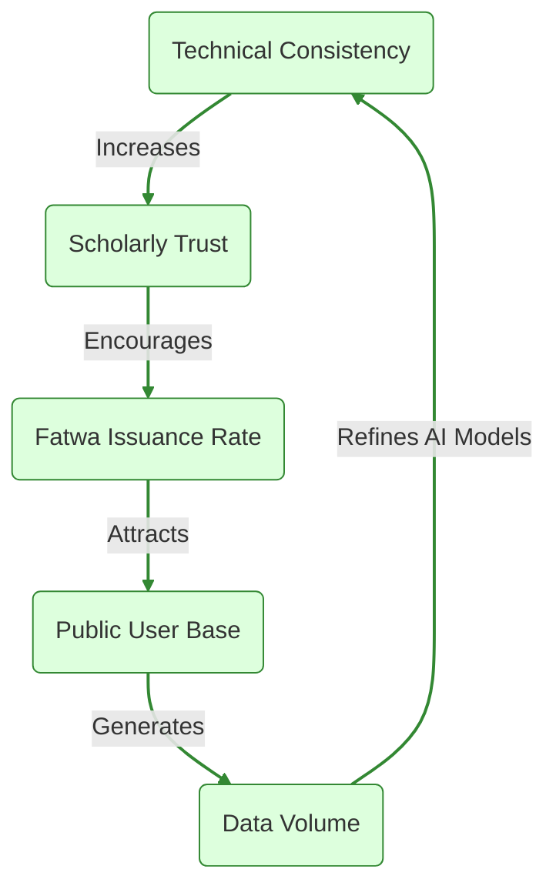
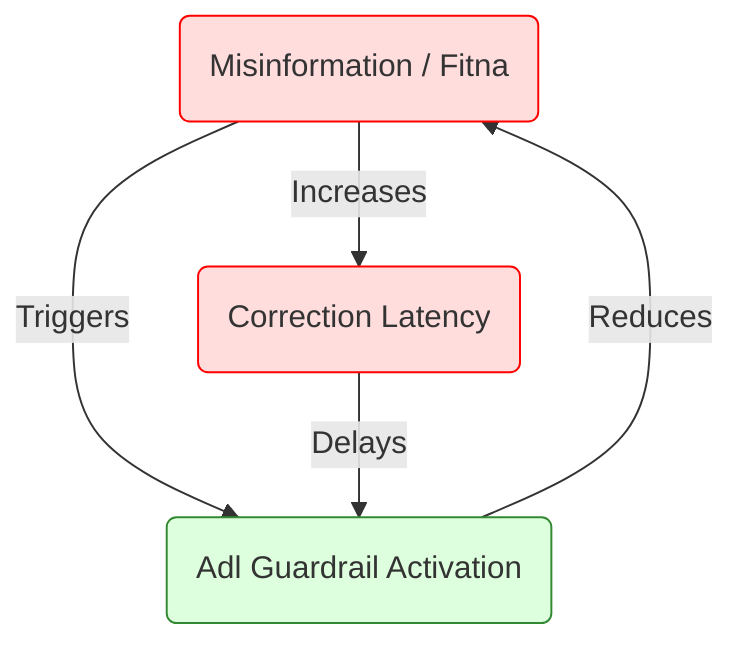

# Al-Mizan: System Dynamics (Causal Loops)

This document models the circular feedback loops that drive the long-term growth and stability of the Al-Mizan ecosystem, using **Causal Loop Diagram (CLD)** semantics.

---

## 1. The Trust-Adoption Flywheel

**Scope**: Analyzing how technical consistency drives scholarly participation.

**Feedback Analysis**:
*   **Result**: Reinforcing Loop (Positive).
*   **Key Driver**: Technical Consistency (The "Thabit" principle). If technical trust fails, the entire loop reverses into a collapse.

---

## 2. The Fitna (Chaos) Damping Loop

**Scope**: How the system self-corrects against misinformation.

**Feedback Analysis**:
*   **Result**: Balancing Loop (Stabilizing).
*   **Constraint**: If `Correction Latency` (Z) becomes too high, the damping fails, leading to runaway Fitna.
