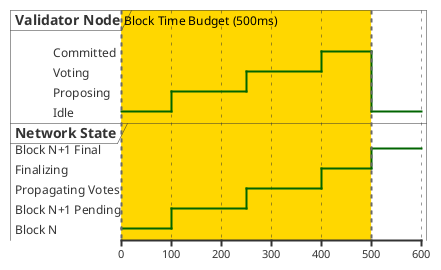

# Al-Mizan: Formal Timing Constraints

This document formally models the strict real-time latency constraints for the BFT Consensus and Network heartbeat using a strict UML Timing Diagram.

---

## 1. Timing Diagram: Real-Time BFT Constraints

Models the state changes of a Validator Node over time, enforcing the 500ms block time budget.

