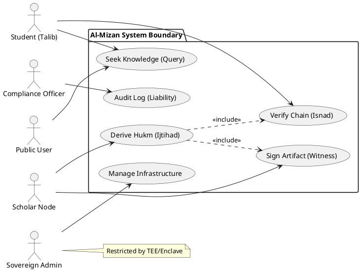

# Al-Mizan: Formal Use Case Model

This document defines the strict UML Use Case model for the Al-Mizan system, identifying primary actors and their permissible interactions with the system boundary.

---

## 1. System Actors

| Actor | Type | Description |
| :--- | :--- | :--- |
| **Public User** | `Consumer` | Layperson seeking religiously valid answers (Fatwa). |
| **Scholar Node** | `Provider` | Authenticated human scholar authorized to derive and sign rulings. |
| **Student** | `Learner` | Academic user accessing raw sources for research. |
| **Sovereign Admin** | `System` | Operator of the physical node (restricted access via TEE). |
| **Compliance Officer** | `Auditor` | Independent verifier of system integrity and logs. |

---

## 2. High-Level Use Case Diagram

---

## 3. Detailed Use Case Specifications

### UC1: Seek Knowledge
*   **Actor**: Public, Student
*   **Goal**: Retrieve a religiously valid answer with evidence.
*   **Preconditions**: None (Public Access).
*   **Postconditions**: Answer delivered with "Certainty Score".

### UC2: Derive Hukm (Ijtihad)
*   **Actor**: Scholar Node
*   **Goal**: Synthesize a new ruling based on primary sources.
*   **Preconditions**: Authenticated via DID + Reputation > Threshold.
*   **Postconditions**: New `FiqhRuling` artifact committed to SurrealDB.

### UC5: Audit Log
*   **Actor**: Compliance Officer
*   **Goal**: Verify that no historical records have been mutated.
*   **Preconditions**: Access to Merkle Tree Head (STH).
*   **Postconditions**: Integrity Report generated.
