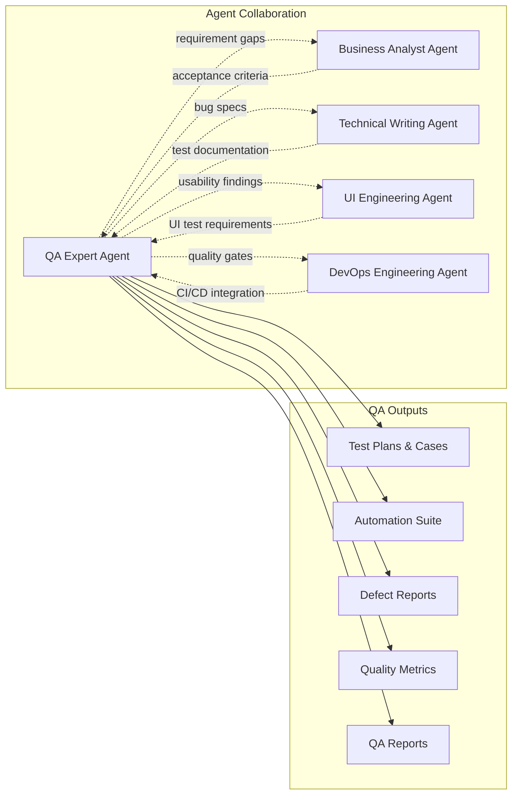
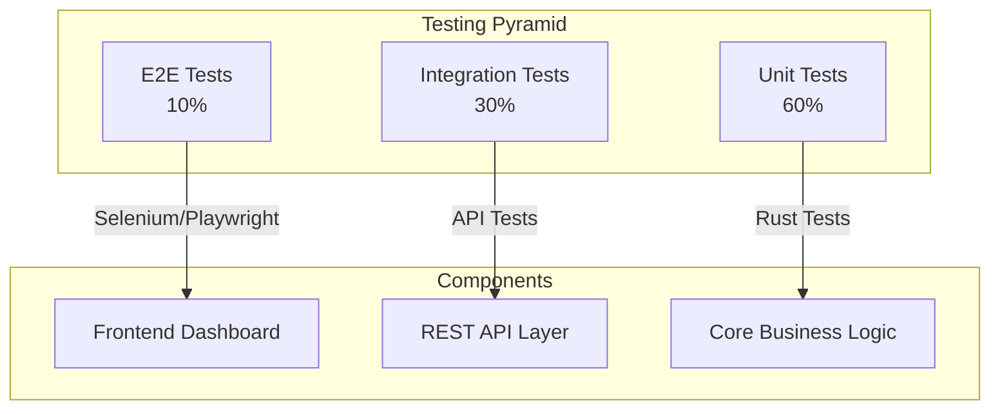
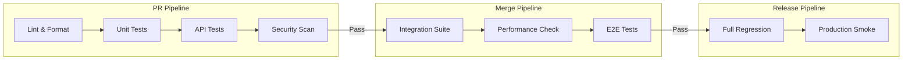

# Quality Assurance & Testing Assessment

> **Author**: QA Expert Agent  
> **Date**: 2026-01-04  
> **Status**: Initial Assessment  
> **Recommended By**: Business Analyst Agent

---

## Executive Summary

This document establishes the **Quality Assurance Foundation** for the **Al-Mizan Project** — a Tawhidic Knowledge Graph Framework. As the newest agent joining the team on the Business Analyst's recommendation, my focus is on ensuring comprehensive quality coverage across the API layer, data integrity, and user-facing components to support both the FYP deliverables and long-term platform reliability.

---

## 1. My Role in This Project

### Primary Responsibilities

| Area | Scope | Status |
|------|-------|--------|
| **Test Strategy** | Comprehensive test plan, risk-based testing | 🟡 Starting |
| **API Testing** | Endpoint validation, contract testing, performance | 🟡 Starting |
| **Data Integrity** | Graph data validation, Isnad chain verification | 🔴 Not Started |
| **Automation** | CI/CD integration, regression suite | 🔴 Not Started |
| **Quality Metrics** | Coverage tracking, defect analysis | 🔴 Not Started |
| **Security Testing** | API security, input validation | 🔴 Not Started |

### Relationship with Other Agents

### Integration with Business Analysis

As recommended by the Business Analyst Agent, I will:
- Validate that implemented features meet documented requirements
- Provide quality metrics for KPI dashboards
- Support risk assessment with defect patterns analysis
- Ensure acceptance criteria are testable and verified

---

## 2. Project Quality Context

### 2.1 Current State Assessment

Based on codebase analysis (2026-01-06):

| Component | Files | Tests | Coverage | Priority |
|-----------|-------|-------|----------|----------|
| **Domain Layer** | 10 | 4 ✅ | ~20% | P1 |
| **API Endpoints** | 14 | 0 ❌ | 0% | P0 |
| **Repository/DB** | 2 | 0 ❌ | 0% | P1 |
| **Enterprise** | 3 | 0 ❌ | 0% | P2 |
| **Identity** | 3 | 0 ❌ | 0% | P2 |

**Existing Tests (4 total):**
1. `test_quran_verse_serialization` - QuranVerse JSON serialization ✅
2. `test_ruling_mutability` - FiqhRuling mutability field ✅
3. `test_reputation_weighted_consensus` - Authority consensus logic ✅
4. `test_slash_mechanism` - Authority slashing logic ✅

**CI/CD Status:**
- ✅ `cargo test` in pipeline
- ✅ `cargo audit` security scan
- ✅ `cargo clippy` linting
- ✅ `cargo fmt` formatting check
- ❌ No API integration tests
- ❌ No E2E tests
- ❌ No performance benchmarks

### 2.2 API Endpoints Requiring Tests

| Endpoint | Method | File | Test Priority |
|----------|--------|------|---------------|
| `/api/v1/verse/{surah}/{ayah}` | GET | verse.rs | P0 |
| `/api/v1/verse/{surah}` | GET | verse.rs | P0 |
| `/api/v1/hadith/{collection}/{number}` | GET | hadith.rs | P0 |
| `/api/v1/hadith/{collection}` | GET | hadith.rs | P0 |
| `/api/v1/graph` | GET | graph.rs | P1 |
| `/api/v1/names` | GET | names.rs | P1 |
| `/api/v1/names/{id}` | GET | names.rs | P1 |
| `/api/v1/synthesis` | POST | synthesis.rs | P1 |
| `/api/v1/dashboard` | POST | dashboard.rs | P1 |
| `/api/v1/evidence/{id}` | GET | evidence.rs | P1 |
| `/api/v1/enterprise/*` | GET/POST | enterprise.rs | P2 |
| `/api/v1/identity/*` | GET/POST | identity.rs | P2 |
| `/api/v1/network/*` | GET/POST | network.rs | P2 |

### 2.3 Quality Risks

| Risk | Severity | Mitigation Strategy |
|------|----------|---------------------|
| **Data Integrity** | 🔴 Critical | Automated validation for Isnad chains |
| **API Contract Drift** | 🟠 High | OpenAPI contract testing |
| **Performance Regression** | 🟡 Medium | Baseline benchmark suite |
| **Security Vulnerabilities** | 🟠 High | OWASP-aligned API testing |
| **UI/UX Defects** | 🟡 Medium | Cross-browser E2E tests |

---

## 3. Test Strategy Framework

### 3.1 Testing Pyramid

### 3.2 Testing Approach by Layer

| Layer | Framework | Approach | Owner |
|-------|-----------|----------|-------|
| **Unit** | Rust `#[test]` | Property-based, edge cases | Development |
| **API Integration** | Hurl / Bruno | Contract, happy path, error handling | QA Expert |
| **E2E** | Playwright | Critical user journeys | QA Expert |
| **Performance** | k6 / Drill | Load, stress, spike | QA Expert |
| **Security** | OWASP ZAP | Vulnerability scanning | QA Expert |

### 3.3 Data Quality Testing

For the Tawhidic Knowledge Graph, special attention required:

| Data Domain | Validation Checks |
|-------------|-------------------|
| **Quran Verses** | 6,236 count, Arabic encoding, ayah integrity |
| **Hadith Records** | Isnad chain completeness, narrator links |
| **Morphology** | Root-word-lemma relationships |
| **Graph Edges** | Referential integrity, no orphans |
| **Unicode** | RTL rendering, Arabic diacritics |

---

## 4. Quality Metrics Dashboard

### 4.1 FYP Phase Metrics

| Metric | Target | Current | Status |
|--------|--------|---------|--------|
| **Test Coverage** | > 70% | ~30% | 🔴 Gap |
| **API Test Pass Rate** | 100% | TBD | 🟡 Measuring |
| **Critical Defects** | 0 | TBD | 🟡 Tracking |
| **Mean Time to Detect** | < 1 day | TBD | 🔴 Not Tracked |
| **Automation Coverage** | > 60% | ~10% | 🔴 Gap |

### 4.2 Proposed KPIs

| KPI | Definition | Data Source |
|-----|------------|-------------|
| **Defect Density** | Defects per 1K LOC | Issue tracker |
| **Test Effectiveness** | Defects found / Total defects | QA logs |
| **Requirement Coverage** | Tests per requirement | Traceability matrix |
| **API Reliability** | Uptime % during testing | CI logs |
| **Regression Cycle Time** | Time to run full suite | CI pipeline |

---

## 5. Test Environment Strategy

### 5.1 Environment Matrix

| Environment | Purpose | Data | Access |
|-------------|---------|------|--------|
| **Local Dev** | Unit testing | Mock/Subset | Developer |
| **CI/CD** | Automated regression | Subset | Pipeline |
| **Staging** | Integration testing | Production-like | QA + Dev |
| **Production** | Smoke tests only | Production | Restricted |

### 5.2 Test Data Management

| Data Type | Source | Anonymization | Refresh |
|-----------|--------|---------------|---------|
| **Quran** | Tanzil.net | N/A (public) | Stable |
| **Hadith** | Sunnah.com | N/A (public) | Stable |
| **User Data** | Generated | N/A (synthetic) | Per test run |
| **API Keys** | Vault/Env | Masked | Per environment |

---

## 6. CI/CD Integration

### 6.1 Quality Gates

### 6.2 Gate Criteria

| Gate | Criteria | Enforcement |
|------|----------|-------------|
| **PR Merge** | Unit pass, no P0 bugs, coverage ≥ baseline | Blocking |
| **Staging Deploy** | Integration pass, performance within bounds | Blocking |
| **Production Deploy** | Full regression pass, security clean | Blocking |

---

## 7. Recommendations

### 7.1 Immediate Priorities (This Week)

1. **API Test Suite Foundation** — Create baseline API tests for critical endpoints
2. **Test Data Preparation** — Curate subset of production data for testing
3. **CI Integration** — Add test execution to existing pipeline

### 7.2 Short-Term (Next 2 Weeks)

1. **E2E Framework Setup** — Playwright configuration for dashboard testing
2. **Performance Baseline** — Establish benchmarks for sub-50ms requirement
3. **Security Scan Integration** — Basic OWASP checks

### 7.3 Long-Term (Post-FYP)

1. **Chaos Testing** — Fault injection for resilience validation
2. **A/B Testing Framework** — For Cyborg Isnad gamification features
3. **Production Monitoring** — Error tracking, synthetic monitoring

---

## 8. Integration Points

### With Business Analyst Agent (Recommender)

- Receive acceptance criteria for requirement validation
- Provide defect trend analysis for risk assessment
- Support KPI definition with quality metrics
- Validate business rules through test coverage

### With DevOps Agent

- Integrate test execution into CI/CD pipelines
- Define quality gates for deployments
- Collaborate on test environment provisioning
- Share performance metrics for SLA monitoring

### With Technical Writing Agent

- Document test cases and results
- Maintain test data specifications
- Create bug report templates
- Update API documentation with edge cases

### With UI Agent

- Execute E2E tests on dashboard components
- Report usability issues from testing
- Validate accessibility compliance
- Cross-browser compatibility verification

### With Future Project Manager

- Provide test progress for sprint tracking
- Deliver quality reports for release decisions
- Support estimation with historical defect data
- Feed test metrics into project dashboards

---

## 9. Summary

As the QA Expert Agent, newly welcomed by the Business Analyst, I am ready to establish a comprehensive quality assurance practice for Al-Mizan. My immediate focus areas:

1. **Building foundational test infrastructure** for the Rust API
2. **Establishing quality metrics** aligned with business KPIs
3. **Integrating testing into the development workflow**
4. **Ensuring data integrity** for the Tawhidic Knowledge Graph

The project's strong technical foundations (Rust + SurrealDB) provide excellent testability. My goal is to increase test coverage to >70% and implement quality gates that prevent defects from reaching production.

---

*This document is maintained by the QA Expert Agent. Last updated: 2026-01-04T21:24:00+08:00*
