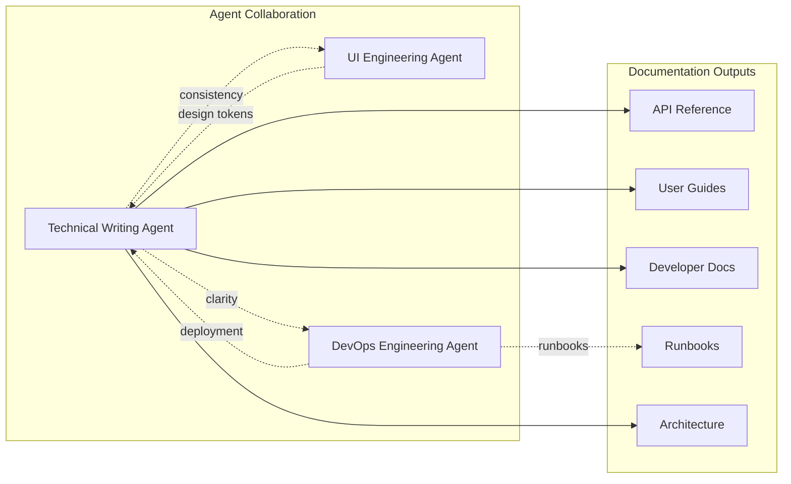
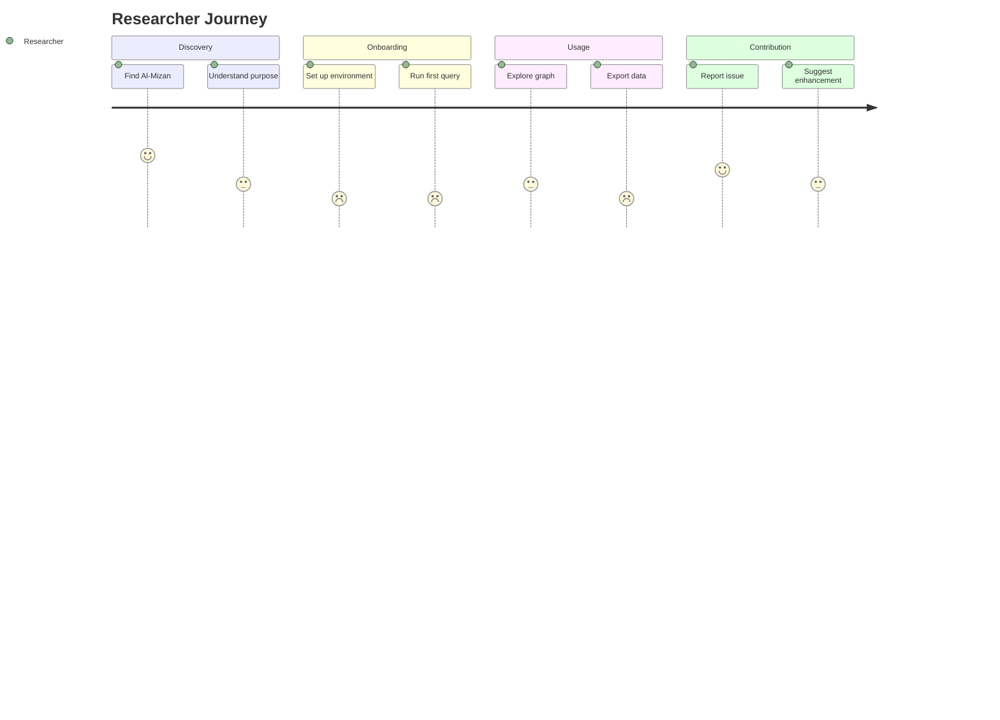

# Documentation Analysis & Content Strategy

> **Author**: Technical Writing Agent  
> **Date**: 2026-01-04  
> **Status**: Initial Assessment

---

## Executive Summary

This document provides a comprehensive analysis of the Al-Mizan project's documentation landscape. The project is a **comparative Islamic Knowledge Graph** mapping relationships between Primary Sources (Quran, Hadith) and Secondary Rulings (Fiqh). While the codebase shows strong technical maturity, the documentation layer requires strategic development to serve its diverse audiences: researchers, developers, and theological scholars.

---

## 1. My Role in This Project

### Primary Responsibilities

| Area | Scope | Status |
|------|-------|--------|
| **API Documentation** | REST endpoints, SurrealQL queries | 🟢 Complete |
| **User Guides** | Researcher onboarding, query tutorials | 🟢 Partial (Quick Start done) |
| **Architecture Docs** | System overview, data model | 🟡 Partial |
| **Developer Docs** | Setup, contribution, coding standards | 🟡 Partial |
| **Ontology Documentation** | Tawhidic Foundation, schema reference | 🟡 Partial |
| **Content Standardization** | Style guide, terminology glossary | 🟢 Complete (Glossary done) |

### Relationship with Other Agents



---

## 2. Current Documentation Landscape

### 2.1 Existing Documentation Assets

| File | Location | Type | Grade | Notes |
|------|----------|------|-------|-------|
| `README.md` | Root | Overview | B | Good intro, needs expansion |
| `AGENTS.md` | Root | Architecture | B | Clear tech stack definition |
| `CONTRIBUTING.md` | Root | Developer | B | Contribution guidelines |
| `SECURITY.md` | Root | Policy | B | Reporting procedures |
| `ROADMAP.md` | Root | Planning | C | Needs updating |
| `CHANGELOG.md` | Root | History | C | Light on details |
| `ARCHITECTURE.md` | docs/ | Technical | B | Good structure |
| `FYP 1 Report.md` | docs/ | Academic | A | Comprehensive |
| `cloud_testing_guide.md` | docs/ | Tutorial | B | Practical guide |
| `data_ingestion_strategy.md` | docs/ | Technical | B | ETL documentation |
| `schema.surql` | database/schema/ | Reference | A | Well-commented 861-line schema |

### 2.2 Documentation Structure

```
docs/
├── README.md               # Docs index
├── ARCHITECTURE.md         # System architecture
├── FYP 1 Report.md        # Academic report
├── index.html             # GitHub Pages landing
├── presentation.html      # FYP presentation
├── playground.html        # API demo
│
├── adr/                   # Architecture Decision Records (6 files)
├── architecture/          # Diagrams and design docs
├── management/            # Project management (3 files)
├── references/            # External resources (5 files)
├── specs/                 # Technical specs (3 files)
│
├── devops/                # DevOps Agent workspace
│   ├── DEVOPS_ANALYSIS.md
│   ├── RUNBOOKS.md
│   └── TASKS.md
│
├── ui/                    # UI Agent workspace
│   ├── UI_ANALYSIS.md
│   ├── RUNBOOKS.md
│   └── TASKS.md
│
└── technical-writing/     # NEW: Technical Writing Agent workspace
    ├── DOCUMENTATION_ANALYSIS.md  (this file)
    ├── RUNBOOKS.md
    └── TASKS.md
```

### 2.3 ADR Status

| ADR | Topic | Status |
|-----|-------|--------|
| ADR-001 | Unknown | Needs review |
| ADR-002 | Unknown | Needs review |
| ADR-003 | Unknown | Needs review |
| ADR-004 | Unknown | Needs review |
| ADR-005 | Unknown | Needs review |
| ADR-006 | Unknown | Needs review |

---

## 3. Audience Analysis

### Primary Audiences

| Audience | Needs | Current Support | Priority |
|----------|-------|-----------------|----------|
| **Academic Researchers** | Query tutorials, ontology reference, data provenance | 🟡 Partial | P0 |
| **Developers** | API docs, setup guides, contribution workflow | 🟡 Partial | P0 |
| **Theological Scholars** | Methodology documentation, source attribution | 🔴 Missing | P1 |
| **FYP Evaluators** | Demo walkthrough, technical depth | 🟢 Good | P0 |

### User Journeys



---

## 4. Gap Analysis

### 🔴 Critical Gaps

| Gap | Impact | Priority | Effort |
|-----|--------|----------|--------|
| **No API Reference** | Developers can't integrate | P0 | 8h |
| **No Query Tutorial** | Researchers can't use graph | P0 | 4h |
| **No Terminology Glossary** | Inconsistent vocabulary | P1 | 2h |
| **No Style Guide** | Fragmented voice/tone | P1 | 2h |

### 🟠 High Gaps

| Gap | Impact | Priority | Effort |
|-----|--------|----------|--------|
| **Schema Documentation** | Ontology not accessible | P1 | 4h |
| **ETL Pipeline Guide** | Cannot regenerate data | P1 | 3h |
| **Deployment Guide** | Ops handoff incomplete | P2 | 2h |
| **Troubleshooting Guide** | Self-service blocked | P2 | 3h |

### 🟢 Enhancement Opportunities

| Opportunity | Benefit | Priority | Effort |
|-------------|---------|----------|--------|
| **Interactive Examples** | Better learning | P3 | 6h |
| **Video Tutorials** | Wider audience | P3 | 8h |
| **Multi-language Docs** | International reach | P3 | 16h |

---

## 5. Content Quality Assessment

### 5.1 README.md Analysis

**Current State**: ~4KB, provides basic project overview.

**Strengths**:
- Clear project description
- Technology stack listed
- Basic installation steps

**Improvements Needed**:
- Quick start example missing
- No architecture diagram
- No link to full documentation site

### 5.2 Schema Documentation

**Current State**: 861-line `schema.surql` with inline comments.

**Strengths**:
- Well-commented tables
- Governance triggers documented
- Version tracked (v1.1)

**Improvements Needed**:
- No standalone schema reference
- Relationships not visualized
- No example queries per table

### 5.3 Academic Report

**Current State**: Comprehensive FYP report.

**Strengths**:
- Thorough methodology
- Literature review
- Technical depth

**Note**: This is excellent for evaluation but not suitable as user-facing documentation.

---

## 6. Terminology Standardization

### Proposed Glossary Structure

| Term | Definition | Arabic | Usage Context |
|------|------------|--------|---------------|
| **Hadith** | Prophetic tradition | حديث | All contexts |
| **Isnad** | Chain of narration | إسناد | Hadith authenticity |
| **Matn** | Text body of hadith | متن | Hadith content |
| **Sahih** | Authentic (grade) | صحيح | Hadith classification |
| **Fiqh** | Islamic jurisprudence | فقه | Tier 2 data |
| **Tawhid** | Oneness of Allah | توحيد | Core ontology |
| **Madhab** | School of thought | مذهب | Scholar attribution |
| **Sanad** | Support/evidence | سند | Source linking |

### Consistency Rules

1. **Transliteration**: Use simplified transliteration without diacritics for technical docs
2. **Capitalization**: Capitalize proper nouns (Quran, Hadith, Prophet)
3. **Abbreviations**: Define on first use, then use abbreviation
4. **Code References**: Use `backticks` for table names, SurQL keywords

---

## 7. Proposed Documentation Architecture

### Information Architecture

```
Al-Mizan Documentation
├── Getting Started
│   ├── Introduction
│   ├── Quick Start (5-minute tutorial)
│   ├── Installation
│   └── Architecture Overview
│
├── User Guides
│   ├── Researcher Guide
│   │   ├── Understanding the Knowledge Graph
│   │   ├── Query Tutorials
│   │   └── Data Export
│   ├── Developer Guide
│   │   ├── API Reference
│   │   ├── SDK/Client Usage
│   │   └── Extension Points
│   └── Administrator Guide
│       ├── Deployment
│       ├── Backup & Restore
│       └── Monitoring
│
├── Reference
│   ├── API Endpoints
│   ├── Schema Reference
│   ├── SurQL Query Reference
│   └── Glossary
│
├── Concepts
│   ├── Ontology Design
│   ├── Tawhidic Foundation
│   ├── Data Tiers
│   └── Governance Model
│
└── Contributing
    ├── Code of Conduct
    ├── Development Setup
    ├── Pull Request Process
    └── Documentation Style Guide
```

### Documentation Tooling Recommendation

| Aspect | Recommendation | Rationale |
|--------|----------------|-----------|
| **Generator** | Continue with static HTML | Matches existing GitHub Pages setup |
| **API Docs** | OpenAPI/Swagger | Industry standard for REST APIs |
| **Diagrams** | Mermaid | Already in use, excellent for graphs |
| **Search** | Algolia DocSearch | Free for open source |
| **Hosting** | GitHub Pages | Already configured |

---

## 8. Integration Points

### With UI Agent

- Document design tokens in component guide
- Ensure consistent naming between docs and UI
- Coordinate on interactive playground documentation

### With DevOps Agent

- Reference runbooks for operational procedures
- Link deployment documentation
- Share backup/restore procedures

### Cross-Reference Strategy

All agent documentation should use consistent:
1. Header format (Title, Author, Date, Status)
2. Emoji status indicators (🔴 🟡 🟢)
3. Mermaid diagram syntax
4. Table formatting
5. Terminology from glossary

---

## 9. Quality Metrics

### Documentation Health Score

| Metric | Target | Current | Status |
|--------|--------|---------|--------|
| **Coverage** | 80% of features documented | ~30% | 🔴 |
| **Freshness** | Updated within 30 days | Mixed | 🟡 |
| **Readability** | Flesch-Kincaid Grade 8-10 | Untested | 🟡 |
| **Completeness** | All APIs documented | 0% | 🔴 |
| **User Satisfaction** | Positive feedback | N/A | 🔴 |

### Success Indicators

- [ ] Researchers can run first query within 10 minutes
- [ ] Developers can call API without support ticket
- [ ] Contributors can submit PR following guidelines
- [ ] New team members onboarded within 1 day

---

## 10. Immediate Priorities

### Phase 1: Foundation (This Week)

1. **Create API Reference** - Document all REST endpoints
2. **Write Quick Start Guide** - 5-minute researcher onboarding
3. **Draft Glossary** - Standardize terminology
4. **Review ADRs** - Catalog existing decisions

### Phase 2: Core Content (Next 2 Weeks)

1. **Schema Reference** - Document all tables and relationships
2. **Query Tutorial** - SurQL examples for common use cases
3. **ETL Guide** - Document data pipeline
4. **Style Guide** - Establish documentation standards

### Phase 3: Polish (Ongoing)

1. **Interactive Examples** - Playground integration
2. **Diagram Updates** - Architecture visualizations
3. **Cross-linking** - Connect related content
4. **User Testing** - Validate documentation usability

---

## 11. Summary

The Al-Mizan project has strong technical foundations but needs a comprehensive documentation strategy to serve its diverse audiences. As the Technical Writing Agent, I will focus on:

1. **Bridging the gap** between code and understanding
2. **Standardizing voice** across all project documentation
3. **Creating pathways** for each audience type
4. **Collaborating with** UI and DevOps agents for consistency

My immediate focus will be creating the API reference and quick start guide to unblock researchers and developers.

---

*This document is maintained by the Technical Writing Agent. Last updated: 2026-01-04T20:51:43+08:00*
