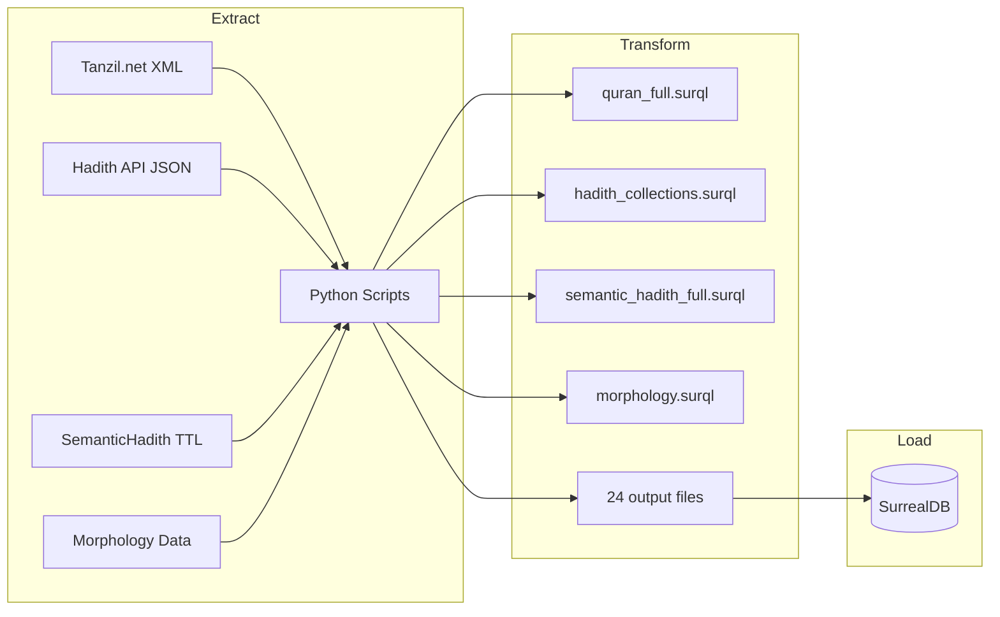

# ETL Pipeline Documentation

> **Author**: Technical Writing Agent  
> **Last Updated**: 2026-01-08  
> **Location**: `almizan-etl/`

---

## Overview

The Al-Mizan ETL (Extract, Transform, Load) pipeline converts raw Islamic textual data from various sources into SurQL statements for ingestion into SurrealDB.

### Pipeline Architecture



### Key Statistics

| Metric | Value |
|--------|-------|
| Source Files | 8+ raw data files |
| Transform Scripts | 15 Python scripts |
| Output Files | 24 SurQL files |
| Total Output Size | ~90 MB |
| Processing Time | 10-15 minutes |

---

## Requirements

### Dependencies

```bash
# requirements.txt
pandas==2.1.4
beautifulsoup4==4.12.2
tqdm==4.66.1
```

### Installation

```bash
cd almizan-etl
python -m venv .venv
source .venv/bin/activate  # Linux/Mac
pip install -r requirements.txt
```

---

## Source Data

### Data Directory Structure

```
almizan-etl/data/
├── quran-uthmani.xml       # 1.3 MB - Tanzil Quran (Uthmani script)
├── quran-data.xml          # 77 KB - Surah metadata
├── hadith40.json           # 75 KB - Nawawi 40 Hadith
├── juz30_arabic.json       # 330 KB - Juz Amma Arabic
├── juz30_english.json      # 315 KB - Juz Amma English
├── hadith-json.zip         # 33 MB - Full hadith archive
│
├── hadith-api/             # Extracted hadith JSON files
│   ├── bukhari.json        # 5.2 MB
│   └── muslim.json         # 4.3 MB
│
└── semantichadith/         # SemanticHadith V2 corpus
    └── SemanticHadith-V2.ttl
```

### Data Sources

| Source | Format | Description | URL |
|--------|--------|-------------|-----|
| Tanzil.net | XML | Official Quran text (Uthmani) | [tanzil.net](https://tanzil.net/) |
| Hadith API | JSON | Bukhari, Muslim collections | [GitHub](https://github.com/fawazahmed0/hadith-api) |
| Nawawi 40 | JSON | Classic 40 hadith collection | [GitHub](https://github.com/Kandil7/hadith_nawawi) |
| SemanticHadith | TTL | Semantic web hadith corpus | [Academic] |

---

## Transform Scripts

### Core Scripts

| Script | Input | Output | Description |
|--------|-------|--------|-------------|
| `download_sources.py` | URLs | raw files | Downloads Quran and Hadith sources |
| `transform_tanzil.py` | XML | `ingest.surql` | Parses Quran, generates master ingest |
| `transform_hadith.py` | JSON | `hadith_collections.surql` | Transforms Bukhari/Muslim |
| `transform_morphology.py` | XML | `morphology.surql` | Extracts Arabic root words |
| `transform_divine_names.py` | JSON | `divine_names.surql` | 99 Names of Allah |

### SemanticHadith Scripts

| Script | Description |
|--------|-------------|
| `ingest_semantichadith.py` | Basic hadith extraction |
| `ingest_semantichadith_full.py` | Full entity extraction (hadiths, narrators, chains) |
| `ingest_semantichadith_remaining.py` | Additional collections |

### Verification Scripts

| Script | Description |
|--------|-------------|
| `verify_ingestion.py` | Compares DB counts vs source files |
| `verify_graph_integrity.py` | Validates graph relationships |

---

## Pipeline Execution

### Step 1: Download Sources

```bash
cd almizan-etl
python download_sources.py
```

**Output**:
```
📥 Downloading Quran (Uthmani Script)...
   → Saved: data/quran-uthmani.xml (1.3 MB)
📥 Downloading Quran Metadata...
   → Saved: data/quran-data.xml (77 KB)
📥 Downloading 40 Nawawi Hadith...
   → Saved: data/hadith40.json (42 hadiths)
🎉 DONE!
```

### Step 2: Transform Quran

```bash
python transform_tanzil.py
```

**What it does**:
1. Parses `quran-uthmani.xml` (Tanzil format)
2. Calculates Juz numbers for each verse
3. Determines revelation place (Makkah/Madinah)
4. Generates SurQL CREATE statements

**Output Files**:
- `output/quran_full.surql` (3.7 MB, 6,236 verses)
- `output/hadith_nawawi.surql` (79 KB, 42 hadiths)
- `output/ingest.surql` (combined master script)

### Step 3: Transform Hadith Collections

```bash
python transform_hadith.py
```

**Output**:
- `output/hadith_collections.surql` (8.9 MB)

### Step 4: Transform SemanticHadith

```bash
python ingest_semantichadith_full.py
```

**What it extracts**:
- Hadiths with Arabic/English text
- Narrator information with generations (tabaqat)
- Chain segments (isnad)
- Topics and chapters
- Hadith similarities

**Output Files**:
- `output/semantic_hadith_full.surql` (25.9 MB)
- `output/narrators.surql` (1.4 MB)
- `output/chain_edges.surql` (10.3 MB)
- `output/hadith_topics.surql` (400 KB)

### Step 5: Transform Morphology

```bash
python transform_morphology.py
```

**Output**:
- `output/morphology.surql` (2.8 MB, root word mappings)

### Step 6: Generate Divine Names

```bash
python transform_divine_names.py
```

**Output**:
- `output/divine_names.surql` (12 KB, 99 names)

### Step 7: Load into Database

```bash
# Ensure SurrealDB is running
docker-compose up -d surreal

# Import schema first
surreal import --conn http://localhost:8000 \
  --user root --pass root \
  --ns idc --db main \
  database/schema/schema.surql

# Import data
surreal import --conn http://localhost:8000 \
  --user root --pass root \
  --ns idc --db main \
  almizan-etl/output/ingest.surql
```

### Step 8: Verify Ingestion

```bash
python verify_ingestion.py
```

**Expected Output**:
```
========================================
   AL-MIZAN INGESTION VERIFICATION
========================================

[Database Status]
Connected to: http://localhost:8000/sql (idc/main)
Quran Verses: 6236
Hadiths:      10000+
Root Words:   2000+

[Verification Report]
✅ QURAN: MATCH
✅ HADITH: MATCH
```

---

## Output Files Reference

### Complete Output Inventory

| File | Size | Content |
|------|------|---------|
| `quran_full.surql` | 3.7 MB | All 6,236 verses |
| `semantic_hadith_full.surql` | 25.9 MB | SemanticHadith V2 corpus |
| `chain_edges.surql` | 10.3 MB | Isnad chain relationships |
| `hadith_collections.surql` | 8.9 MB | Bukhari/Muslim collections |
| `morphology.surql` | 2.8 MB | Root word mappings |
| `hadith_chapters.surql` | 2.2 MB | Chapter structure |
| `mentions.surql` | 1.9 MB | Entity mentions |
| `hadith_types.surql` | 1.8 MB | Hadith classifications |
| `narrators.surql` | 1.4 MB | Narrator details |
| `chapters.surql` | 1.3 MB | Book chapters |
| `hadith_topics.surql` | 400 KB | Topic assignments |
| `similarities.surql` | 299 KB | Hadith similarities |
| `quran_juz30.surql` | 274 KB | Juz Amma subset |
| `cloud_juz30.surql` | 212 KB | Cloud-ready Juz 30 |
| `hadith40.surql` | 81 KB | Nawawi 40 |
| `divine_names.surql` | 12 KB | 99 Names |

**Total**: ~90 MB across 24 files

---

## Data Quality

### Tier 1 Verification (ADR-0004)

Per the [Tiered Data Verification Protocol](./ADR_CATALOG.md#adr-0004-tiered-data-verification), Quran text is verified against Tanzil.net checksums:

```python
# In transform_tanzil.py
def verify_checksum(parsed_verses):
    """Verify against Tanzil.net published checksums"""
    expected_verse_count = 6236
    if len(parsed_verses) != expected_verse_count:
        raise ValueError(f"Verse count mismatch: {len(parsed_verses)} != {expected_verse_count}")
```

### Verification Queries

```surql
-- Check verse count
SELECT count() FROM quran_verse;
-- Expected: 6236

-- Check collection distribution
SELECT collection, count() FROM hadith GROUP BY collection;

-- Check root word coverage
SELECT count() FROM has_root;
```

---

## Troubleshooting

### Common Issues

| Issue | Solution |
|-------|----------|
| "File not found" errors | Run `download_sources.py` first |
| Import fails with syntax error | Check SurQL escaping in transform scripts |
| Slow import | Import files individually, not master ingest |
| Connection refused | Ensure SurrealDB is running on port 8000 |

### Debug Mode

Add verbose output to verify scripts:

```bash
python verify_ingestion.py --debug
```

### Starting Fresh

```bash
# Clear database
surreal sql --conn http://localhost:8000 \
  --user root --pass root \
  --ns idc --db main \
  "REMOVE DATABASE main; DEFINE DATABASE main"

# Re-import schema
surreal import ... database/schema/schema.surql

# Re-import data
surreal import ... almizan-etl/output/ingest.surql
```

---

## Extending the Pipeline

### Adding New Sources

1. Create new transform script in `almizan-etl/`
2. Follow naming convention: `transform_<source>.py` or `ingest_<source>.py`
3. Output to `output/<source>.surql`
4. Add verification checks in `verify_ingestion.py`

### Script Template

```python
#!/usr/bin/env python3
"""
transform_newsource.py
Transforms <source> data into SurQL statements.
"""
import json
import os

BASE_DIR = os.path.dirname(__file__)
DATA_DIR = os.path.join(BASE_DIR, "data")
OUTPUT_DIR = os.path.join(BASE_DIR, "output")

def escape_surql(text: str) -> str:
    """Escape single quotes for SurQL strings."""
    return text.replace("'", "\\'")

def transform_data():
    """Transform source data into SurQL."""
    statements = []
    # ... transformation logic
    return statements

def write_output(statements: list, filename: str):
    """Write SurQL statements to file."""
    filepath = os.path.join(OUTPUT_DIR, filename)
    with open(filepath, 'w', encoding='utf-8') as f:
        f.write('\n'.join(statements))
    print(f"Wrote {len(statements)} statements to {filepath}")

def main():
    print("Transforming <source>...")
    statements = transform_data()
    write_output(statements, "newsource.surql")
    print("Done!")

if __name__ == "__main__":
    main()
```

---

## Related Documentation

- [Schema Reference](./SCHEMA_REFERENCE.md) - Database table definitions
- [Query Tutorial](./QUERY_TUTORIAL.md) - SurQL query patterns
- [ADR-0004](../adr/0004-data-verification-protocol.md) - Verification protocol

---

*This documentation is maintained by the Technical Writing Agent. Last updated: 2026-01-08*
