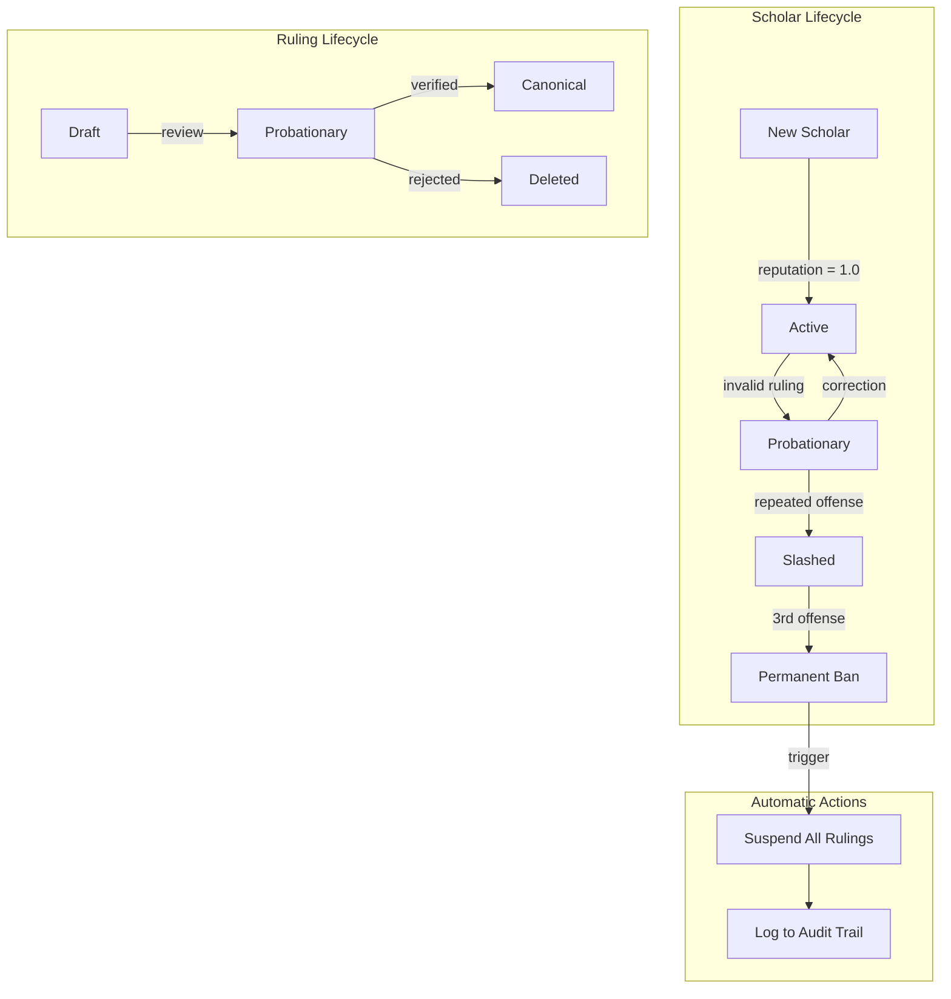
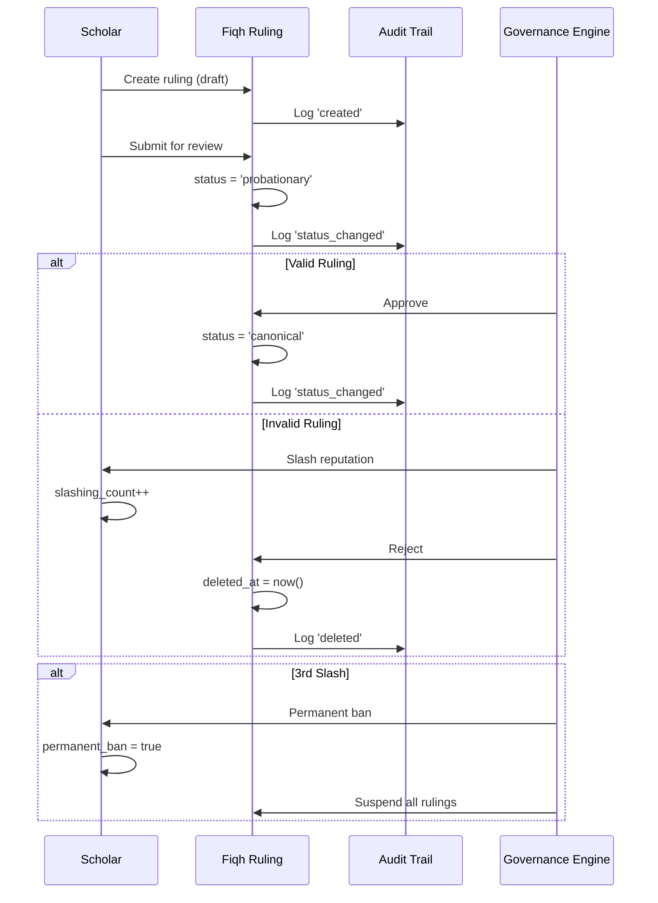

# Governance Model Documentation

> **Author**: Technical Writing Agent  
> **Last Updated**: 2026-01-08  
> **Related ADR**: [ADR-0004 - Tiered Data Verification](../adr/0004-data-verification-protocol.md)

---

## Overview

The Al-Mizan governance model ensures the integrity and trustworthiness of Islamic knowledge in the graph. It implements a **Stake & Slash** protocol inspired by blockchain consensus mechanisms, adapted for scholarly accountability.

### Core Principles

1. **Accountability**: Every ruling must be attributed to a scholar
2. **Transparency**: All changes are logged in an immutable audit trail
3. **Trust Scoring**: Scholars have quantifiable reputation
4. **Automatic Enforcement**: Byzantine (malicious) scholars are automatically banned

---

## Governance Architecture



---

## Scholar Reputation System

### Scholar Status

Scholars progress through trust levels based on their contribution quality:

| Status | Description | Capabilities |
|--------|-------------|--------------|
| `active` | Good standing | Can issue rulings, full write access |
| `probationary` | Under review | Limited write access, rulings require approval |
| `slashed` | Penalized | No write access, reputation reduced |

### Reputation Score

Scholars have a **reputation score** (0.0 - 10.0) that reflects their trustworthiness:

| Score Range | Trust Level | Meaning |
|-------------|-------------|---------|
| 8.0 - 10.0 | ⭐ High | Highly trusted, rulings fast-tracked |
| 5.0 - 7.9 | ✅ Normal | Standard review process |
| 2.0 - 4.9 | ⚠️ Low | Extended review, additional scrutiny |
| 0.0 - 1.9 | 🔴 Critical | Rulings blocked, account under review |

### Schema Definition

```surql
-- Scholar governance fields
DEFINE FIELD status ON scholar TYPE string 
    DEFAULT 'active' 
    ASSERT $value INSIDE ['active', 'probationary', 'slashed'];

DEFINE FIELD reputation ON scholar TYPE float 
    DEFAULT 1.0
    ASSERT $value >= 0.0 AND $value <= 10.0;

DEFINE FIELD slashing_count ON scholar TYPE int DEFAULT 0;
DEFINE FIELD permanent_ban ON scholar TYPE bool DEFAULT false;
```

---

## Stake & Slash Protocol

### What is Stake & Slash?

The protocol draws from blockchain governance:
- **Stake**: Scholars "stake" their reputation when issuing rulings
- **Slash**: Invalid rulings result in reputation reduction (slashing)

This creates accountability without requiring financial stakes.

### Slashing Triggers

A scholar may be slashed for:

1. **Fabricated Evidence**: Citing non-existent Quran verses or hadiths
2. **Mawdu Hadith Usage**: Basing rulings on fabricated hadiths
3. **Abrogation Violations**: Incorrect naskh claims
4. **Consensus Contradiction**: Contradicting established ijma without evidence
5. **Plagiarism**: Copying rulings without attribution

### Slashing Consequences

| Offense | Reputation Impact | Status Change |
|---------|-------------------|---------------|
| First offense | -2.0 | `active` → `probationary` |
| Second offense | -3.0 | Remains `probationary` |
| Third offense | → 0.0 | `slashed` + `permanent_ban` |

### Byzantine Scholar Detection

A **Byzantine Scholar** is one who has been permanently banned after 3 slashing incidents:

```surql
-- Auto-ban trigger (Event 9.6)
DEFINE EVENT auto_ban_byzantine_scholars ON TABLE scholar
WHEN $event = "UPDATE" THEN {
    IF $after.slashing_count >= 3 AND $after.permanent_ban = false {
        UPDATE $after SET
            status = 'slashed',
            permanent_ban = true,
            reputation = 0.0;
        
        -- Suspend all their rulings
        UPDATE fiqh_ruling 
        SET status = 'suspended',
            deleted_at = time::now(),
            deleted_by = 'system:auto_ban'
        WHERE issued_by = $after;
    };
};
```

---

## Ruling Lifecycle

### Ruling Status

All fiqh rulings progress through a lifecycle:

```
draft → probationary → canonical
                    ↘ deleted
```

| Status | Description | Visibility |
|--------|----------------|------------|
| `draft` | Initial submission | Author only |
| `probationary` | Under peer review | All scholars |
| `canonical` | Verified and accepted | Public |
| `suspended` | Temporarily hidden | Hidden (audit only) |

### Mandatory Attribution

**Every ruling must have a scholar attribution** - anonymous rulings are rejected:

```surql
DEFINE FIELD issued_by ON fiqh_ruling TYPE record<scholar> 
    ASSERT $value != NONE;
```

### Evidence Requirements

Rulings must be linked to primary sources via the `derived_from` relationship:

```surql
-- Create ruling with evidence
CREATE fiqh_ruling SET
    text = 'Interest-based loans are prohibited',
    hukm = 'Haram',
    issued_by = scholar:imam_malik;

-- Link to evidence
RELATE (SELECT id FROM fiqh_ruling WHERE text CONTAINS 'Interest')
    ->derived_from->quran_verse:2_275;
```

### Mawdu Hadith Protection

The system automatically prevents rulings based on fabricated (Mawdu) hadiths:

```surql
-- Event trigger (9.1)
DEFINE EVENT prevent_mawdu_derivation ON TABLE derived_from 
WHEN $event = "CREATE" THEN {
    LET $hadith_grades = (
        SELECT VALUE rank FROM graded WHERE out = $after.out
    );
    IF array::len($hadith_grades) > 0 AND 'Mawdu' IN $hadith_grades {
        THROW "Error: Cannot base a ruling on fabricated (Mawdu) evidence.";
    };
};
```

---

## Audit Trail

### Purpose

All ruling modifications are logged for:
- **Compliance**: Meeting academic and regulatory requirements
- **Transparency**: Anyone can see the history of a ruling
- **Accountability**: Track who made what changes when

### Audit Record Structure

```surql
DEFINE TABLE ruling_history SCHEMAFULL;

DEFINE FIELD ruling_id ON ruling_history TYPE record<fiqh_ruling>;
DEFINE FIELD modified_at ON ruling_history TYPE datetime DEFAULT time::now();
DEFINE FIELD modified_by ON ruling_history TYPE string;
DEFINE FIELD previous_hukm ON ruling_history TYPE option<string>;
DEFINE FIELD new_hukm ON ruling_history TYPE string;
DEFINE FIELD change_reason ON ruling_history TYPE option<string>;
DEFINE FIELD change_type ON ruling_history TYPE string
    ASSERT $value INSIDE ['created', 'hukm_changed', 'status_changed', 'deleted'];
```

### Automatic Logging

Changes are logged automatically via event triggers:

| Event | Logged When |
|-------|-------------|
| `created` | New ruling inserted |
| `hukm_changed` | Ruling verdict changed (e.g., Makruh → Haram) |
| `status_changed` | Lifecycle change (draft → canonical) |
| `deleted` | Ruling removed or suspended |

### Querying Audit History

```surql
-- Get full history for a ruling
SELECT * FROM ruling_history 
WHERE ruling_id = fiqh_ruling:riba_prohibition
ORDER BY modified_at DESC;

-- Get all changes by a specific user
SELECT * FROM ruling_history 
WHERE modified_by = 'scholar:ibn_taymiyyah';

-- Get recent changes (last 7 days)
SELECT * FROM ruling_history 
WHERE modified_at > time::now() - 7d;
```

---

## Cascade Behaviors

### Scholar Deletion

When a scholar is deleted, their rulings are **soft-deleted** (not permanently removed):

```surql
-- Event trigger (9.2)
DEFINE EVENT cascade_scholar_delete ON TABLE scholar
WHEN $event = "DELETE" THEN {
    UPDATE fiqh_ruling 
    SET deleted_at = time::now(),
        deleted_by = 'system:cascade_delete',
        status = 'suspended'
    WHERE issued_by = $before;
};
```

### Source Protection

Primary sources (Quran verses, hadiths) **cannot be deleted** if rulings depend on them:

```surql
-- Event trigger (9.4)
DEFINE EVENT prevent_source_deletion_verse ON TABLE quran_verse
WHEN $event = "DELETE" THEN {
    LET $dependent_rulings = (
        SELECT count() FROM derived_from WHERE out = $before
    )[0].count;
    
    IF $dependent_rulings > 0 {
        THROW "Cannot delete verse: " + $dependent_rulings + " ruling(s) depend on it";
    };
};
```

---

## Role-Based Access

### Permission Matrix

| Role | View | Create Rulings | Edit Rulings | Delete Rulings | Manage Scholars |
|------|------|----------------|--------------|----------------|-----------------|
| **admin** | ✅ | ✅ | ✅ | ✅ | ✅ |
| **scholar** | ✅ | ✅ (own) | ✅ (own) | ❌ | ❌ |
| **student** | ✅ | ❌ | ❌ | ❌ | ❌ |
| **anonymous** | ✅ (public) | ❌ | ❌ | ❌ | ❌ |

### Implementation

```surql
-- Fiqh ruling permissions
DEFINE TABLE fiqh_ruling SCHEMAFULL
    PERMISSIONS
        FOR select FULL
        FOR create, update, delete WHERE $auth.role IN ['admin', 'scholar'];

-- Audit trail permissions (read-only for scholars)
DEFINE TABLE ruling_history SCHEMAFULL
    PERMISSIONS FOR select WHERE $auth.role IN ['admin', 'scholar'];
```

---

## Governance Queries

### Find High-Reputation Scholars

```surql
SELECT name_ar, name_en, reputation, status
FROM scholar 
WHERE status = 'active' AND reputation >= 8.0
ORDER BY reputation DESC;
```

### Get Slashing History

```surql
-- Scholars with slashing incidents
SELECT name_ar, slashing_count, status, permanent_ban
FROM scholar 
WHERE slashing_count > 0
ORDER BY slashing_count DESC;
```

### Audit a Ruling's Changes

```surql
SELECT 
    modified_at,
    modified_by,
    previous_hukm,
    new_hukm,
    change_type,
    change_reason
FROM ruling_history 
WHERE ruling_id = fiqh_ruling:target_ruling
ORDER BY modified_at ASC;
```

### Count Rulings by Status

```surql
SELECT status, count() as total
FROM fiqh_ruling 
WHERE deleted_at IS NONE
GROUP BY status;
```

---

## Governance Flow Diagram



---

## Best Practices

### For Scholars

1. **Always cite evidence**: Link rulings to Quran/Hadith via `derived_from`
2. **Check hadith grades**: Ensure hadiths are Sahih or Hasan before citing
3. **Document reasoning**: Include `change_reason` when modifying rulings
4. **Respect ijma**: Acknowledge consensus positions in your rulings

### For Administrators

1. **Review probationary rulings**: Regularly process the review queue
2. **Monitor reputation scores**: Identify scholars needing support
3. **Audit high-impact changes**: Review changes to canonical rulings
4. **Backup audit trail**: Preserve ruling_history for compliance

---

## Related Documentation

- [Schema Reference](./SCHEMA_REFERENCE.md) - Table definitions
- [ADR-0004](../adr/0004-data-verification-protocol.md) - Verification protocol
- [ADR-0005](../adr/0005-public-api-security.md) - API security model
- [Glossary](./GLOSSARY.md) - Term definitions

---

*This documentation is maintained by the Technical Writing Agent. Last updated: 2026-01-08*
