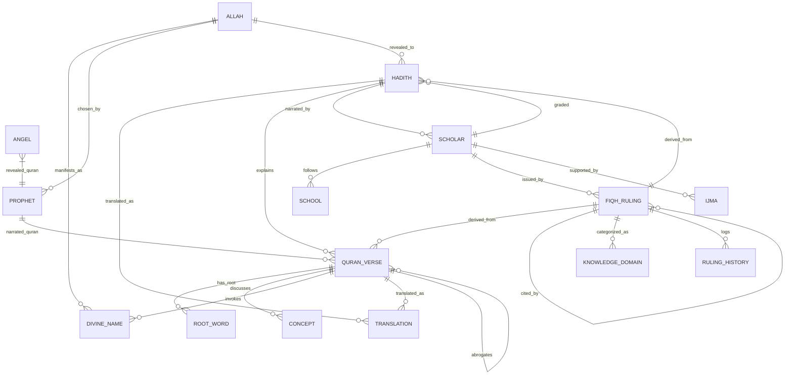

# Al-Mizan Schema Reference

> **Version**: 1.1 (Tawhidic Foundation Complete)  
> **Author**: Technical Writing Agent  
> **Last Updated**: 2026-01-08  
> **Source**: [schema.surql](file:///home/a/code/al-mizan-project/database/schema/schema.surql)

---

## Overview

The Al-Mizan schema implements a **neuro-symbolic knowledge graph** based on Tawhidic epistemology. All knowledge traces back to a single ontological root (Allah), flowing through prophets and revelation to scholarly interpretation.

### Schema Statistics

| Metric | Count |
|--------|-------|
| Entity Tables | 18 |
| Relationship Tables | 17 |
| Event Triggers | 6 |
| Performance Indexes | 40+ |
| Total Lines | 861 |

### Data Tier Architecture

```
┌─────────────────────────────────────────────────────────────┐
│  TIER 1: IMMUTABLE (Thabit)                                 │
│  Quran, Sahih Hadith - Read-only after digitization         │
├─────────────────────────────────────────────────────────────┤
│  TIER 2: INTERPRETIVE (Zanni)                               │
│  Fiqh Rulings - Mutable with mandatory attribution          │
├─────────────────────────────────────────────────────────────┤
│  TIER 3: CONTEXTUAL                                         │
│  Historical, Linguistic, Biographical data                  │
└─────────────────────────────────────────────────────────────┘
```

---

## Entity Tables

### 1. Tawhidic Foundation

#### `allah`

The ontological root - singleton node representing the source of all knowledge.

| Field | Type | Required | Description |
|-------|------|----------|-------------|
| `id` | record | Yes | `allah:tawhid` (singleton) |
| `essence` | string | Yes | Always `'al-Wujud al-Mutlaq'` (immutable) |

**Permissions**: Select only (read-only for all users)

**Example**:
```surql
SELECT * FROM allah:tawhid;
```

---

#### `prophet`

Prophets (Anbiya) - 25 mentioned in Quran plus Prophet Muhammad (ﷺ).

| Field | Type | Required | Default | Description |
|-------|------|----------|---------|-------------|
| `name_ar` | string | Yes | - | Arabic name |
| `name_en` | string | Yes | - | English name |
| `lineage` | string | No | - | Genealogy |
| `birth_year_approx` | int | No | - | Approximate birth year |
| `death_year_approx` | int | No | - | Approximate death year |
| `revelation_received` | string | No | - | Scripture received (Tawrat, Injil, Zabur, Quran) |
| `messenger_rank` | string | Yes | `'nabi'` | `'nabi'` (prophet) or `'rasul'` (messenger) |
| `quranic_mentions` | int | Yes | `0` | Frequency in Quran |
| `digitized_by` | string | No | - | Data source |
| `digitization_date` | datetime | Yes | `time::now()` | Ingestion timestamp |

**Index**: `prophet_name_ar_idx` (unique on `name_ar`)

**Example**:
```surql
SELECT * FROM prophet WHERE messenger_rank = 'rasul';
```

---

#### `angel`

Angels (Mala'ika) - carriers of revelation.

| Field | Type | Required | Description |
|-------|------|----------|-------------|
| `name_ar` | string | Yes | Arabic name |
| `name_en` | string | Yes | English name |
| `role` | string | Yes | Function (Revelation, Sustenance, Death, etc.) |
| `quranic_mentions` | int | Yes | Frequency in Quran |

**Index**: `angel_name_ar_idx` (unique)

---

#### `divine_name`

The 99 Names of Allah (Asma ul Husna).

| Field | Type | Required | Description |
|-------|------|----------|-------------|
| `transliteration` | string | Yes | Romanized name |
| `arabic` | string | Yes | Arabic name |
| `meaning_en` | string | Yes | English meaning |

**Index**: `divine_name_ar_idx` (unique on `arabic`)

**Example**:
```surql
SELECT * FROM divine_name ORDER BY id LIMIT 10;
```

---

### 2. Primary Sources (Tier 1)

#### `quran_verse`

Individual verses of the Quran - **immutable** after digitization.

| Field | Type | Required | Default | Constraint |
|-------|------|----------|---------|------------|
| `text_uthmani` | string | Yes | - | Uthmani script |
| `text_simple` | string | No | - | Simplified script |
| `surah_number` | int | Yes | - | 1-114 |
| `ayah_number` | int | Yes | - | Verse number |
| `juz_number` | int | Yes | - | 1-30 |
| `revelation_place` | string | Yes | - | `'Makkah'` or `'Madinah'` |
| `mutability` | string | Yes | `'CONSTANT'` | Always `'CONSTANT'` |
| `digitized_by` | string | No | - | Source attribution |
| `digitization_date` | datetime | Yes | `time::now()` | Ingestion timestamp |

**Index**: `verse_coords_idx` (unique on `surah_number`, `ayah_number`)

**Permissions**: 
- Select: All users
- Create/Update/Delete: Admin only

**Example Queries**:
```surql
-- Get a specific verse
SELECT * FROM quran_verse:1_1;

-- Get all verses in a surah
SELECT * FROM quran_verse WHERE surah_number = 1;

-- Get Makkan verses
SELECT * FROM quran_verse WHERE revelation_place = 'Makkah' LIMIT 100;
```

---

#### `hadith`

Prophetic traditions - **immutable** after verification.

| Field | Type | Required | Default | Constraint |
|-------|------|----------|---------|------------|
| `collection` | string | Yes | - | Collection name (bukhari, muslim, etc.) |
| `hadith_number` | int | Yes | - | Reference number |
| `matn_ar` | string | Yes | - | Arabic text |
| `matn_en` | string | No | - | English translation |
| `hadith_type` | string | Yes | `'nabawi'` | `'qudsi'` (divine) or `'nabawi'` (prophetic) |
| `mutability` | string | Yes | `'CONSTANT'` | Always `'CONSTANT'` |
| `digitized_by` | string | No | - | Source attribution |
| `digitization_date` | datetime | Yes | `time::now()` | Ingestion timestamp |

**Index**: `hadith_ref_idx` (unique on `collection`, `hadith_number`)

**Example**:
```surql
-- Get hadith by collection and number
SELECT * FROM hadith WHERE collection = 'bukhari' AND hadith_number = 1;

-- Get all Hadith Qudsi
SELECT * FROM hadith WHERE hadith_type = 'qudsi';
```

---

### 3. Scholarly Context (Tier 2)

#### `scholar`

Islamic scholars - includes governance fields for reputation management.

| Field | Type | Required | Default | Constraint |
|-------|------|----------|---------|------------|
| `name_ar` | string | Yes | - | Arabic name |
| `name_en` | string | No | - | English name |
| `death_year_ah` | int | No | - | Death year (Hijri calendar) |
| `status` | string | Yes | `'active'` | `'active'`, `'probationary'`, `'slashed'` |
| `reputation` | float | Yes | `1.0` | 0.0 - 10.0 |
| `slashing_count` | int | Yes | `0` | Number of penalties |
| `permanent_ban` | bool | Yes | `false` | Byzantine scholar flag |

**Indexes**: 
- `scholar_status_idx` (on `status`)
- `scholar_reputation_idx` (on `reputation`)

**Governance Rules**:
- 3 slashing incidents → automatic permanent ban
- Ban triggers suspension of all rulings

---

#### `fiqh_ruling`

Scholarly jurisprudential rulings - **mutable** with mandatory attribution.

| Field | Type | Required | Default | Constraint |
|-------|------|----------|---------|------------|
| `text` | string | Yes | - | Ruling content |
| `hukm` | string | Yes | - | `'Wajib'`, `'Mandub'`, `'Mubah'`, `'Makruh'`, `'Haram'` |
| `madhab` | string | No | - | School of thought |
| `issued_by` | record<scholar> | Yes | - | **Cannot be null** |
| `mutability` | string | Yes | `'VARIABLE'` | Always `'VARIABLE'` |
| `status` | string | Yes | `'draft'` | `'draft'`, `'probationary'`, `'canonical'` |
| `created_at` | datetime | Yes | `time::now()` | Creation timestamp |
| `deleted_at` | datetime | No | - | Soft delete timestamp |
| `deleted_by` | string | No | - | Who deleted |

**Audit Trail**: All changes logged to `ruling_history` via event trigger.

**Example**:
```surql
-- Create a ruling with attribution
CREATE fiqh_ruling SET
    text = 'Gold investment is permissible',
    hukm = 'Mubah',
    madhab = 'Shafi',
    issued_by = scholar:imam_shafi;
```

---

#### `school`

Schools of Islamic jurisprudence (Madhahib).

| Field | Type | Required | Description |
|-------|------|----------|-------------|
| `name` | string | Yes | School name |
| `founder` | string | No | Founder's name |

**Index**: `school_name_idx` (unique)

---

#### `ijma`

Scholarly consensus - third source of Islamic law.

| Field | Type | Required | Default | Constraint |
|-------|------|----------|---------|------------|
| `topic_ar` | string | Yes | - | Arabic topic |
| `topic_en` | string | Yes | - | English topic |
| `description_ar` | string | No | - | Arabic description |
| `description_en` | string | No | - | English description |
| `consensus_level` | string | Yes | - | `'unanimous'`, `'majority'`, `'disputed'` |
| `era` | string | Yes | - | `'sahabah'`, `'tabiun'`, `'tabi_tabiun'`, `'classical'`, `'contemporary'` |
| `evidence` | array<string> | No | - | Textual evidence |
| `created_at` | datetime | Yes | `time::now()` | Creation timestamp |

---

### 4. Linguistic & Semantic

#### `root_word`

Arabic trilateral roots for morphological analysis.

| Field | Type | Required | Description |
|-------|------|----------|-------------|
| `root_ar` | string | Yes | Arabic root (e.g., ر ح م) |
| `definition_en` | string | No | English meaning |

**Index**: `root_ar_idx` (unique)

---

#### `concept`

Thematic concepts for categorization.

| Field | Type | Required | Description |
|-------|------|----------|-------------|
| `name_en` | string | Yes | English name |
| `name_ar` | string | No | Arabic name |
| `description` | string | No | Description |

**Index**: `concept_name_idx` (unique on `name_en`)

---

#### `translation`

Human translations of primary sources.

| Field | Type | Required | Default | Description |
|-------|------|----------|---------|-------------|
| `text_en` | string | Yes | - | Translated text |
| `translator` | string | Yes | - | Translator name |
| `language` | string | Yes | `'en'` | Language code |

---

### 5. Access Control

#### `user`

System users with role-based access.

| Field | Type | Required | Constraint |
|-------|------|----------|------------|
| `email` | string | Yes | Valid email format |
| `password` | string | Yes | Argon2 hashed |
| `role` | string | Yes | `'admin'`, `'scholar'`, `'student'` |

**Index**: `user_email_idx` (unique)

**Scope**: `allusers` (24-hour session)

---

### 6. Audit & History

#### `ruling_history`

Immutable audit trail for fiqh ruling changes.

| Field | Type | Required | Description |
|-------|------|----------|-------------|
| `ruling_id` | record<fiqh_ruling> | Yes | Reference to ruling |
| `modified_at` | datetime | Yes | Change timestamp |
| `modified_by` | string | Yes | Who made change |
| `previous_hukm` | string | No | Previous ruling value |
| `new_hukm` | string | Yes | New ruling value |
| `change_reason` | string | No | Justification |
| `change_type` | string | Yes | `'created'`, `'hukm_changed'`, `'status_changed'`, `'deleted'` |

**Indexes**: 
- `ruling_history_ruling_idx` (on `ruling_id`)
- `ruling_history_date_idx` (on `modified_at`)

---

## Relationship Tables

### Tawhidic Chain

| Table | From | To | Description |
|-------|------|-----|-------------|
| `manifests_as` | `allah` | `divine_name` | Divine names manifestation |
| `chosen_by` | `allah` | `prophet` | Prophet selection |
| `revealed_quran` | `allah` | `prophet` | Quran revelation chain |
| `revealed_to` | `allah` | `hadith` | Hadith Qudsi revelation |
| `narrated_quran` | `prophet` | `quran_verse` | Verse narration |
| `supported_by` | `ijma` | `scholar` | Consensus support |
| `categorized_as` | `fiqh_ruling` | `knowledge_domain` | Knowledge classification |

### Source Relationships

| Table | From | To | Fields | Description |
|-------|------|-----|--------|-------------|
| `translated_as` | `quran_verse\|hadith` | `translation` | - | Translations |
| `has_root` | `quran_verse` | `root_word` | - | Morphology |
| `discusses` | `quran_verse` | `concept` | - | Thematic links |
| `invokes` | `quran_verse` | `divine_name` | - | Name invocations |
| `explains` | `hadith` | `quran_verse` | - | Tafsir links |

### Scholarly Relationships

| Table | From | To | Fields | Description |
|-------|------|-----|--------|-------------|
| `derived_from` | `fiqh_ruling` | `quran_verse\|hadith` | `strength`, `method` | Ruling derivation |
| `graded` | `scholar` | `hadith` | `rank`, `justification` | Hadith grading |
| `narrated_by` | `hadith` | `scholar` | `narration_order` | Isnad chain |
| `follows` | `scholar` | `school` | `rank` | School affiliation |
| `abrogates` | `quran_verse` | `quran_verse` | `attributed_to`, `consensus` | Naskh |
| `cited_by` | `fiqh_ruling` | `fiqh_ruling` | `citation_type` | Ruling citations |
| `contradicts` | `fiqh_ruling` | `fiqh_ruling` | `explanation` | Contradictions |

---

## Event Triggers

### Governance & Integrity

| Event | Table | Trigger | Action |
|-------|-------|---------|--------|
| `prevent_mawdu_derivation` | `derived_from` | CREATE | Blocks rulings from fabricated hadith |
| `cascade_scholar_delete` | `scholar` | DELETE | Soft-deletes all scholar's rulings |
| `track_ruling_changes` | `fiqh_ruling` | CREATE/UPDATE | Logs to `ruling_history` |
| `track_ruling_deletion` | `fiqh_ruling` | DELETE | Logs deletion to history |
| `prevent_source_deletion_verse` | `quran_verse` | DELETE | Blocks if rulings depend on it |
| `prevent_source_deletion_hadith` | `hadith` | DELETE | Blocks if rulings depend on it |
| `validate_abrogation` | `abrogates` | CREATE | Prevents cycles, enforces chronology |
| `auto_ban_byzantine_scholars` | `scholar` | UPDATE | 3 slashes → permanent ban |

---

## Common Query Patterns

### Get Verse with Roots

```surql
SELECT *, ->has_root->root_word.root_ar AS roots 
FROM quran_verse:1_1;
```

### Get Hadith with Grading

```surql
SELECT *, <-graded<-scholar AS graders, <-graded.rank AS grades
FROM hadith 
WHERE collection = 'bukhari' AND hadith_number = 1;
```

### Trace Ruling Evidence

```surql
SELECT *, ->derived_from->(quran_verse, hadith) AS evidence
FROM fiqh_ruling
WHERE hukm = 'Haram';
```

### Get Scholar's Rulings

```surql
SELECT text, hukm, status FROM fiqh_ruling
WHERE issued_by = scholar:imam_shafi
AND deleted_at IS NONE;
```

### Graph Traversal (Tawhidic Chain)

```surql
-- From Allah to verses via prophets
SELECT ->chosen_by->prophet->narrated_quran->quran_verse AS verses
FROM allah:tawhid;
```

---

## Entity Relationship Diagram



---

## Performance Indexes

All relationship tables have bidirectional indexes for O(1) traversal:

| Table | Indexes |
|-------|---------|
| `derived_from` | `derived_from_in_idx`, `derived_from_out_idx` |
| `explains` | `explains_in_idx`, `explains_out_idx` |
| `has_root` | `has_root_in_idx`, `has_root_out_idx` |
| `discusses` | `discusses_in_idx`, `discusses_out_idx` |
| `invokes` | `invokes_in_idx`, `invokes_out_idx` |
| `graded` | `graded_in_idx`, `graded_out_idx` |
| `narrated_by` | `narrated_by_in_idx`, `narrated_by_out_idx` |
| `follows` | `follows_in_idx`, `follows_out_idx` |
| `abrogates` | `abrogates_in_idx`, `abrogates_out_idx` |
| `cited_by` | `cited_by_in_idx`, `cited_by_out_idx` |
| `contradicts` | `contradicts_in_idx`, `contradicts_out_idx` |
| ... | (40+ total indexes) |

---

## Permission Summary

| Role | Can Read | Can Write |
|------|----------|-----------|
| **admin** | All tables | All tables |
| **scholar** | All tables | `fiqh_ruling`, `ijma`, `abrogates` |
| **student** | All tables | Own user record only |
| **anonymous** | Public tables | None |

---

*This reference is maintained by the Technical Writing Agent. Last updated: 2026-01-08*
