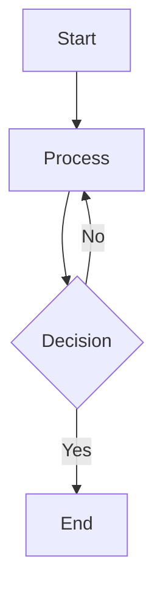

# Al-Mizan Documentation Style Guide

> **Author**: Technical Writing Agent  
> **Version**: 1.0  
> **Last Updated**: 2026-01-08

---

## Purpose

This style guide ensures consistency across all Al-Mizan documentation. All contributors should follow these guidelines when creating or updating documentation.

---

## 1. Document Structure

### Standard Header

Every documentation file should begin with a metadata header:

```markdown
# Document Title

> **Author**: [Agent Name or Contributor]  
> **Date**: YYYY-MM-DD  
> **Status**: Draft | Review | Published

---
```

### Section Organization

Use hierarchical headings:

```markdown
# H1 - Document Title (one per document)
## H2 - Major Sections
### H3 - Subsections
#### H4 - Detail sections (use sparingly)
```

### Standard Sections

Consider including these sections where applicable:

1. **Overview/Introduction** - What and why
2. **Prerequisites** (for tutorials) - What's needed
3. **Main Content** - Core information
4. **Examples** - Practical demonstrations
5. **Troubleshooting** - Common issues
6. **References** - Related documents

---

## 2. Writing Style

### Voice and Tone

| Do | Don't |
|----|-------|
| Be professional but approachable | Be overly formal or academic |
| Use active voice | Use passive voice excessively |
| Address the reader as "you" | Use "one" or "the user" |
| Be concise | Pad with unnecessary words |

**Examples**:
- ✅ "Run the server with `cargo run`"
- ❌ "The server should be run by the user using the cargo run command"

### Terminology Consistency

Always use terms from the [Glossary](./GLOSSARY.md). Key rules:

| Term | Usage |
|------|-------|
| **Quran** | Capitalize, no "the Holy" prefix in technical docs |
| **hadith** | Lowercase when referring to a single report |
| **Hadith** | Capitalize when referring to the corpus/science |
| **Tier 1** | For immutable data (Quran, Sahih Hadith) |
| **Tier 2** | For interpretive data (Fiqh rulings) |

### First Reference Rule

On first use in a document, provide Arabic and transliteration:

> "Fiqh (فقه, *fiqh*) is the Islamic science of jurisprudence..."

After the first reference, use English only:

> "The fiqh ruling was issued by..."

---

## 3. Formatting Standards

### Code Blocks

Always specify the language for syntax highlighting:

````markdown
```bash
curl http://localhost:3000/api/v1/verse/1/1
```

```json
{
  "id": "quran_verse:1_1",
  "surah": 1
}
```

```rust
pub async fn get_verse() -> impl IntoResponse {
    // ...
}
```

```surql
SELECT * FROM quran_verse WHERE surah_number = 1;
```
````

### Inline Code

Use backticks for:
- File names: `schema.surql`
- Table names: `quran_verse`
- Field names: `matn_ar`
- Record IDs: `hadith:bukhari_1`
- Commands: `cargo run`
- API paths: `/api/v1/verse`

**Don't** use backticks for:
- General emphasis (use *italics* or **bold**)
- Links (they break the formatting)

### Tables

Use tables for structured data:

```markdown
| Column A | Column B | Column C |
|----------|----------|----------|
| Value 1  | Value 2  | Value 3  |
```

Keep columns aligned and use consistent capitalization.

### Lists

**Bulleted lists** for unordered items:
```markdown
- Item one
- Item two
- Item three
```

**Numbered lists** for sequential steps:
```markdown
1. First step
2. Second step
3. Third step
```

---

## 4. API Documentation

### Endpoint Format

Use this structure for each endpoint:

```markdown
### `METHOD /path/to/endpoint`

Brief description of what this endpoint does.

**Path Parameters**:
| Parameter | Type | Description |
|-----------|------|-------------|
| `param` | string | What it does |

**Query Parameters**:
| Parameter | Type | Default | Description |
|-----------|------|---------|-------------|
| `param` | boolean | `false` | What it does |

**Request Body**:
| Field | Type | Required | Description |
|-------|------|----------|-------------|
| `field` | string | Yes | What it contains |

**Example**:
```bash
curl http://localhost:3000/api/v1/endpoint
```

**Success Response** (`200 OK`):
```json
{
  "field": "value"
}
```

**Error Responses**:
- `404 Not Found`: Resource not found
- `500 Internal Server Error`: Server error
```

---

## 5. Status Indicators

Use consistent emoji indicators:

| Emoji | Meaning | Usage |
|-------|---------|-------|
| 🔴 | Critical/Missing | `🔴 Missing` |
| 🟡 | Partial/In Progress | `🟡 Partial` |
| 🟢 | Complete/Good | `🟢 Complete` |
| ✅ | Done/Checked | `✅ Done` |
| ❌ | Failed/Deprecated | `❌ Deprecated` |
| ⚠️ | Warning/Caution | `⚠️ Caution` |
| ⏳ | In Progress | `⏳ In Progress` |

---

## 6. Alerts and Callouts

Use GitHub-style alerts for important information:

```markdown
> [!NOTE]
> Background information or helpful tips.

> [!TIP]
> Best practices or performance suggestions.

> [!IMPORTANT]
> Critical information the reader must know.

> [!WARNING]
> Potential issues or breaking changes.

> [!CAUTION]
> Dangerous actions that could cause problems.
```

**When to use each**:

| Alert | Use For |
|-------|---------|
| NOTE | Helpful context, implementation details |
| TIP | Performance optimizations, shortcuts |
| IMPORTANT | Essential requirements, must-know info |
| WARNING | Breaking changes, compatibility issues |
| CAUTION | Destructive actions, security risks |

---

## 7. Links and References

### Internal Links

Use relative paths for internal documentation:

```markdown
See the [API Reference](./API_REFERENCE.md) for details.
Check [ADR-0001](../adr/0001-tech-stack.md) for the decision.
```

### External Links

Use descriptive link text (not "click here"):

```markdown
✅ See the [SurrealDB documentation](https://surrealdb.com/docs) for query syntax.
❌ Click [here](https://surrealdb.com/docs) for more info.
```

### File Links

Use the `file://` protocol for local files:

```markdown
[schema.surql](file:///home/a/code/al-mizan-project/database/schema/schema.surql)
```

---

## 8. Diagrams

Use Mermaid for diagrams when possible:

````markdown

````

**Diagram Types**:
- `graph TD` - Top-down flowcharts
- `graph LR` - Left-right flowcharts
- `sequenceDiagram` - API interactions
- `erDiagram` - Database relationships
- `journey` - User journeys

---

## 9. File Naming

| Type | Convention | Example |
|------|-----------|---------|
| Documentation | `SCREAMING_SNAKE.md` | `API_REFERENCE.md` |
| ADRs | `NNNN-kebab-case.md` | `0001-tech-stack.md` |
| Guides | `SCREAMING_SNAKE.md` | `QUICK_START.md` |
| Code | `snake_case.ext` | `get_verse.rs` |

---

## 10. Versioning

### Document Versions

Include "Last Updated" in the header:

```markdown
> **Last Updated**: 2026-01-08
```

### API Versions

Always include version in API paths:

```
/api/v1/endpoint  ✅
/api/endpoint     ❌
```

### Changelog Updates

For significant changes, add to `CHANGELOG.md`:

```markdown
## [Unreleased]

### Added
- New API endpoint for divine names

### Changed
- Updated synthesis response format

### Fixed
- Corrected hadith collection names
```

---

## 11. Accessibility

### Alt Text for Images

Always provide descriptive alt text:

```markdown

```

### Heading Hierarchy

Never skip heading levels:

```markdown
# Title
## Section (correct)
### Subsection (correct)
##### Detail (incorrect - skipped H4)
```

### Table Headers

Always include header rows in tables.

---

## 12. Quality Checklist

Before submitting documentation:

- [ ] Spelling and grammar checked
- [ ] All links verified working
- [ ] Code examples tested
- [ ] Terms match glossary
- [ ] Consistent formatting
- [ ] Appropriate alerts used
- [ ] Header metadata complete
- [ ] Version/date updated

---

## Quick Reference

### Common Markdown Patterns

| Pattern | Syntax |
|---------|--------|
| Bold | `**text**` |
| Italic | `*text*` |
| Code | `` `code` `` |
| Link | `[text](url)` |
| Image | `` |
| Horizontal rule | `---` |

### Agent Documentation Files

| Agent | Location | Files |
|-------|----------|-------|
| UI | `docs/ui/` | UI_ANALYSIS.md, TASKS.md, RUNBOOKS.md |
| DevOps | `docs/devops/` | DEVOPS_ANALYSIS.md, TASKS.md, RUNBOOKS.md |
| Technical Writing | `docs/technical-writing/` | All documentation files |

---

*This style guide is maintained by the Technical Writing Agent. Suggest improvements via GitHub Issues.*
