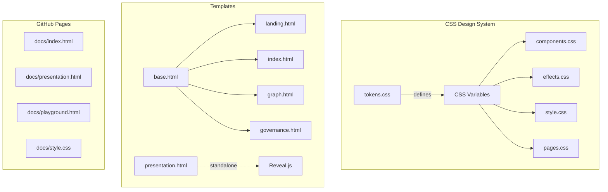

# UI/Frontend Analysis & Design System Documentation

> **Author**: UI Engineering Agent  
> **Date**: 2026-01-04  
> **Status**: FYP Showcase Polish (In Progress)

---

## Executive Summary

This document provides a comprehensive analysis of the Al-Mizan frontend architecture, design system, and UI polish efforts for the FYP showcase. The project has a **well-designed design token system** but suffers from **fragmentation across templates** with significant inline style duplication.

---

## 1. My Role in This Project

### Primary Responsibilities

| Area | Scope | Status |
|------|-------|--------|
| **Design System** | tokens.css, components.css, effects.css | 🟢 Well-structured |
| **Theme Toggle** | Light/Dark mode support | 🟡 Partial |
| **Page Polish** | Template consistency | 🟡 Partial |
| **GitHub Pages Sync** | docs/ vs almizan-core/ | 🔴 Mismatched |
| **Responsive Design** | Mobile breakpoints | 🟡 Partial |
| **Accessibility** | ARIA, semantic HTML | 🟡 Partial |

### Design System Architecture



---

## 2. Design System Deep Dive

### 2.1 Token System (`tokens.css`)

**Color Palette**:

| Token | Dark Mode | Light Mode | Usage |
|-------|-----------|------------|-------|
| `--color-gold` | `#D4AF37` | `#b8860b` | Primary accent, CTAs |
| `--color-crimson` | `#DC143C` | `#DC143C` | Errors, warnings |
| `--color-emerald` | `#10b981` | `#10b981` | Success, online status |
| `--color-blue` | `#1173d4` | `#1173d4` | Info, secondary accent |
| `--color-purple` | `#a855f7` | `#a855f7` | Governance theme |
| `--color-void` | `#050510` | `#f5f3ef` | Background |
| `--text-primary` | `#E0E0E0` | `#1a1a2e` | Text color |
| `--text-muted` | `#8892B0` | `#475569` | Secondary text |

**Typography Scale**:

| Token | Value | Usage |
|-------|-------|-------|
| `--text-xs` | 0.75rem | Captions, metadata |
| `--text-sm` | 0.875rem | Labels |
| `--text-base` | 1rem | Body text |
| `--text-lg` | 1.25rem | Subheadings |
| `--text-xl` | 1.5rem | Section headers |
| `--text-2xl` | 2rem | Page titles |
| `--text-3xl` | 2.5rem | Hero text |

**Spacing System**:

| Token | Value |
|-------|-------|
| `--space-1` | 0.25rem |
| `--space-2` | 0.5rem |
| `--space-4` | 1rem |
| `--space-6` | 1.5rem |
| `--space-8` | 2rem |
| `--space-12` | 3rem |

### 2.2 Components Library (`components.css`)

| Component | Class | Status | Notes |
|-----------|-------|--------|-------|
| **Glass Panel** | `.glass-panel` | ✅ Good | Backdrop blur + border |
| **Buttons** | `.btn`, `.btn--primary` | ✅ Good | Gold accent, hover states |
| **Badges** | `.badge`, `.badge--status` | ✅ Good | Status indicators |
| **Cards** | `.card`, `.card--portal` | ✅ Good | Hover lift effect |
| **Inputs** | `.input`, `.glass-input` | 🟡 Partial | Missing `.glass-select` |
| **Tabs** | `.tabs`, `.tab` | ✅ Good | Active state animations |
| **Gauge** | `.gauge`, `.gauge-progress` | ✅ Good | SVG-based circular |
| **Toast** | `.toast` | ✅ Good | Notification system |

### 2.3 Effects Library (`effects.css`)

| Effect | Class | Usage |
|--------|-------|-------|
| **Mesh Background** | `.mesh-background` | Landing page backdrop |
| **Aurora** | `.aurora` | Ambient glow effect |
| **Text Shimmer** | `.text-shimmer` | Gold shimmer on text |
| **Morph Blob** | `.morph-blob` | Floating shapes |
| **Stagger Reveal** | `.stagger-reveal` | Sequential fade-in |
| **Hover Lift** | `.hover-lift` | Card elevation on hover |
| **Gradient Border** | `.gradient-border` | Animated border glow |
| **Noise Overlay** | `.noise-overlay` | Subtle texture |

---

## 3. Current Issues Identified

### 🔴 Critical

| Issue | Impact | File | Status |
|-------|--------|------|--------|
| **GitHub Pages Mismatch** | Different UX on showcase vs local | `docs/*` vs `almizan-core/*` | 🔴 Broken |
| **Theme Toggle Incomplete** | Body/cards don't change | `style.css`, templates | 🟡 Fixing |
| **"Tawhidic" Text Invisible** | Missing hero text | `effects.css` `.text-shimmer` | 🔴 Bug |

### 🟠 High

| Issue | Impact | File | Status |
|-------|--------|------|--------|
| **Inline Style Duplication** | ~1000 lines duplicated | All templates | 🟡 Partial fix |
| **Missing CSS Variables** | Some hardcoded values | Templates | 🟡 Partial fix |
| **presentation.html Standalone** | Doesn't use base.html | `presentation.html` | 🟡 Intentional |

### 🟢 Low

| Issue | Impact | File | Status |
|-------|--------|------|--------|
| **No CSS minification** | Larger file sizes | All CSS | Not started |
| **Inconsistent spacing** | Visual irregularities | Various | Partial |

---

## 4. File Changelog

### Files Modified

| File | Changes | Date |
|------|---------|------|
| `tokens.css` | Added utility classes, `--color-gold-light` for light theme | 2026-01-04 |
| `style.css` | Removed duplicate `:root` block, added light mode overrides | 2026-01-04 |
| `pages.css` | **NEW** - Consolidated page-specific styles | 2026-01-04 |
| `base.html` | Added `pages.css` link, bumped versions | 2026-01-04 |
| `index.html` | Removed 245 lines of inline styles | 2026-01-04 |
| `docs/style.css` | Rebuilt with unified design tokens | 2026-01-04 |
| `docs/index.html` | Rebuilt to match local design | 2026-01-04 |

### Files Created

| File | Purpose |
|------|---------|
| `static/css/pages.css` | Consolidated styles from all template inline blocks |

---

## 5. Theme Toggle System

### Implementation

```javascript
// theme.js
function toggleTheme() {
    const current = document.documentElement.getAttribute('data-theme') || 'dark';
    const next = current === 'dark' ? 'light' : 'dark';
    document.documentElement.setAttribute('data-theme', next);
    localStorage.setItem('theme', next);
}
```

### CSS Pattern

```css
/* Default (dark mode) */
.element {
    background: rgba(20, 20, 35, 0.7);
}

/* Light mode override */
[data-theme="light"] .element {
    background: rgba(255, 255, 255, 0.95);
}
```

### Known Issues

1. **CSS Variables Not Cascading**: Some variables defined in `:root` don't update because they're evaluated at parse time, not runtime
2. **Background Gradient**: Uses hardcoded values instead of variables
3. **Missing Light Mode Overrides**: Portal cards, footer, body background need explicit overrides

---

## 6. Template Structure

### Standard Page Layout

```html


Page Title | Al-Mizan


<!-- Styles now in pages.css -->

<div class="page-wrapper noise-overlay">
    <!-- Mesh Background -->
    <div class="mesh-background" style="opacity: 0.15;">
        <div class="mesh-blob mesh-blob--gold morph-blob"></div>
    </div>
    
    <!-- Content -->
    <main class="container">
        <!-- Page content -->
    </main>
</div>

```

### Page Classes

| Class | Purpose |
|-------|---------|
| `.landing-page` | Full-height hero layout |
| `.graph-page` | Full-viewport graph container |
| `.gov-page` | Governance console layout |
| `.network-page` | Network dashboard layout |
| `.playground-page` | API playground layout |

---

## 7. GitHub Pages vs Local

### Current State

| Aspect | Local (`almizan-core/`) | GitHub Pages (`docs/`) |
|--------|------------------------|------------------------|
| CSS | 5 files (tokens, effects, components, style, pages) | 1 file (style.css) |
| Templates | Jinja2 + base.html | Static HTML |
| Presentation | Custom scroll-snap | Reveal.js + Tailwind |
| Theme | system.js driven | None |
| Graph | Cytoscape.js | vis-network |

### Sync Strategy

The `docs/` folder should be treated as a **static export** with:
1. Unified `style.css` matching design tokens
2. Standalone HTML files (no templating)
3. Demo/mock data for API features

---

## 8. Recommended Improvements

### Immediate

- [ ] Restart server to apply CSS changes
- [ ] Fix `.text-shimmer` visibility (add fallback color)
- [ ] Add remaining light mode overrides

### Short-term

- [ ] Extract remaining inline styles to `pages.css`
- [ ] Add CSS minification step
- [ ] Create static export script for docs/

### Long-term

- [ ] Component library (Web Components or framework)
- [ ] Storybook for component documentation
- [ ] Visual regression testing

---

## 9. Quick Reference

### Common Patterns

```css
/* Glass Panel */
.my-panel {
    background: var(--color-panel);
    backdrop-filter: blur(12px);
    border: var(--border-glass);
    border-radius: var(--radius-xl);
}

/* Gold Accented Button */
.my-button {
    background: var(--color-gold);
    color: var(--text-inverse);
    box-shadow: var(--shadow-glow-gold);
}

/* Theme-aware element */
.my-element {
    background: rgba(20, 20, 35, 0.7);
}
[data-theme="light"] .my-element {
    background: rgba(255, 255, 255, 0.9);
}
```

### Color Quick Reference

```css
Gold: var(--color-gold)         /* #D4AF37 */
Blue: var(--color-blue)         /* #1173d4 */
Green: var(--color-emerald)     /* #10b981 */
Purple: var(--color-purple)     /* #a855f7 */
Error: var(--color-crimson)     /* #DC143C */
```

---

*This document is maintained by the UI Engineering Agent. Last updated: 2026-01-04T20:18:40+08:00*
